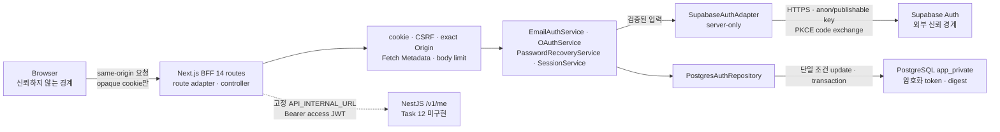

# 인증 백엔드 아키텍처

> **English Summary:** The implemented authentication boundary now includes 14 same-origin Next.js BFF routes, always-Secure opaque cookies, selector-bound CSRF, server-owned OAuth redirect handoff, request-scoped services over a shared database client, encrypted provider credentials, typed refresh failures, and responsive accessible authentication screens. Task 12 NestJS API/JWT validation, rate-limit use cases, and live Supabase/PostgreSQL verification remain unfinished.

이 문서는 현재 코드에 구현된 인증 도메인, 저장소, same-origin HTTP 경계가 왜 이런 구조를 택했는지 설명한다. 구현 근거는 [`apps/web/src/server`](../../apps/web/src/server/), [`apps/web/src/app/api`](../../apps/web/src/app/api/), browser query 계층과 [인증 DB 스키마](../database/auth-schema.ko.md)다.

## 현재 구현 범위

| 상태 | 범위 |
| --- | --- |
| 구현됨 | 인증 계약과 도메인 서비스, Supabase server-only adapter, opaque session·PostgreSQL 저장소, Next.js BFF 14개 route, request-scoped controller/container, same-origin CSRF, server-owned OAuth redirect handoff, always-Secure cookie, no-store 응답, ky 2 browser client와 TanStack Query binding, Task 11 반응형 인증 UI |
| 스키마만 구현됨 | `auth_rate_limits` 테이블. 이를 사용하는 rate-limit use case는 없다. |
| 아직 없음 | Task 12 NestJS `/v1/me` API와 JWT guard, 관리자 페이지, rate-limit use case, revocation retry worker |
| 이 작업 공간에서 미검증 | 실제 Supabase Auth와 disposable PostgreSQL에 대한 live 통합 검증 |
| 품질 후속 | web test 426개와 production build는 통과했다. optional coverage는 기존 instrumentation 범위에서 branch `91.78%`로 100% threshold를 충족하지 못하며 Task 10·11 신규 경계가 아직 include되지 않았다. |

## 문제와 선택

브라우저가 Supabase token을 직접 보관하면 XSS나 브라우저 저장소 유출이 곧 provider session 탈취로 이어진다. 반대로 모든 token을 서버에 두면 요청마다 저장소 조회가 필요하고 서버가 암호화 키와 세션 수명을 책임져야 한다. 이 구현은 후자의 비용을 선택했다.

- **same-origin BFF**: 브라우저의 인증 진입점을 `/api` 아래 14개 Next.js route로 제한하고 provider token과 내부 URL을 서버에 둔다.
- **opaque session**: 브라우저에는 의미 없는 256비트 selector만 두고, DB에는 그 SHA-256 digest만 저장한다.
- **server-owned PKCE**: PKCE verifier를 브라우저나 Supabase SDK 저장소에 맡기지 않고 서버에서 생성·암호화한다.
- **AES-256-GCM envelope**: token 평문을 DB에 저장하지 않고 record ID와 token kind를 AAD(추가 인증 데이터)에 결합한다.
- **interaction binding**: 인증 시작 브라우저와 callback 브라우저가 같은지 별도 selector digest로 묶는다.
- **claim-before-exchange**: 외부 provider 호출 전에 DB 행의 소비권을 먼저 획득해 replay와 동시 실행을 막는다.

## 모듈과 신뢰 경계

브라우저 URL, `Host`, forwarding header와 request body는 신뢰하지 않는다. BFF는 callback URL을 canonical `APP_ORIGIN`에서 만들고 selector를 두 `__Host-` cookie에서만 읽으며, 입력과 upstream JSON을 stream byte 기준으로 제한한다. Supabase adapter는 공급자 응답의 사용자 UUID, session UUID, email 확인 시각, JWT `iat`·`exp`, token lifetime 일관성을 다시 검사한다. `/api/me`가 호출하는 NestJS `/v1/me`와 JWT 서명 guard는 Task 12 범위라 아직 구현되지 않았다.

## 비밀값과 selector의 위치

| 값 | 생성·유입 | 허용되는 위치 | 금지되는 위치 |
| --- | --- | --- | --- |
| Supabase access token | Supabase 응답 | 서버 메모리에서 짧게 사용, `auth_sessions.encrypted_access_token` envelope | 브라우저 응답·cookie·URL·로그·평문 DB |
| Supabase refresh token | Supabase 응답 | 서버 메모리, `auth_sessions.encrypted_refresh_token` envelope | 브라우저 저장소·cookie·URL·로그·평문 DB |
| recovery credential pair | recovery code 교환 결과 | canonical JSON으로 만든 뒤 `auth_recovery_transactions.encrypted_recovery_token` envelope | 일반 app session, 브라우저, URL, 로그 |
| PKCE verifier | 서버 CSPRNG | `encrypted_pkce_verifier` envelope, provider code 교환 직전 서버 메모리 | 브라우저, SDK persistence, URL, 로그, 평문 DB |
| PKCE challenge | verifier의 S256 digest | Supabase signup/recover/authorize 요청 | verifier를 대신하는 비밀 저장소로 사용하지 않음 |
| OAuth `state` | 서버 CSPRNG | provider 왕복 URL의 protocol 값, DB에는 `state_hash`만 | cookie·브라우저 영구 저장소·평문 DB·로그 |
| interaction selector | BFF가 signup·OAuth start·recovery start마다 새로 생성 | `__Host-ab_interaction` HttpOnly·Secure cookie, 서비스 호출 시 서버 문맥 | 요청 body/query, DB 평문, 로그, 기존 selector의 시작 흐름 재사용 |
| session selector | `SessionService` CSPRNG | `__Host-ab_session` HttpOnly cookie, lookup 시 서버 메모리 | DB 평문, 브라우저 JavaScript 저장소, 로그 |

`state`는 OAuth protocol상 redirect URL을 왕복하지만 저장 시에는 32바이트 digest만 남는다. interaction selector와 session selector는 둘 다 canonical base64url 43자이며 원본의 역할이 다르다.

## 암호화 envelope

[`token-envelope.ts`](../../apps/web/src/server/security/token-envelope.ts)는 AES-256-GCM을 사용한다.

- key는 정확히 32바이트다.
- 매 암호화에 새 12바이트 IV를 만든다.
- authentication tag는 16바이트다.
- envelope 필드는 정확히 `version`, `keyId`, `iv`, `ciphertext`, `tag` 다섯 개다.
- 현재 version은 `1`이다.
- AAD는 `v1\0<recordId>\0<tokenKind>`이며 `tokenKind`는 `access | refresh | pkce | recovery`다.
- 쓰기는 `currentKeyId`만 사용하고, 읽기는 keyring에 남은 이전 key도 허용해 점진적 key rotation을 지원한다.
- envelope 형식, key lookup, tag, AAD 중 하나라도 맞지 않으면 `TOKEN_ENVELOPE_INVALID` 하나로 실패한다. 평문 fallback은 없다.

이 선택은 DB 유출만으로 token을 바로 사용할 수 없게 하고 row 간 ciphertext 바꿔치기를 막는다. 대신 BFF의 keyring이 유출되면 저장 token이 위험해지므로 key 접근 제한과 전체 세션 폐기 절차가 필요하다.

## 이메일 가입·로그인·확인

구현은 [`EmailAuthService`](../../apps/web/src/server/auth/email-auth-service.ts)가 담당한다.

### 가입

1. `SignUpInputSchema`가 이메일과 12~1024자 비밀번호를 strict하게 검증한다.
2. BFF가 canonical `APP_ORIGIN`으로 만든 confirmation URL, 새 interaction selector와 시각을 서비스 경계에서 다시 검사한다.
3. 서버가 transaction UUID와 PKCE verifier를 만든다.
4. interaction selector는 SHA-256으로 바꾸고 verifier는 `tokenKind: "pkce"`로 암호화한다.
5. 15분 수명의 `email_confirmation_transactions` 행을 **provider 요청 전에** 만든다.
6. Supabase signup에는 callback URL과 S256 challenge만 보낸다.
7. 신규 계정, 이미 존재하는 계정, 예상 밖의 즉시 인증 결과 모두 공개 결과는 `{ accepted: true }`다. signup 경로는 app session을 만들지 않는다.

### 비밀번호 로그인

1. 입력을 strict 검증한 뒤 Supabase의 request-scoped non-persistent client로 로그인한다.
2. provider promise가 끝난 뒤 새 시각을 샘플링한다.
3. email 확인, 사용자 UUID와 JWT `sub` 일치, session UUID, `iat`·`exp`를 검사한다.
4. token pair를 `SessionService.create`에 전달한다.
5. 반환값은 opaque selector, 공개 사용자, access 만료와 absolute 만료뿐이다.

### 이메일 확인

1. callback code를 길이·공백·control character 기준으로 먼저 검사한다.
2. interaction digest가 일치하고 아직 소비되지 않았으며 만료 전인 행을 조건부 update로 먼저 claim한다.
3. 저장 행이 정확히 15분 수명이고 digest·시각·envelope 불변식을 만족하는지 다시 검사한다.
4. verifier를 복호화하고 code와 함께 Supabase PKCE token endpoint로 보낸다.
5. 검증된 token pair로 opaque session을 만든다.

provider 교환이 실패해도 claim은 되돌리지 않는다. 사용자는 새 인증 흐름을 시작해야 하며, 같은 code를 다시 provider까지 전달하지 않는다.

## OAuth 시작·완료

구현은 [`OAuthService`](../../apps/web/src/server/auth/oauth-service.ts)가 담당한다.

### 시작

1. CSRF가 적용된 `POST /api/auth/oauth/{provider}/start`는 `google | kakao | naver`와 `/app | /settings/security`만 허용한다.
2. POST는 provider transaction이나 `state`를 만들지 않는다. 새 interaction cookie와 고정된 same-origin `/api/auth/oauth/{provider}/continue?returnPath=...` 경로만 JSON으로 돌려준다.
3. 브라우저가 그 경로로 document navigation을 수행하면 continue GET가 exact same-origin Fetch Metadata, interaction cookie와 allowlist를 검사한다.
4. 이 GET에서만 canonical `APP_ORIGIN` 기반 callback URL을 만들고 `OAuthService.start`를 호출한다.
5. 서버가 `state`, PKCE verifier, transaction UUID를 만들고, 두 selector digest와 암호화 verifier를 저장한다.
6. transaction은 정확히 10분 후 만료한다.
7. BFF는 검증된 HTTPS 또는 exact loopback HTTP provider URL만 `303 Location`으로 전달한다. credential·fragment·public HTTP URL은 거부한다.

Supabase provider mapping은 Google `google`, Kakao `kakao`, Naver `custom:naver`로 고정된다.

### 완료

1. callback의 provider, `state`, code와 기존 interaction selector를 먼저 검증한다.
2. provider·`state_hash`·`interaction_hash`가 모두 일치하고 미소비·미만료인 행 하나를 먼저 claim한다.
3. 반환 행의 digest, 10분 수명, provider, return path를 다시 검사한다.
4. verifier를 복호화해 code를 교환한다.
5. provider 완료 뒤의 시각으로 token pair를 검증하고 opaque session을 만든다.
6. redirect 대상은 요청 값이 아니라 DB에 저장된 두 allowlisted return path 중 하나다.

잘못된 browser, provider, state, 만료, replay는 provider 호출 전에 차단된다. 동시 callback 중 하나만 provider에 도달한다.

## 세션 조회·refresh·revoke

[`SessionService`](../../apps/web/src/server/session/session-service.ts)와 [`PostgresAuthRepository`](../../apps/web/src/server/persistence/postgres-auth-repository.ts)가 정책을 나눠 가진다.

### 생성과 조회

- 생성 시 absolute 만료는 정확히 30일 뒤다.
- 활성 조회는 `revoked_at IS NULL`, `absolute_expires_at > now`, `last_seen_at > now - 7 days`를 모두 요구한다.
- idle 7일 경계와 absolute 만료 경계는 활성으로 인정하지 않는다.
- 단순 `resolve`는 `last_seen_at`을 갱신하거나 provider token을 refresh하지 않는다.
- DB에서 읽은 row가 UUID, digest 길이, 시각 순서, 수명, rotation version 중 하나라도 어기면 하나의 고정 오류로 실패한다.

### refresh

1. 현재 selector로 활성 session을 load하고 refresh token을 복호화한다.
2. Supabase에 refresh를 요청한다.
3. provider 완료 뒤 새 시각을 샘플링해 replacement token pair를 검증한다.
4. replacement `userId`가 기존 사용자와 다르면 DB에 쓰지 않는다.
5. `id`, 이전 `rotation_version`, 이전 `supabase_session_id`, active/idle/absolute 조건을 한 update에 넣는다.
6. 한 요청만 두 encrypted token과 provider session ID를 함께 교체하고 version을 1 증가시킨다. 패자는 `{ status: "superseded" }`를 받는다.

### revoke

구현된 primitive는 다음과 같다.

- selector digest로 현재 local session을 한 번만 revoke한다.
- 사용자 UUID의 모든 active local session을 revoke한다.
- local revoke 뒤 외부 revoke 재시도가 필요하면 `revocation_pending_at`을 기록한다.
- provider port에는 `signOut(accessToken, refreshToken)`이 있다.

`POST /api/auth/sign-out`은 session을 resolve한 뒤 local revoke를 먼저 commit하고 provider sign-out을 시도한다. provider 실패 시 `revocation_pending_at`을 기록하며 성공·실패 응답 모두에서 session cookie를 제거한다. local session을 되살리는 rollback은 없다. 다만 pending 외부 revoke를 재시도하는 worker는 아직 없다.

## 비밀번호 복구 상태기계

구현은 [`PasswordRecoveryService`](../../apps/web/src/server/auth/password-recovery-service.ts)가 담당한다. 일반 app session을 발급하지 않는다.

### 시작

1. 이메일을 strict 검증한다.
2. interaction digest와 encrypted PKCE verifier가 든 pending row를 만든다.
3. 수명은 정확히 15분이다.
4. Supabase recovery 요청에는 callback URL과 challenge만 보낸다.
5. 계정 존재 여부와 무관하게 공개 결과는 `{ accepted: true }`다.

### code 교환

1. pending row의 `exchange_claimed_at`을 먼저 설정한다.
2. verifier를 복호화해 recovery code를 교환한다.
3. verified email 사용자와 provider credential pair를 검증한다.
4. credential을 key 순서가 고정된 canonical JSON으로 만들고 `tokenKind: "recovery"`로 암호화한다.
5. claim timestamp를 CAS 조건으로 verifier를 지우고 사용자·encrypted recovery credential·`exchanged_at`을 설정한다.
6. 공개 결과는 `{ ready: true }`뿐이다.

### 비밀번호 변경

1. 새 비밀번호를 12~1024자로 검증한다.
2. exchanged row의 `password_update_claimed_at`을 먼저 설정한다.
3. recovery credential을 복호화하고 provider session의 user가 저장 user와 같은지 확인한다.
4. provider 비밀번호 변경이 성공한 뒤에만 recovery consume, 사용자 issuance gate 전진, 모든 local session revoke를 한 DB transaction으로 수행한다.
5. 공개 결과는 `{ updated: true }`뿐이다.

provider 비밀번호 변경이 실패하면 row는 update-claimed 상태로 남고 consume/revoke는 실행하지 않는다. 같은 transaction의 재사용을 허용하지 않는 보안 선택이다.

## 비밀번호 변경과 진행 중 로그인 경쟁 조건

`auth_user_security_state.minimum_accepted_iat`는 사용자별로 허용할 최소 provider JWT `iat`를 저장한다. 세션 생성과 recovery 완료는 같은 사용자 행을 update해 row lock을 공유한다.

### 순서 A: 세션 생성이 먼저 lock을 얻음

1. `createSession`이 사용자 security row를 만들거나 확인하고 no-op update로 lock한다.
2. token의 `iat >= minimum_accepted_iat`를 확인하고 session을 insert한 뒤 commit한다.
3. recovery transaction이 같은 row를 lock하고 `clock_timestamp()`의 다음 정수 초로 minimum을 올린다.
4. 같은 transaction에서 방금 생성된 것을 포함한 모든 active session을 revoke한다.

결과: 먼저 생성된 stale session도 살아남지 않는다.

### 순서 B: recovery가 먼저 lock을 얻음

1. recovery transaction이 minimum을 DB 현재 시각의 다음 정수 초로 올리고 모든 active session을 revoke한 뒤 commit한다.
2. 기다리던 `createSession`이 lock을 얻는다.
3. recovery 이전에 발급된 token의 `iat`는 새 minimum보다 작으므로 insert하지 않는다.

결과: 비밀번호 변경 전에 시작해 provider 응답만 늦게 도착한 로그인도 stale session을 만들 수 없다. 같은 초에 발급된 token까지 보수적으로 거부하는 것이 trade-off다.

## 요청 방어와 cookie 정책

### 구현된 cookie와 request 경계

- cookie 이름은 `__Host-ab_session`, `__Host-ab_interaction` 두 개뿐이다.
- cookie builder는 `HttpOnly: true`, `Secure: true`, `SameSite: "lax"`, `Path: "/"`, `Priority: "high"`를 고정하고 `Domain`을 제공하지 않는다. `Secure: false`는 loopback에서도 거부한다.
- CSRF token은 selector, 32바이트 HMAC key, 새 32바이트 nonce에 묶인다. 발급 시각을 초 단위로 내림한 값에 300초를 더한 expiry 경계부터 거부하므로 실제 유효 시간은 최대 300초다.
- state-changing request validator는 대문자 `POST`, JSON content type, exact `Origin` 또는 same-origin `Referer`, `Sec-Fetch-Site: same-origin | none`, 단일 `X-CSRF-Token`을 요구한다. `Sec-Fetch-Mode`와 `Sec-Fetch-Dest`는 header가 있을 때만 각각 allowlist와 빈 destination을 검증한다. controller의 mutation route가 use case 호출 전에 이를 실행한다.
- allowed origin 문자열은 URL의 exact `origin`과 같아야 하며 path·query·fragment·credential·공백·control character를 허용하지 않는다.
- request JSON은 stream을 읽으며 최대 16,384바이트, 내부 `/v1/me` 응답은 최대 65,536바이트로 제한한다. `Content-Length`가 없거나 chunked여도 실제 누적 byte가 한도를 넘으면 reader를 cancel한다.
- 성공, 오류, redirect, 405 응답은 모두 `Cache-Control: private, no-store`, `Pragma: no-cache`, `Expires: 0`를 포함한다. 14개 route는 지원하지 않는 GET/POST/PUT/PATCH/DELETE/HEAD/OPTIONS를 공통 405 handler로 명시한다.

### 브라우저 query 경계

ky 2 client는 `prefix: "/api"`, same-origin credential, 10초 timeout, retry 0을 사용한다. mutation마다 CSRF token을 새로 받고 browser storage에는 token이나 selector를 저장하지 않는다. TanStack Query는 query/mutation retry를 기본적으로 끄며, current-user GET가 `AUTH_SESSION_REFRESH_REQUIRED`를 받을 때만 CSRF-protected refresh POST 한 번과 원래 GET 한 번을 수행한다.

session 조회와 `/api/me`는 access token 만료까지 60초 이하이면 자동 refresh하지 않고 `AUTH_SESSION_REFRESH_REQUIRED`를 반환한다. refresh 결과는 session 계층의 typed reason에 따라 expired는 401, provider rate limit은 429, operational unavailable은 retryable 503으로 매핑한다.

### 반응형 인증 UI 경계

`/login`, `/sign-up`, `/verify-email`, `/forgot-password`, `/reset-password`는 공통 `AuthShell`과 인증 form component를 사용한다. 모바일에서는 제품 식별과 form을 먼저 보여주고 상세 설명을 뒤에 배치하며, 769px부터 설명 영역과 form을 두 열로 전환한다. 입력 label, `autocomplete`, 오류 field 연결, keyboard focus, 최소 44px target, 3:1 이상 control 경계와 WCAG AA text 대비를 유지한다.

form은 로컬 입력 상태만 보관하고 서버 상태는 기존 TanStack Query mutation으로 전달한다. OAuth button은 allowlist의 `google | kakao | naver`와 BFF가 반환한 exact same-origin `authorizationPath`만 top-level document navigation으로 연다. UI는 access token, refresh token, selector, provider URL, request ID와 API 원문 message를 저장하거나 출력하지 않고 공개 error code를 고정 한국어 문구로만 변환한다.

pending indicator와 상태 전환은 180ms ease-out으로 제한한다. `prefers-reduced-motion`에서는 animation과 transition을 1ms·1회로 축소한다. 390×844와 1440×900의 다섯 인증 route, 768/769px 경계에서 horizontal overflow 0과 console error 0을 확인했다.

## 고정 오류와 비노출

provider boundary가 허용하는 오류 코드는 다음 다섯 개다.

- `AUTH_INVALID_CREDENTIALS`
- `AUTH_EMAIL_VERIFICATION_REQUIRED`
- `AUTH_OAUTH_TRANSACTION_INVALID`
- `AUTH_RATE_LIMITED`
- `AUTH_PROVIDER_UNAVAILABLE`

세션 서비스는 message를 `AUTH_SESSION_OPERATION_FAILED`로 고정하고 `expired | rate_limited | unavailable` reason만 내부 경계에 제공한다. BFF는 이를 각각 `AUTH_SESSION_EXPIRED`, `AUTH_RATE_LIMITED`, `AUTH_PROVIDER_UNAVAILABLE` 공개 envelope로 바꾼다. 60초 refresh 경계에는 `AUTH_SESSION_REFRESH_REQUIRED`를 사용한다. CSRF/request boundary는 `AUTH_CSRF_REJECTED`, envelope은 `TOKEN_ENVELOPE_INVALID`로 실패하며 외부 provider message, code 원문, email, selector, token, SQL 오류를 응답에 붙이지 않는다.

가입과 recovery 시작은 명시적으로 인식한 account existence/absence provider code만 동일 acknowledgement로 축약한다. 실제 HTTP status가 body 안의 가짜 status보다 우선하며, 429는 body가 malformed여도 `AUTH_RATE_LIMITED`로 매핑한다.

## trade-off와 잔여 위험

| 선택 | 얻는 것 | 비용·잔여 위험 |
| --- | --- | --- |
| DB-backed opaque session | 즉시 local revoke, browser token 비노출 | 매 요청 DB 의존성과 암호화 key 운영 |
| claim-before-exchange | replay·동시 provider 호출 차단 | 일시적 provider 실패도 transaction을 소모해 사용자가 다시 시작해야 함 |
| server-owned PKCE | SDK/browser persistence 제거 | 서버 transaction 저장과 callback 조립 책임 증가 |
| exact provider/return path | open redirect와 provider 혼동 축소 | 새 provider/path 추가 시 코드·DB constraint·migration 동시 변경 필요 |
| strict malformed-row rejection | 손상·공격 데이터의 fail-closed 처리 | 자동 복구 대신 인증 재시작 또는 운영 조사 필요 |
| shared per-user issuance gate | 비밀번호 변경과 늦은 로그인 race 차단 | 같은 초 token까지 거부할 수 있고 사용자별 lock 경합 발생 |
| local-first logout orchestration | 외부 장애 중에도 local 접근과 browser cookie를 먼저 제거 | pending 외부 revoke retry worker는 아직 없음 |

## 관련 문서

- [인증 데이터베이스 스키마](../database/auth-schema.ko.md)
- [인증 백엔드 운영 가이드](../guides/backend-auth-operations.ko.md)
- [보안 아키텍처와 위협 모델](../security/security-architecture.md)
- [구현 설계](../superpowers/specs/2026-07-20-security-auth-foundation-design.md)
- [SQL migration 001](../../supabase/migrations/202607200001_security_auth_foundation.sql), [002](../../supabase/migrations/202607200002_server_pkce_transactions.sql), [003](../../supabase/migrations/202607200003_user_security_state.sql)
