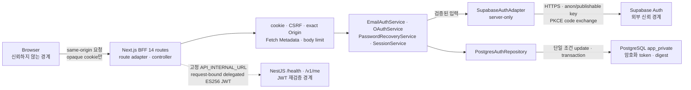

# 인증 백엔드 아키텍처

## Supabase 인증 어댑터의 역할 분리 — 2026-09-10 R1

이 절은 승인된 R1 구조를 설명한다. 구현·검증의 완료 여부는 [실행 계획](../superpowers/plans/2026-09-10-auth-adapter-role-split.md)과 [테스트 기록](../guides/security-auth-testing.md#supabase-어댑터-역할-분리-2026-09-10-r1)을 따른다. 인증 기능을 새로 만드는 작업이 아니라 기존 625줄 파일의 책임을 나누는 작업이다.

어댑터(adapter)는 앱이 쓰는 인증 인터페이스를 외부 Supabase 호출로 바꿔 주는 연결부다. 서비스는 여전히 `SupabaseAuthAdapter`만 호출하고 내부 파일 배치에 의존하지 않는다. 파일이 늘어도 외부 공개 API와 사용자 로그인 절차는 같아야 한다.

| 파일 (`apps/web/src/server/auth/` 기준) | 책임과 입력 → 출력 | 수정하는 상황 |
| --- | --- | --- |
| `supabase-auth-adapter.ts` | 로그인·가입·복구 등의 작업 입력 → 검증된 인증 결과. 어떤 검사를 먼저 하고 어떤 통신을 호출할지 조합 | 인증 작업의 순서를 검토할 때 |
| `supabase/validation.ts` | URL·문자열·UUID·PKCE 후보 → 허용된 입력 또는 고정 오류 | 입력 형식/설정 정책을 변경할 때 |
| `supabase/session-parser.ts` | 외부 SDK/HTTP 응답 → 내부 토큰 쌍. 사용자·메일 확인·발급/만료 시각 일치 검사 | 외부 응답 계약을 검토할 때 |
| `supabase/error-mapper.ts` | 원시 오류·HTTP 상태 → 허용된 앱 오류/계정 존재 은폐 판단 | 오류 정책을 검토할 때 |
| `supabase/http-client.ts` | 서버 설정·fetch 함수·URL·JSON 객체 → HTTP 상태와 읽은 본문 | 직접 HTTP 전송/JSON 처리를 검토할 때 |
| `supabase/sdk-client.ts` | URL·anon 키·비영속 옵션 → 새 SDK 클라이언트 | SDK 초기화/서버 저장 금지 정책을 검토할 때 |

입문자는 공개 어댑터의 `signInWithPassword`를 먼저 읽고, `sdk-client` → `session-parser` → `validation` → `error-mapper` 순서로 따라가면 된다. 로그인은 이메일·비밀번호를 검사한 후 작업 전용 SDK로 요청하고, SDK의 오류를 먼저 확인한 다음 세션의 사용자·토큰·시각을 검사한다. 외부 호출만 성공했다고 앱의 세션이 자동 생성되는 것은 아니다. 검증된 결과를 받은 상위 서비스가 서버 세션 저장을 맡는다.

메일 확인/OAuth/복구 코드 교환은 다른 경로다. 서버 보유 PKCE verifier와 코드를 검사하고 `http-client`로 직접 POST한다. SDK에 PKCE 저장을 맡기지 않는다. `error-mapper`는 직접 HTTP의 실제 상태를 우선하므로, 본문 안에 가짜 status가 있어도 이를 대신 사용하지 않는다. 가입 중 이미 존재하는 계정, 복구 중 없는 계정을 숨기는 허용 상태·오류 코드 조합도 기존 정책 그대로다.

`session-parser`의 JWT 처리는 **구문과 클레임의 일관성 검사이지 암호학적 서명 검증이 아니다**. Heroku API의 delegated JWT 서명 검증과 혼동하면 안 된다. 또한 파일 분리는 새 timeout·재시도·레이트리밋·보안 기능을 추가하지 않는다.

서버 전용 경계는 모든 제품 모듈의 `server-only` 표식으로 유지한다. 의존 방향은 어댑터 → 통신/파서 → 검증/오류이며, 오류 모듈이 검증 모듈을 역참조하지 않는다. `SupabaseServerConfig`, `SupabaseClientFactory`, `SupabaseFetch`는 기존 어댑터 경로에서도 타입으로 사용할 수 있어 호출부를 바꿀 필요가 없다. 테스트 대역은 `test-fixtures.ts`에만 두고 제품 코드에서는 사용하지 않는다.

파일을 역할별로 나누는 것은 브라우저에서 필요한 JavaScript만 내려받는 동적 코드 분할과 다르다. 이번 변경으로 FCP나 서버 응답 시간이 개선됐다고 주장하지 않는다. 이득은 다음 수정 때 읽고 검토해야 할 책임의 범위가 명확해지는 것이다.

## DB 연결 오류 경계 — 2026-09-09 A안

DB 연결 풀은 여러 요청이 사용할 연결을 보관하고 재사용한다. BFF의 [`createDatabaseClient`](../../packages/database/src/client.ts)는 Drizzle이 만든 node-postgres 풀을 감싸며, API의 [`MeModule`](../../apps/api/src/me/me.module.ts)은 Nest DI에 API 전용 풀을 제공한다. 이번 A안은 두 생성 지점의 유휴 오류 수신을 보완한다. 실행·검증 상태는 [상세 계획](../superpowers/plans/2026-09-09-database-pool-error-boundary.md)의 기록을 따른다.

쿼리 실패와 유휴 연결 오류는 서로 다른 경로다.

1. **쿼리 중 실패:** 요청을 처리하던 코드가 reject된 Promise를 받아 기존 오류 응답으로 바꾼다. API replay 저장소는 상세 정보를 버린 `ReplayStoreUnavailableError`를 발생시켜 인증을 실패 차단한다.
2. **유휴 연결의 오류:** 사용하지 않는 연결도 DB 재시작·네트워크 단절로 실패할 수 있다. 이때 풀의 `error` 이벤트를 별도로 받아야 한다. 요청 함수의 try/catch만으로는 이 이벤트를 처리할 수 없다.

두 생성 지점의 수신 함수는 오류와 client 인수를 읽지 않고, **풀마다 최초 한 번만** `DB_POOL_IDLE_ERROR source=bff` 또는 `DB_POOL_IDLE_ERROR source=api`를 서버의 표준 오류 출력에 남긴다. 출력 전에 인스턴스별 플래그를 설정해 반복·중첩 이벤트의 로그 폭주를 막는다. 로그 출력 자체가 동기적으로 실패하더라도 그 예외를 다시 이벤트 밖으로 전파하지 않는다. 오류 원문·stack·SQL·연결 문자열·사용자 데이터는 진단에 포함하지 않는다.

이는 완전한 장애 모니터링이 아니다. 같은 풀에서 두 번째 이후 장애는 별도 출력하지 않으므로 이 메시지 수를 장애 횟수로 계산하면 안 된다. 여러 프로세스/인스턴스는 각각 최초 진단을 낼 수 있고, 출력 계층 자체가 실패하면 기록이 남지 않을 수 있다. 배포 시 이 고정 이벤트와 플랫폼 로그·가용성 경보를 연결하는 작업은 별도다.

오류 수신은 DB 복구나 쿼리 재실행을 뜻하지 않는다. 손상된 유휴 연결 제거는 pg 드라이버의 기존 책임이며, 앱은 자동 재시도·전역 예외 무시·인증 성공 우회를 추가하지 않는다. API의 최대 5개 연결·연결 대기 2초·유휴 10초 설정, BFF의 프로세스 내 클라이언트 재사용, replay 저장소의 종료 1회 책임은 유지한다. 전체 인스턴스 연결 예산과 실제 Supabase 요청 시간 제한은 이번 변경과 별개다.

> 2026-09-08 갱신: 이 문서의 SHA별 테스트·Task 기록은 당시 증거로 보존한다. 최신 HEAD `5cc94601c74a1e08f848a0cbc0bde191e7a47f81` CI는 899개 테스트 기록이며 로컬 UUID 보완은 contracts 66개로 별도 검증했다. 현재 금융 CRUD·원장 DB·`/app`·모바일은 미구현이다. 입문자는 [코드 읽기](../guides/code-reading.ko.md), 전체 상태는 [문서 지도](../README.md)를 먼저 읽는다. live Supabase 미검증과 disposable PostgreSQL CI 성공은 서로 다른 상태다.

> **English Summary:** The implemented authentication boundary now includes 14 same-origin Next.js BFF routes, always-Secure opaque cookies, selector-bound CSRF, server-owned OAuth redirect handoff, request-scoped services over a shared database client, encrypted provider credentials, responsive accessible authentication screens, and a NestJS/Fastify API that independently verifies JWT signatures and claims before creating a request principal. Rate-limit use cases and live Supabase/PostgreSQL verification remain unfinished.

이 문서는 현재 코드에 구현된 인증 도메인, 저장소, same-origin HTTP 경계가 왜 이런 구조를 택했는지 설명한다. 구현 근거는 [`apps/web/src/server`](../../apps/web/src/server/), [`apps/web/src/app/api`](../../apps/web/src/app/api/), browser query 계층과 [인증 DB 스키마](../database/auth-schema.ko.md)다.

## 현재 구현 범위

| 상태 | 범위 |
| --- | --- |
| 구현됨 | 인증 계약과 도메인 서비스, Supabase server-only adapter, opaque session·PostgreSQL 저장소, Next.js BFF 14개 route, request-scoped controller/container, same-origin CSRF, server-owned OAuth redirect handoff, always-Secure cookie, no-store 응답, ky 2 browser client와 TanStack Query binding, Task 11 반응형 인증 UI, Task 12 NestJS/Fastify JWT guard와 `/health`·`/v1/me`, Task 13 disposable DB·ES256 IDP·Playwright 인증 체인과 CI gate, Task 14 browser UI·HTTP response contract 분리, exact app alert 선택자, token-free storage, opaque cookie·logout selector replay의 동일 SHA CI 증거 |
| 스키마만 구현됨 | `auth_rate_limits` 테이블. 이를 사용하는 rate-limit use case는 없다. |
| 아직 없음 | 금융 원장 DB/RLS·CRUD API, `/app` 화면, 별도 모바일 앱, 관리자 페이지, persistent rate-limit use case, revocation retry worker |
| 이 작업 공간에서 미검증 | 실제 hosted Supabase Auth·role·pooler와 Google·Kakao·Naver live 통합 검증 |
| 품질 후속 | 최종 SHA `93737d3`에서 Security/legacy 53개, contracts 22개, database 12개, API 113개, web 479개, E2E preflight 2개가 로컬에서 통과했다. 같은 SHA의 GitHub security-gate run 15는 disposable PostgreSQL과 Chromium E2E까지 통과했다. 기존 optional branch coverage `91.78%`의 100% threshold 충족은 별도 품질 후속이다. Hosted DB 최소 권한·pooler, persistent rate limit과 Google·Kakao·Naver live OAuth는 여전히 운영 출시 차단 항목이다. |
| Task 14 동일 SHA 검증 | 최종 검증 코드 SHA `0d996fe726debaa8a2eec10865f63418635d06d8`에서 [push CI](https://github.com/jawon0407/account-book/actions/runs/30252139895)와 [PR CI](https://github.com/jawon0407/account-book/actions/runs/30252146533)가 성공했다. Node 22 CI는 disposable PostgreSQL DB 22개, browser-stage 정책·preflight 7개, 단일 worker Playwright HTTP·UI 8개를 통과했다. 로컬 Node 24는 `pnpm test`의 legacy/security 53개, contracts 22개, database package 12개, API 113개, web 479개, E2E preflight 2개를 통과했으며 PostgreSQL-backed Playwright는 로컬에서 실행하지 않았다. |

## 문제와 선택

브라우저가 Supabase token을 직접 보관하면 XSS나 브라우저 저장소 유출이 곧 provider session 탈취로 이어진다. 반대로 모든 token을 서버에 두면 요청마다 저장소 조회가 필요하고 서버가 암호화 키와 세션 수명을 책임져야 한다. 이 구현은 후자의 비용을 선택했다.

- **same-origin BFF**: 브라우저의 인증 진입점을 `/api` 아래 14개 Next.js route로 제한하고 provider token과 내부 URL을 서버에 둔다.
- **opaque session**: 브라우저에는 의미 없는 256비트 selector만 두고, DB에는 그 SHA-256 digest만 저장한다.
- **server-owned PKCE**: PKCE verifier를 브라우저나 Supabase SDK 저장소에 맡기지 않고 서버에서 생성·암호화한다.
- **AES-256-GCM envelope**: token 평문을 DB에 저장하지 않고 record ID와 token kind를 AAD(추가 인증 데이터)에 결합한다.
- **interaction binding**: 인증 시작 브라우저와 callback 브라우저가 같은지 별도 selector digest로 묶는다.
- **claim-before-exchange**: 외부 provider 호출 전에 DB 행의 소비권을 먼저 획득해 replay와 동시 실행을 막는다.

## 모듈과 신뢰 경계

브라우저 URL, `Host`, forwarding header와 request body는 신뢰하지 않는다. BFF는 callback URL을 canonical `APP_ORIGIN`에서 만들고 selector를 두 `__Host-` cookie에서만 읽으며, 입력과 upstream JSON을 stream byte 기준으로 제한한다. Supabase adapter는 공급자 응답의 사용자 UUID, session UUID, email 확인 시각, JWT `iat`·`exp`, token lifetime 일관성을 다시 검사한다. `/api/me`는 고정 `API_INTERNAL_URL/v1/me`에 요청별 30초 delegated ES256 JWT와 request binding을 전달하고, NestJS API가 static public-key keyring·accepted `kid`·scope·`jti` replay consume을 독립 검증해 BFF와 provider adapter 자체를 암묵적으로 신뢰하지 않는다.

## NestJS API delegated JWT 신뢰 경계

[`apps/api/src/auth`](../../apps/api/src/auth/)는 HTTP header와 JWT를 다음 순서로 검증한다.

1. Node raw header pair에서 `Authorization`이 정확히 한 개인지 확인한다.
2. 전체 값이 8192바이트 이하이고 제어 문자, 앞뒤 공백, 병합된 값이 없는 canonical `Bearer <JWT>` 형식인지 확인한다.
3. 지원하지 않는 protected `crit` 확장을 key resolver 호출 전에 invalid credential로 거부한다.
4. static P-256 public-key keyring에서 accepted `kid`를 찾고 ES256 서명을 검증한다. private signing key나 remote key fetch는 API에 없다.
5. 정확한 issuer와 scalar audience, 필수 `exp`, 유효한 optional `nbf`, 단일 scope, request binding을 검증한다. audience 배열이나 추가 audience는 허용하지 않는다.
6. `sub`, session UUID, `jti`가 canonical 형식인지 확인하고 PostgreSQL에서 `jti`를 원자적으로 한 번만 consume한 뒤 최소 immutable `AuthPrincipal`을 만든다.
7. 모든 검증이 끝난 뒤에만 Fastify request에 principal을 부착한다.

따라서 body, query, 일반 header나 이메일·역할 같은 임의 JWT claim으로 사용자 소유권을 결정할 수 없다. `/v1/me`는 공유 `CurrentUser` 계약에 맞춰 검증된 `userId`, `email: null`, 기존 verified-session 불변조건을 나타내는 `emailVerified: true`만 반환한다.

잘못된 credential은 세부 원인을 구분하지 않는 401 `AUTH_SESSION_EXPIRED`, keyring·replay store·내부 운영 실패는 503 `AUTH_PROVIDER_UNAVAILABLE`로 고정한다. 두 경우 모두 strict `ApiError`, 서버 생성 UUID `X-Request-Id`, `Cache-Control: private, no-store`를 사용하며 exception, token, 공급자 URL/message, header/body나 환경값을 직렬화하거나 로그로 남기지 않는다. Helmet은 등록하고 CORS는 등록하지 않는다.

환경 변수는 Zod로 한 번 파싱하고 frozen snapshot으로 재사용한다. API는 `API_DATABASE_URL`, `BFF_AUTH_DISABLED`, static `BFF_JWT_ACCEPTED_KIDS`, static `BFF_JWT_PUBLIC_KEYS`만으로 trust boundary를 구성한다. key rotation은 allowlist overlap과 제거 drill로 증명하고 BFF private signing key는 API에 배포하지 않는다.

### 변경 요청 framing과 운영 규칙

변경은 `POST`·`PATCH`·`DELETE`만 허용하며, raw JSON parser가 보존한 비어 있지 않은 `Uint8Array`가 1..32,768 bytes인지, raw header에 중복·`transfer-encoding`이 없는지, 선택한 `content-length`가 exact byte count와 같은지를 먼저 확인한다. `PUT`, JSON 이외 content type, raw body 부재는 verifier 전에 거부한다. canonical request binding은 `method`, query를 정렬한 relative `target`, 정규화된 `contentType`, **그 exact body bytes의 SHA-256**, server-generated canonical UUID `requestId`를 줄바꿈으로 연결한다. BFF client는 caller-owned body를 진입 시 내부 `Uint8Array`로 snapshot한 뒤 그 인스턴스만 signer와 upstream fetch에 공유하므로, signer를 기다리는 동안 caller가 원본을 바꿔도 전송 byte가 drift하지 않는다.

`method`·`target`·`contentType`·`body`·`scope`는 BFF server route/use-case와 strict public contract가 결정한다. `scope`는 API controller metadata와 shared allowlist에서 다시 확인한다. browser `userId`, `Authorization`, cookie, host, request ID는 BFF의 delegated request interface에 없고 신뢰하지 않는다. `requestId`는 signer가 생성해 JWT claim과 outbound `X-Request-Id`에 함께 넣는다. BFF→API 호출은 3초 timeout이며 signer·timeout·network failure는 fail closed로 unavailable 오류가 된다.

키 배치는 분리한다. `BFF_JWT_PRIVATE_KEY`는 Vercel server-only secret이며 Heroku API에는 배포하지 않는다. `BFF_JWT_PUBLIC_KEYS`와 accepted-`kid` set은 Heroku secret이다. rotation 때 API는 current public key와 직전 public key만 제한적으로 겹쳐 검증하고, overlap 종료 전에 새 key signing 확인 후 직전 key를 제거·거부하는 drill을 수행한다. 운영 로그는 `requestId`, `jti`, 결과 코드와 route 같은 구조화 필드만 기록하며 JWT, 원문 body, cookie, private/public key material을 기록하지 않는다. replay store 오류는 503으로 fail closed한다.

rate limit의 identity는 인증 principal + route다. 신뢰 가능한 platform-provided IP는 abuse 분석용 보조 signal일 뿐 NAT·proxy 공유 IP를 사용자 식별자로 단독 사용하지 않는다. 현재 `auth_rate_limits` schema만 있고 persistent rate-limit use case는 구현되지 않았다. 담당자는 API owner이며 기한은 **최초 hosted delegated mutation release 전** 구현·abuse regression·운영 관측 완료다. 재검토 조건은 rate-limit backend, route/scope, 또는 trusted platform IP 의미 변경이며 배포 전에 다시 검토한다.

과거 `apps/api/tsconfig.json`에 두었던 package-local `skipLibCheck: true` 예외는 제거했다. 동일 Node 22 계열의 `@types/node`를 TypeScript 6.0.3 호환 선언이 포함된 22.20.1로 갱신해 `strict`, `noUncheckedIndexedAccess`, `exactOptionalPropertyTypes`와 외부 선언 검사를 모두 유지한다.

## 비밀값과 selector의 위치

| 값 | 생성·유입 | 허용되는 위치 | 금지되는 위치 |
| --- | --- | --- | --- |
| Supabase access token | Supabase 응답 | 서버 메모리에서 짧게 사용, `auth_sessions.encrypted_access_token` envelope | 브라우저 응답·cookie·URL·로그·평문 DB |
| Supabase refresh token | Supabase 응답 | 서버 메모리, `auth_sessions.encrypted_refresh_token` envelope | 브라우저 저장소·cookie·URL·로그·평문 DB |
| recovery credential pair | recovery code 교환 결과 | canonical JSON으로 만든 뒤 `auth_recovery_transactions.encrypted_recovery_token` envelope | 일반 app session, 브라우저, URL, 로그 |
| PKCE verifier | 서버 CSPRNG | `encrypted_pkce_verifier` envelope, provider code 교환 직전 서버 메모리 | 브라우저, SDK persistence, URL, 로그, 평문 DB |
| PKCE challenge | verifier의 S256 digest | Supabase signup/recover/authorize 요청 | verifier를 대신하는 비밀 저장소로 사용하지 않음 |
| OAuth `state` | 서버 CSPRNG | provider 왕복 URL의 protocol 값, DB에는 `state_hash`만 | cookie·브라우저 영구 저장소·평문 DB·로그 |
| interaction selector | BFF가 signup·OAuth start·recovery start마다 새로 생성 | `__Host-ab_interaction` HttpOnly·Secure cookie, 서비스 호출 시 서버 문맥 | 요청 body/query, DB 평문, 로그, 기존 selector의 시작 흐름 재사용 |
| session selector | `SessionService` CSPRNG | `__Host-ab_session` HttpOnly cookie, lookup 시 서버 메모리 | DB 평문, 브라우저 JavaScript 저장소, 로그 |

`state`는 OAuth protocol상 redirect URL을 왕복하지만 저장 시에는 32바이트 digest만 남는다. interaction selector와 session selector는 둘 다 canonical base64url 43자이며 원본의 역할이 다르다.

## 암호화 envelope

[`token-envelope.ts`](../../apps/web/src/server/security/token-envelope.ts)는 AES-256-GCM을 사용한다.

- key는 정확히 32바이트다.
- 매 암호화에 새 12바이트 IV를 만든다.
- authentication tag는 16바이트다.
- envelope 필드는 정확히 `version`, `keyId`, `iv`, `ciphertext`, `tag` 다섯 개다.
- 현재 version은 `1`이다.
- AAD는 `v1\0<recordId>\0<tokenKind>`이며 `tokenKind`는 `access | refresh | pkce | recovery`다.
- 쓰기는 `currentKeyId`만 사용하고, 읽기는 keyring에 남은 이전 key도 허용해 점진적 key rotation을 지원한다.
- envelope 형식, key lookup, tag, AAD 중 하나라도 맞지 않으면 `TOKEN_ENVELOPE_INVALID` 하나로 실패한다. 평문 fallback은 없다.

이 선택은 DB 유출만으로 token을 바로 사용할 수 없게 하고 row 간 ciphertext 바꿔치기를 막는다. 대신 BFF의 keyring이 유출되면 저장 token이 위험해지므로 key 접근 제한과 전체 세션 폐기 절차가 필요하다.

## 이메일 가입·로그인·확인

구현은 [`EmailAuthService`](../../apps/web/src/server/auth/email-auth-service.ts)가 담당한다.

### 가입

1. `SignUpInputSchema`가 이메일과 12~1024자 비밀번호를 strict하게 검증한다.
2. BFF가 canonical `APP_ORIGIN`으로 만든 confirmation URL, 새 interaction selector와 시각을 서비스 경계에서 다시 검사한다.
3. 서버가 transaction UUID와 PKCE verifier를 만든다.
4. interaction selector는 SHA-256으로 바꾸고 verifier는 `tokenKind: "pkce"`로 암호화한다.
5. 15분 수명의 `email_confirmation_transactions` 행을 **provider 요청 전에** 만든다.
6. Supabase signup에는 callback URL과 S256 challenge만 보낸다.
7. 신규 계정, 이미 존재하는 계정, 예상 밖의 즉시 인증 결과 모두 공개 결과는 `{ accepted: true }`다. signup 경로는 app session을 만들지 않는다.

### 비밀번호 로그인

1. 입력을 strict 검증한 뒤 Supabase의 request-scoped non-persistent client로 로그인한다.
2. provider promise가 끝난 뒤 새 시각을 샘플링한다.
3. email 확인, 사용자 UUID와 JWT `sub` 일치, session UUID, `iat`·`exp`를 검사한다.
4. token pair를 `SessionService.create`에 전달한다.
5. 반환값은 opaque selector, 공개 사용자, access 만료와 absolute 만료뿐이다.

### 이메일 확인

1. callback code를 길이·공백·control character 기준으로 먼저 검사한다.
2. interaction digest가 일치하고 아직 소비되지 않았으며 만료 전인 행을 조건부 update로 먼저 claim한다.
3. 저장 행이 정확히 15분 수명이고 digest·시각·envelope 불변식을 만족하는지 다시 검사한다.
4. verifier를 복호화하고 code와 함께 Supabase PKCE token endpoint로 보낸다.
5. 검증된 token pair로 opaque session을 만든다.

provider 교환이 실패해도 claim은 되돌리지 않는다. 사용자는 새 인증 흐름을 시작해야 하며, 같은 code를 다시 provider까지 전달하지 않는다.

## OAuth 시작·완료

구현은 [`OAuthService`](../../apps/web/src/server/auth/oauth-service.ts)가 담당한다.

### 시작

1. CSRF가 적용된 `POST /api/auth/oauth/{provider}/start`는 `google | kakao | naver`와 `/app | /settings/security`만 허용한다.
2. POST는 provider transaction이나 `state`를 만들지 않는다. 새 interaction cookie와 고정된 same-origin `/api/auth/oauth/{provider}/continue?returnPath=...` 경로만 JSON으로 돌려준다.
3. 브라우저가 그 경로로 document navigation을 수행하면 continue GET가 exact same-origin Fetch Metadata, interaction cookie와 allowlist를 검사한다.
4. 이 GET에서만 canonical `APP_ORIGIN` 기반 callback URL을 만들고 `OAuthService.start`를 호출한다.
5. 서버가 `state`, PKCE verifier, transaction UUID를 만들고, 두 selector digest와 암호화 verifier를 저장한다.
6. transaction은 정확히 10분 후 만료한다.
7. BFF는 검증된 HTTPS 또는 exact loopback HTTP provider URL만 `303 Location`으로 전달한다. credential·fragment·public HTTP URL은 거부한다.

Supabase provider mapping은 Google `google`, Kakao `kakao`, Naver `custom:naver`로 고정된다.

### 완료

1. callback의 provider, `state`, code와 기존 interaction selector를 먼저 검증한다.
2. provider·`state_hash`·`interaction_hash`가 모두 일치하고 미소비·미만료인 행 하나를 먼저 claim한다.
3. 반환 행의 digest, 10분 수명, provider, return path를 다시 검사한다.
4. verifier를 복호화해 code를 교환한다.
5. provider 완료 뒤의 시각으로 token pair를 검증하고 opaque session을 만든다.
6. redirect 대상은 요청 값이 아니라 DB에 저장된 두 allowlisted return path 중 하나다.

잘못된 browser, provider, state, 만료, replay는 provider 호출 전에 차단된다. 동시 callback 중 하나만 provider에 도달한다.

## 세션 조회·refresh·revoke

[`SessionService`](../../apps/web/src/server/session/session-service.ts)와 [`PostgresAuthRepository`](../../apps/web/src/server/persistence/postgres-auth-repository.ts)가 정책을 나눠 가진다.

### 생성과 조회

- 생성 시 absolute 만료는 정확히 30일 뒤다.
- 활성 조회는 `revoked_at IS NULL`, `absolute_expires_at > now`, `last_seen_at > now - 7 days`를 모두 요구한다.
- idle 7일 경계와 absolute 만료 경계는 활성으로 인정하지 않는다.
- 단순 `resolve`는 `last_seen_at`을 갱신하거나 provider token을 refresh하지 않는다.
- DB에서 읽은 row가 UUID, digest 길이, 시각 순서, 수명, rotation version 중 하나라도 어기면 하나의 고정 오류로 실패한다.

### refresh

1. 현재 selector로 활성 session을 load하고 refresh token을 복호화한다.
2. Supabase에 refresh를 요청한다.
3. provider 완료 뒤 새 시각을 샘플링해 replacement token pair를 검증한다.
4. replacement `userId`가 기존 사용자와 다르면 DB에 쓰지 않는다.
5. `id`, 이전 `rotation_version`, 이전 `supabase_session_id`, active/idle/absolute 조건을 한 update에 넣는다.
6. 한 요청만 두 encrypted token과 provider session ID를 함께 교체하고 version을 1 증가시킨다. 패자는 `{ status: "superseded" }`를 받는다.

### revoke

구현된 primitive는 다음과 같다.

- selector digest로 현재 local session을 한 번만 revoke한다.
- 사용자 UUID의 모든 active local session을 revoke한다.
- local revoke 뒤 외부 revoke 재시도가 필요하면 `revocation_pending_at`을 기록한다.
- provider port에는 `signOut(accessToken, refreshToken)`이 있다.

`POST /api/auth/sign-out`은 session을 resolve한 뒤 local revoke를 먼저 commit하고 provider sign-out을 시도한다. provider 실패 시 `revocation_pending_at`을 기록하며 성공·실패 응답 모두에서 session cookie를 제거한다. local session을 되살리는 rollback은 없다. 다만 pending 외부 revoke를 재시도하는 worker는 아직 없다.

## 비밀번호 복구 상태기계

구현은 [`PasswordRecoveryService`](../../apps/web/src/server/auth/password-recovery-service.ts)가 담당한다. 일반 app session을 발급하지 않는다.

### 시작

1. 이메일을 strict 검증한다.
2. interaction digest와 encrypted PKCE verifier가 든 pending row를 만든다.
3. 수명은 정확히 15분이다.
4. Supabase recovery 요청에는 callback URL과 challenge만 보낸다.
5. 계정 존재 여부와 무관하게 공개 결과는 `{ accepted: true }`다.

### code 교환

1. pending row의 `exchange_claimed_at`을 먼저 설정한다.
2. verifier를 복호화해 recovery code를 교환한다.
3. verified email 사용자와 provider credential pair를 검증한다.
4. credential을 key 순서가 고정된 canonical JSON으로 만들고 `tokenKind: "recovery"`로 암호화한다.
5. claim timestamp를 CAS 조건으로 verifier를 지우고 사용자·encrypted recovery credential·`exchanged_at`을 설정한다.
6. 공개 결과는 `{ ready: true }`뿐이다.

### 비밀번호 변경

1. 새 비밀번호를 12~1024자로 검증한다.
2. exchanged row의 `password_update_claimed_at`을 먼저 설정한다.
3. recovery credential을 복호화하고 provider session의 user가 저장 user와 같은지 확인한다.
4. provider 비밀번호 변경이 성공한 뒤에만 recovery consume, 사용자 issuance gate 전진, 모든 local session revoke를 한 DB transaction으로 수행한다.
5. 공개 결과는 `{ updated: true }`뿐이다.

provider 비밀번호 변경이 실패하면 row는 update-claimed 상태로 남고 consume/revoke는 실행하지 않는다. 같은 transaction의 재사용을 허용하지 않는 보안 선택이다.

## 비밀번호 변경과 진행 중 로그인 경쟁 조건

`auth_user_security_state.minimum_accepted_iat`는 사용자별로 허용할 최소 provider JWT `iat`를 저장한다. 세션 생성과 recovery 완료는 같은 사용자 행을 update해 row lock을 공유한다.

### 순서 A: 세션 생성이 먼저 lock을 얻음

1. `createSession`이 사용자 security row를 만들거나 확인하고 no-op update로 lock한다.
2. token의 `iat >= minimum_accepted_iat`를 확인하고 session을 insert한 뒤 commit한다.
3. recovery transaction이 같은 row를 lock하고 `clock_timestamp()`의 다음 정수 초로 minimum을 올린다.
4. 같은 transaction에서 방금 생성된 것을 포함한 모든 active session을 revoke한다.

결과: 먼저 생성된 stale session도 살아남지 않는다.

### 순서 B: recovery가 먼저 lock을 얻음

1. recovery transaction이 minimum을 DB 현재 시각의 다음 정수 초로 올리고 모든 active session을 revoke한 뒤 commit한다.
2. 기다리던 `createSession`이 lock을 얻는다.
3. recovery 이전에 발급된 token의 `iat`는 새 minimum보다 작으므로 insert하지 않는다.

결과: 비밀번호 변경 전에 시작해 provider 응답만 늦게 도착한 로그인도 stale session을 만들 수 없다. 같은 초에 발급된 token까지 보수적으로 거부하는 것이 trade-off다.

## 요청 방어와 cookie 정책

### 구현된 cookie와 request 경계

- cookie 이름은 `__Host-ab_session`, `__Host-ab_interaction` 두 개뿐이다.
- cookie builder는 `HttpOnly: true`, `Secure: true`, `SameSite: "lax"`, `Path: "/"`, `Priority: "high"`를 고정하고 `Domain`을 제공하지 않는다. `Secure: false`는 loopback에서도 거부한다.
- CSRF token은 selector, 32바이트 HMAC key, 새 32바이트 nonce에 묶인다. 발급 시각을 초 단위로 내림한 값에 300초를 더한 expiry 경계부터 거부하므로 실제 유효 시간은 최대 300초다.
- state-changing request validator는 대문자 `POST`, JSON content type, exact `Origin` 또는 same-origin `Referer`, `Sec-Fetch-Site: same-origin | none`, 단일 `X-CSRF-Token`을 요구한다. `Sec-Fetch-Mode`와 `Sec-Fetch-Dest`는 header가 있을 때만 각각 allowlist와 빈 destination을 검증한다. controller의 mutation route가 use case 호출 전에 이를 실행한다.
- allowed origin 문자열은 URL의 exact `origin`과 같아야 하며 path·query·fragment·credential·공백·control character를 허용하지 않는다.
- request JSON은 stream을 읽으며 최대 16,384바이트, 내부 `/v1/me` 응답은 최대 65,536바이트로 제한한다. `Content-Length`가 없거나 chunked여도 실제 누적 byte가 한도를 넘으면 reader를 cancel한다.
- 성공, 오류, redirect, 405 응답은 모두 `Cache-Control: private, no-store`, `Pragma: no-cache`, `Expires: 0`를 포함한다. 14개 route는 지원하지 않는 GET/POST/PUT/PATCH/DELETE/HEAD/OPTIONS를 공통 405 handler로 명시한다.

### 브라우저 query 경계

ky 2 client는 `prefix: "/api"`, same-origin credential, 10초 timeout, retry 0을 사용한다. mutation마다 CSRF token을 새로 받고 browser storage에는 token이나 selector를 저장하지 않는다. TanStack Query는 query/mutation retry를 기본적으로 끄며, current-user GET가 `AUTH_SESSION_REFRESH_REQUIRED`를 받을 때만 CSRF-protected refresh POST 한 번과 원래 GET 한 번을 수행한다.

session 조회와 `/api/me`는 access token 만료까지 60초 이하이면 자동 refresh하지 않고 `AUTH_SESSION_REFRESH_REQUIRED`를 반환한다. refresh 결과는 session 계층의 typed reason에 따라 expired는 401, provider rate limit은 429, operational unavailable은 retryable 503으로 매핑한다.

### 반응형 인증 UI 경계

`/login`, `/sign-up`, `/verify-email`, `/forgot-password`, `/reset-password`는 공통 `AuthShell`과 인증 form component를 사용한다. 모바일에서는 제품 식별과 form을 먼저 보여주고 상세 설명을 뒤에 배치하며, 769px부터 설명 영역과 form을 두 열로 전환한다. 입력 label, `autocomplete`, 오류 field 연결, keyboard focus, 최소 44px target, 3:1 이상 control 경계와 WCAG AA text 대비를 유지한다.

form은 로컬 입력 상태만 보관하고 서버 상태는 기존 TanStack Query mutation으로 전달한다. OAuth button은 allowlist의 `google | kakao | naver`와 BFF가 반환한 exact same-origin `authorizationPath`만 top-level document navigation으로 연다. UI는 access token, refresh token, selector, provider URL, request ID와 API 원문 message를 저장하거나 출력하지 않고 공개 error code를 고정 한국어 문구로만 변환한다.

pending indicator와 상태 전환은 180ms ease-out으로 제한한다. `prefers-reduced-motion`에서는 animation과 transition을 1ms·1회로 축소한다. 390×844와 1440×900의 다섯 인증 route, 768/769px 경계에서 horizontal overflow 0과 console error 0을 확인했다.

## 고정 오류와 비노출

provider boundary가 허용하는 오류 코드는 다음 다섯 개다.

- `AUTH_INVALID_CREDENTIALS`
- `AUTH_EMAIL_VERIFICATION_REQUIRED`
- `AUTH_OAUTH_TRANSACTION_INVALID`
- `AUTH_RATE_LIMITED`
- `AUTH_PROVIDER_UNAVAILABLE`

세션 서비스는 message를 `AUTH_SESSION_OPERATION_FAILED`로 고정하고 `expired | rate_limited | unavailable` reason만 내부 경계에 제공한다. BFF는 이를 각각 `AUTH_SESSION_EXPIRED`, `AUTH_RATE_LIMITED`, `AUTH_PROVIDER_UNAVAILABLE` 공개 envelope로 바꾼다. 60초 refresh 경계에는 `AUTH_SESSION_REFRESH_REQUIRED`를 사용한다. CSRF/request boundary는 `AUTH_CSRF_REJECTED`, envelope은 `TOKEN_ENVELOPE_INVALID`로 실패하며 외부 provider message, code 원문, email, selector, token, SQL 오류를 응답에 붙이지 않는다.

가입과 recovery 시작은 명시적으로 인식한 account existence/absence provider code만 동일 acknowledgement로 축약한다. 실제 HTTP status가 body 안의 가짜 status보다 우선하며, 429는 body가 malformed여도 `AUTH_RATE_LIMITED`로 매핑한다.

## trade-off와 잔여 위험

| 선택 | 얻는 것 | 비용·잔여 위험 |
| --- | --- | --- |
| DB-backed opaque session | 즉시 local revoke, browser token 비노출 | 매 요청 DB 의존성과 암호화 key 운영 |
| claim-before-exchange | replay·동시 provider 호출 차단 | 일시적 provider 실패도 transaction을 소모해 사용자가 다시 시작해야 함 |
| server-owned PKCE | SDK/browser persistence 제거 | 서버 transaction 저장과 callback 조립 책임 증가 |
| exact provider/return path | open redirect와 provider 혼동 축소 | 새 provider/path 추가 시 코드·DB constraint·migration 동시 변경 필요 |
| strict malformed-row rejection | 손상·공격 데이터의 fail-closed 처리 | 자동 복구 대신 인증 재시작 또는 운영 조사 필요 |
| shared per-user issuance gate | 비밀번호 변경과 늦은 로그인 race 차단 | 같은 초 token까지 거부할 수 있고 사용자별 lock 경합 발생 |
| local-first logout orchestration | 외부 장애 중에도 local 접근과 browser cookie를 먼저 제거 | pending 외부 revoke retry worker는 아직 없음 |
| delegated mutation | body·method·target·scope·request ID를 한 JWT에 결속하고 one-time replay를 소비 | BFF가 침해되면 이미 허용된 least-privilege scope로 짧은 요청을 만들 수 있음. key rotation·kill switch·replay fail-closed·principal+route rate limit으로 완화하지만 hosted 침해 대응 훈련이 필요 |
| 413 parser allowlist | oversized JSON을 verifier 전에 413으로 돌려 body-limit 경계를 보존 | Fastify `5.12.3` body-limit message와 Nest `11.1.28` HttpException wrapper에 버전 결합. API owner는 둘 중 하나를 업그레이드하거나 parser/filter를 변경하기 전에 oversized·forged-413 integration regression과 allowlist를 재검토해야 하며, 확인 전 배포하지 않음 |

## 관련 문서

- [인증 데이터베이스 스키마](../database/auth-schema.ko.md)
- [인증 백엔드 운영 가이드](../guides/backend-auth-operations.ko.md)
- [보안 아키텍처와 위협 모델](../security/security-architecture.md)
- [구현 설계](../superpowers/specs/2026-07-20-security-auth-foundation-design.md)
- [SQL migration 001](../../supabase/migrations/202607200001_security_auth_foundation.sql), [002](../../supabase/migrations/202607200002_server_pkce_transactions.sql), [003](../../supabase/migrations/202607200003_user_security_state.sql)

## Delegated JWT 경계와 실행 정책

브라우저는 Vercel same-origin BFF의 HttpOnly opaque cookie만 사용한다. BFF는 세션을 확인한 뒤 Heroku API 요청마다 ES256 delegated JWT를 발급하며, Heroku는 PostgreSQL에서 원자적으로 one-time replay를 consume한다. JWT는 30초 TTL, exact issuer/audience, route scope, request binding, `jti`를 요구한다. Heroku는 static public-key allowlist만 신뢰하고 `BFF_AUTH_DISABLED` kill switch로 BFF를 독립적으로 fail-closed 할 수 있다.

모든 BFF route는 Node.js, dynamic, 10초 maxDuration 정책을 명시한다. 단일 `iad1` 실행 지역은 `apps/web/vercel.json`으로 통합했으며 향후 Vercel Root Directory는 `apps/web`이다. 실제 프로젝트 생성과 hosted 배치 확인은 아직 미완료다. 이 변경은 Heroku API 리전·DB credential·JWT 신뢰 경계를 바꾸지 않는다. E2E는 프로세스 수명의 ephemeral P-256 key pair로 private BFF signing key와 public API verification key를 분리한다. secret, key material, JWT, selector, request-binding hash, DB 연결 문자열은 문서·로그·trace·snapshot에 기록하지 않는다.

Task 7 code-fix commit은 `357f8412dcb19b004a0a0e45f08449682fc23f75`, 최종 검증 SHA는 `93737d3c8278f92242670b403c30cb3beb05b0e2`다. focused route-wiring GREEN은 25 files/479 tests였고, 최종 로컬 `pnpm test`는 legacy 53, contracts 22, database 12, API 113, web 479, E2E preflight 2 tests로 exit 0이었다. child process는 OS/toolchain 변수만 상속하고 Windows case-insensitive API/BFF/auth/database boundary 변수를 explicit allowlist 전 삭제한다. 개발 PC의 PostgreSQL listener 부재로 guarded DB preparation과 browser E2E는 로컬에서 실행하지 않았지만, 같은 최종 SHA의 GitHub `security-gate` [run 15](https://github.com/jawon0407/account-book/actions/runs/30214338261)가 pinned Node 22, disposable PostgreSQL, Chromium E2E와 production audit를 통과했다. Hosted Supabase role·pooler·cron, provider별 live OAuth, key rotation 제거와 kill-switch evidence는 출시 전 책임자가 별도로 수집해야 하는 차단 조건이다.

## TASK 14 인증 E2E 증거 경계

### M1.1 현재 책임 경계 (기존 TASK 14 문구 대체)

아래 TASK 14의 SHA와 run 기록은 당시 결정을 설명하는 역사적 증거이며 M1.1이 대체한다. UI는 `tests/e2e/ui/`의 canonical root 안에서 화면 가시 상태, 접근성, keyboard, URL, cookie metadata/opaque boolean, token-free storage와 `Authorization` 존재 여부 boolean만 검증한다. UI는 status, response body, `Response` provenance를 보유하거나 검사하지 않으며 trace도 켜지 않는다.

HTTP 계약 프로젝트는 status/body, CSRF, logout, selector replay와 raw/nested credential scan을 독점한다. UI 정책은 정적 import graph를 canonical realpath로 가두고 고정 capability 진단만 내며, URL·header·cookie·body·source 표현을 진단에 포함하지 않는다. 따라서 기존의 “UI가 status를 소유하고 DOM `Response` provenance AST가 body를 보호한다”는 설명은 현재 설계가 아니다.

`da0b0f1c2712d56dca8ce231b48a16637e1ac809`와 same-SHA [push run 30278565453](https://github.com/jawon0407/account-book/actions/runs/30278565453)·[PR run 30278569950](https://github.com/jawon0407/account-book/actions/runs/30278569950)은 당시 성공했지만 최종 완료 증거가 아닌 중간 기록이다. 후속 리뷰에서 external import alias, authorization header 원문 보존, `waitForRequest`·`route`·`route.fetch` 및 별칭·computed member 우회가 발견되어 이 증거를 대체했다.

이전 폐쇄형 allowlist 구현 SHA `d1a71a24a5b24d5330d525c77d5eabe97f034a2a`의 exact-SHA [push security-gate run 30326538341](https://github.com/jawon0407/account-book/actions/runs/30326538341)과 [PR security-gate run 30326540058](https://github.com/jawon0407/account-book/actions/runs/30326540058)은 모두 `completed/success`였다. 정책은 exported/local name이 같은 승인 named import와 `Page`·`BrowserContext`·`Request`·`Route`·`APIRequestContext`·`Locator`별 폐쇄형 capability allowlist만 허용한다. 선언·대입·구조 분해 별칭, pass/return, fixture·factory, optional/computed member, `.call/.apply/.bind`, `fetch`·XHR·Request/Response factory와 trusted consumer shadow를 fail-closed 한다. authorization recorder는 strict null 비교로 즉시 boolean 축약하는 exact callback만 허용하며 원문 반환·연결·object wrapper·대입을 거부한다.

Local Node 24.14.0 GREEN은 focused 44/44, E2E preflight 46/46, typecheck·lint와 전체 legacy/security 53, contracts 22, database package 12, API 113, web 479였다. repository Node 22 범위의 disposable PostgreSQL·Chromium·production audit는 위 exact-SHA CI가 권위 있는 증거다. D2 hosted provider/TLS와 beta-before penetration test는 이 CI와 별개인 출시 차단 조건으로 남는다.

문서 SHA `57c3776fe2adbdb6e630fef2e326314f14b2970b` 이후의 scoped re-review는 nonliteral `globalThis[key]`가 transport capability 획득과 반환 `Response` 관찰을 우회하는 Critical 결함을 확인해 M1.1/M1을 다시 차단했다. 새로 승인된 bounded cycle의 code SHA `5cda5422e114f872ceb031f34180f9f346cb3088`은 `globalThis`·Node `global`·`window`·`self`와 선언·대입 root alias의 모든 nonliteral computed member를 획득 전에 고정 `network/unapproved-browser-capability`로 거부한다. optional invocation, `.call/.apply/.bind`, 동적 `fetch`·XHR·Request/Response 선택도 같은 규칙을 받으며 기존 import, Page, Context, Request, Route, APIRequestContext, Locator, recorder, `page.evaluate` 규칙은 바꾸지 않았다.

TDD는 exact bypass 39/40→40/40, alternate roots 0/3→3/3, alias·adapter·factory 43/51→51/51 순서로 RED/GREEN을 기록했다. Repository Node 22.15.1에서 focused 51/51, E2E subset 57/57, typecheck·lint·diff check와 전체 53/22/12/113/479가 통과했다. 로컬 full preflight의 package-spawn 1건은 untracked pnpm `.modules.yaml` 부재 때문에 fallback install retry로 검증하지 못했지만 production/fake startup guard 자체는 직접 실행에서 `AUTH_CONFIGURATION_INVALID`로 즉시 실패했다.

정확히 `5cda5422e114f872ceb031f34180f9f346cb3088`의 [push security-gate run 30330701053](https://github.com/jawon0407/account-book/actions/runs/30330701053)과 [PR security-gate run 30330704817](https://github.com/jawon0407/account-book/actions/runs/30330704817)은 모두 `completed/success`였다. 이 구현 증거는 `57c3776` 차단 finding을 코드 수준에서 대체하지만 M1.1 완료 증거는 아니다. 독립 scoped re-review와 문서/final SHA의 exact push/PR gate가 모두 성공할 때까지 M1.1/M1은 차단 상태이며 M2를 시작하지 않는다.

### Safe Auth UI Facade로의 최종 전환

현재 UI E2E 신뢰 경계는 위의 문자열 provenance/Playwright capability
allowlist를 더 확장하지 않는다. `tests/e2e/ui/auth-ui.spec.ts`는
`authTest`와 고정 `AuthUi` 메서드만 사용하고, wrapper가 callback에
동결된 `authUi` 한 항목만 전달한다. 얇은 정적 Gate는 이 폐쇄형 문법과
canonical module identity를 검증하고, 런타임 Transport Tripwire는 callback
동안 Node transport global을 차단한 뒤 descriptor를 정확히 복원한다.
`auth-ui-driver.ts`만 raw Playwright/Axe를 소유하며 원문 cookie, storage,
header, DOM, Axe 결과를 spec이나 오류에 넘기지 않는다.

백엔드 책임은 이 전환에서 바뀌지 않았다. 기준 commit `3047b08`부터 최종
코드 SHA까지 `tests/e2e/auth-response.spec.ts`, `apps/api`,
`apps/web/src/server`에는 diff가 없다. 따라서 status/body, CSRF,
logout, selector replay, delegated JWT와 PostgreSQL replay consume은 기존
HTTP/API 경계가 계속 독점한다. UI project는 화면·접근성·keyboard·URL과
boolean-safe browser 상태만 확인하며 screenshot, video, trace를 모두 끈다.

`d1a71a2`, `5cda542`, `5729d98`, `ef0d1bc`는 이전 analyzer 계열의
역사적 중간 SHA다. `24b4dd1`도 targeted 6/6, Gate 29/29, preflight
85/85를 통과했으나 exact-SHA CI에서 workspace policy 기대값이 오래된
`ui-network-boundary.test.ts`를 가리켜 실패했다. 정책 테스트
2/3 RED→3/3 GREEN으로 정합성을 고친 최종 코드 SHA는
`61a0ea334761fc48394bae515edfeb440aed052a`다.

이 SHA의 [push run
30460467954](https://github.com/jawon0407/account-book/actions/runs/30460467954)와
[PR run
30460473476](https://github.com/jawon0407/account-book/actions/runs/30460473476)은
모두 `completed/success`다. 두 gate는 repository-pinned Node 22.15.1에서
legacy 53, contracts 22, database 12, API 113, web 479, preflight 85,
disposable DB test 2 files, Playwright 8, production audit와 346개 changed
blob 검사를 통과했다. Task 1~4의 최종 독립 리뷰에는 미해결
Critical/Important가 없다.

M1.1/M1은 이 문서 변경의 최종 SHA에 대한 push/PR gate와 최종 독립 branch
review가 끝나기 전까지 열어 둔다. 이 완료 여부와 관계없이 D2 hosted
Google·Kakao·Naver/TLS 검증 및 지인 베타 전 전문 침투 테스트는 별도
production release blocker다.

다음은 M1.1 이전 TASK 14의 역사적 기록이다. commit `835dbc9`의 [RED run](https://github.com/jawon0407/account-book/actions/runs/29970158952)은 navigation 응답 본문 경합과 broad alert selector 충돌을 드러냈다. 당시 UI는 trace 없이 visible browser state와 status를, HTTP contract는 공개 응답·CSRF·logout·selector replay를 소유했고 DOM Response body 접근을 AST provenance 정책으로 제한했다. 이 결정은 위 M1.1 폐쇄형 capability 경계로 대체되었다.

동일 SHA `0d996fe726debaa8a2eec10865f63418635d06d8`의 성공한 Node 22 CI는 로컬의 PostgreSQL-backed Playwright 미실행을 보완하지만, D2 hosted staging/live Google·Kakao·Naver 및 실제 TLS 증거를 대체하지 않는다. D2는 미실행 상태이며 운영 출시 차단 조건으로 유지한다.
