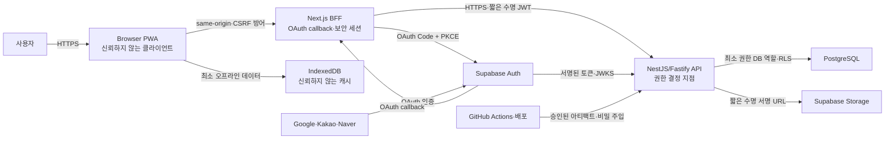

# 보안 아키텍처와 위협 모델

## 1. 범위와 보안 목표

이 문서는 Next.js PWA, NestJS/Fastify API, Supabase Auth, PostgreSQL, Supabase Storage, IndexedDB 오프라인 대기열, Google·Kakao·Naver OAuth를 대상으로 한다.

보안 목표는 다음 순서로 평가한다.

1. 사용자 간 재무 데이터 격리
2. 계정 탈취와 세션 재사용 방지
3. 거래·예산·자산 데이터의 무단 변경 및 중복 처리 방지
4. 비밀정보와 개인정보 유출 방지
5. 장애·공격·실수 후 복구 가능성

성능이나 편의 개선이 이 목표와 충돌하면 보안 목표를 우선한다.

## 2. 신뢰 경계

신뢰 경계마다 인증, 입력 검증, 최소 권한, 로그 마스킹, 실패 시 기본 거부를 적용한다. 프런트엔드에서 숨긴 버튼이나 UUID의 예측 난이도는 보안 통제가 아니다.

## 3. 자산과 데이터 분류

| 등급 | 데이터 | 저장 위치 | 필수 통제 |
|---|---|---|---|
| 제한 | service-role key, DB 자격 증명, OAuth client secret, 서명 키, refresh token, 비밀번호 재설정 토큰 | 비밀 저장소·인증 공급자 | 코드·Git·로그 금지, 최소 권한, 회전·폐기, 접근 감사 |
| 기밀 | 거래, 예산, 잔액, 자산, 계좌 별칭·끝 네 자리, 메모, CSV, 이메일, OAuth subject | PostgreSQL·Storage·제한된 IndexedDB | 사용자 격리, TLS, 저장 암호화, 최소 보존, 내보내기·삭제 감사 |
| 내부 | request ID, 배포 메타데이터, 마이그레이션 상태, 보안 감사 로그 | 로그 저장소·CI | 변조 방지, 접근 제한, 민감값 마스킹, 보존 정책 |
| 공개 | 공개 제품 문서와 비민감 정적 자산 | 저장소·CDN | 무결성, 공급망 검증 |

실제 은행 로그인 정보, 카드 인증 정보, 주민등록번호, 전체 계좌번호는 1단계에서 수집하지 않는다. 필요성이 생기면 별도 위협 모델과 법적 검토 없이 범위를 확장하지 않는다.

## 4. 공격자와 가정

- 다른 사용자의 UUID를 확보한 정상 사용자
- 탈취한 비밀번호나 OAuth 세션을 사용하는 공격자
- XSS·CSRF·SQL 인젝션·SSRF를 시도하는 인터넷 공격자
- 악성 CSV·영수증·OAuth 콜백을 보내는 공격자
- 손상된 npm 패키지, GitHub Action, 에이전트 스킬을 배포 경로에 넣는 공급망 공격자
- 운영 권한이나 비밀정보를 과도하게 가진 내부자
- 잠금 해제된 공유 PC 또는 분실 기기에 접근한 사람

브라우저와 기기는 완전히 신뢰할 수 없다고 가정한다. 관리형 서비스가 기본 암호화와 가용성을 제공하더라도 애플리케이션 권한 설정과 키 관리는 프로젝트 책임으로 남는다.

## 5. STRIDE 위협 분석

| 영역 | 주요 위협 | 필수 통제 | 검증 증거 |
|---|---|---|---|
| 인증·OAuth | 위장, 코드 가로채기, 계정 혼동 | Authorization Code + PKCE, `state`·`nonce`, 정확한 redirect URI, 공급자·issuer·audience 검증, 묵시적 계정 병합 금지 | 공급자별 정상·변조·재전송 E2E |
| 세션 | 토큰 탈취·재사용, 고정 세션 | 짧은 access token, 안전한 refresh token 보관, 회전·폐기, `Secure`·`HttpOnly`·`SameSite` 쿠키 또는 동등한 서버 세션, 로그아웃 시 서버 폐기 | 만료·회전·탈취 가정 테스트 |
| API | 객체 수준 권한 우회, 대량 할당, 주입 | 엔드포인트별 인증, 서버 유도 `userId`, DTO 허용 목록, 매개변수 SQL, 본문·페이지 크기 제한 | 사용자 A가 사용자 B 리소스에 접근하는 음성 테스트 |
| 데이터베이스 | 교차 사용자 읽기·변조, 권한 상승 | 모든 사용자 테이블의 `user_id`, 소유권 조건, RLS, `BYPASSRLS` 없는 앱 역할, 사용자 경계를 포함한 FK·인덱스 | 정책 테스트와 마이그레이션 검토 |
| 동기화 | 재전송, 순서 역전, 충돌 덮어쓰기 | client UUID, idempotency key, version 비교, 원자적 트랜잭션, tombstone, 충돌의 명시적 해결 | 중복·역순·두 기기 충돌 테스트 |
| IndexedDB | 공유 기기 노출, 변조, 오래된 권한 재사용 | 토큰 저장 금지, 최소 필드, 사용자·버전 네임스페이스, 로그아웃·탈퇴 시 삭제, 서버 재검증 | 저장소 검사와 로그아웃 삭제 E2E |
| CSV·파일 | 수식 삽입, 파서 공격, 악성 파일, 대량 업로드 | 크기·행 수·MIME·magic byte 제한, 격리 파싱, 수식 문자 중화, 짧은 보존, 서명 URL | 악성 샘플과 제한값 테스트 |
| 웹 UI | XSS, CSRF, 클릭재킹, 정보 노출 | 출력 인코딩, CSP nonce, 상태 변경 GET 금지, CSRF token·Origin 검증, `frame-ancestors`, 안전한 오류 | 보안 헤더·XSS·CSRF 자동 테스트 |
| 로그·관측 | 부인 방지 실패, 민감정보 유출, 로그 변조 | 인증·권한·내보내기·삭제 감사, UTC·request ID, 마스킹, 제한된 쓰기·읽기 권한, 경보 | 로그 스키마 테스트와 샘플 검토 |
| CI/CD | 비밀 유출, 악성 의존성·Action, 변조 빌드 | lockfile, SHA 고정 Action, 승인된 설치 스크립트, secret/SAST/SCA 검사, SBOM, 보호 브랜치 | CI 아티팩트와 승인 기록 |

## 6. 인증과 세션 통제

### 6.1 로그인

- 이메일 가입은 이메일 소유 확인을 완료해야 활성화한다.
- 로그인·가입·비밀번호 재설정은 계정 존재 여부를 구분하지 않는 응답을 사용한다.
- 속도 제한은 IP, 계정 식별자, 기기·세션 신호를 조합하고 정상 사용자를 영구 잠그지 않는다.
- Google, Kakao, Naver는 공급자별 최소 scope만 요청한다.
- OAuth는 Authorization Code + PKCE를 사용하고 `state`, OIDC `nonce`, redirect URI를 거래별로 검증한다.
- 동일 이메일만으로 계정을 병합하지 않는다. 로그인된 사용자의 최근 재인증 후 명시적으로 연결한다.
- 마지막 로그인 수단 해제, 이메일 변경, 전체 내보내기, 계정 삭제에는 최근 재인증을 요구한다.
- 운영·GitHub·Supabase 관리자 계정에는 MFA를 의무화한다.

### 6.2 토큰 저장과 검증

- refresh token은 `localStorage`, `sessionStorage`, IndexedDB에 저장하지 않는다.
- Next.js BFF가 OAuth code를 교환하고 refresh token을 `Secure`, `HttpOnly`, 적절한 `SameSite` 속성의 쿠키 또는 서버 측 불투명 세션으로 보호한다.
- 브라우저는 같은 origin의 BFF만 호출하며 access token을 JavaScript에 전달하지 않는다. BFF가 짧은 수명 JWT를 NestJS API의 서버 간 요청에 사용한다.
- API는 토큰 서명, 알고리즘, issuer, audience, 만료, not-before를 검증하고 JWKS 갱신 실패 시 기존 안전 캐시 범위를 벗어난 토큰을 거부한다.
- 로그아웃, 비밀번호 변경, 공급자 연결 해제, 계정 위험 감지 시 refresh token 계열을 폐기한다.

토큰 저장 방식은 구현 전에 ADR로 확정한다. 위 금지 조건을 만족하지 못한 구현은 기능 완성으로 간주하지 않는다.

## 7. 권한과 데이터베이스 통제

- API의 사용자 주체는 검증된 토큰에서만 얻는다.
- 모든 거래·계좌·카테고리·예산·반복 규칙·자산·가져오기·동기화 쿼리는 `user_id`를 조건에 포함한다.
- 전송 쌍, 카테고리 참조, 계좌 참조처럼 리소스를 연결하는 제약은 같은 사용자의 행끼리만 연결되게 한다.
- 애플리케이션 DB 역할은 superuser와 `BYPASSRLS`를 갖지 않는다. 요청 트랜잭션에 검증된 사용자 문맥을 설정하고 RLS를 두 번째 방어선으로 사용한다.
- service-role key는 일반 금융 쿼리에 사용하지 않는다. 인증 관리나 제한된 운영 작업은 별도 서비스와 최소 범위 함수로 격리한다.
- 금액 변경, 이체 생성, 동기화 push, 삭제는 트랜잭션으로 처리하고 일부 성공을 허용하지 않는다.
- 운영 DB 직접 접근은 개인 계정, MFA, 시간 제한 권한, 감사 로그를 요구한다.

## 8. API와 브라우저 통제

- API는 HTTPS만 제공하며 HSTS를 적용한다.
- CORS는 정확한 운영 origin 허용 목록을 사용하고 와일드카드와 credential 조합을 금지한다.
- 쿠키 인증 상태 변경 요청은 CSRF token과 `Origin` 또는 `Referer` 검증을 사용한다. `SameSite`는 단독 방어로 간주하지 않는다.
- `GET`, `HEAD`, `OPTIONS`는 서버 상태를 변경하지 않는다.
- JSON content type, 요청 본문 크기, 배열 길이, 페이지 크기, 문자열 길이, 날짜·금액 범위를 서버에서 제한한다.
- Drizzle의 매개변수 바인딩을 기본으로 하고 raw SQL은 정적 SQL과 바인딩 값으로만 작성한다. 정렬 열과 방향은 허용 목록으로 변환한다.
- 응답은 내부 예외, SQL, 스택, 파일 경로, 공급자 원문 오류를 노출하지 않고 `requestId`와 안전한 오류 코드만 제공한다.
- CSP nonce, `frame-ancestors 'none'`, `X-Content-Type-Options: nosniff`, 엄격한 `Referrer-Policy`, 최소 `Permissions-Policy`를 적용한다.
- 사용자 입력을 HTML로 직접 렌더링하지 않는다. 불가피한 리치 텍스트는 검증된 sanitizer와 허용 목록을 사용한다.

## 9. 오프라인·CSV·향후 파일 처리

### 9.1 IndexedDB

IndexedDB는 암호화된 금고가 아니라 사용자가 접근 가능한 기기의 캐시다. 보관 항목은 동기화에 필요한 최소 거래 필드, client UUID, idempotency key, version으로 제한한다. 로그아웃, 계정 전환, 탈퇴 완료 시 해당 사용자의 대기열과 캐시를 삭제한다. 변조된 로컬 데이터는 서버 스키마·소유권·버전 검사를 다시 통과해야 한다.

### 9.2 CSV

- 업로드 크기, 행 수, 열 수, 인코딩, 지원 헤더를 제한한다.
- 파일 확장자가 아니라 MIME과 내용 형식을 검증한다.
- 파서는 명령, 매크로, 외부 참조를 실행하지 않는다.
- 내보내기 값이 `=`, `+`, `-`, `@`, 탭, 캐리지 리턴으로 시작하면 스프레드시트 수식으로 실행되지 않게 중화한다.
- 가져오기 원본은 필요한 시간만 격리 보관하고 성공·취소·만료 후 삭제한다.
- 내보내기와 대량 가져오기는 재인증, 속도 제한, 감사 로그 대상이다.

### 9.3 OCR·금융기관 연동

후속 단계에서는 별도 위협 모델 승인이 필요하다. 영수증은 격리 bucket, magic byte·크기 검사, 악성코드 검사, 짧은 수명 서명 URL, 보존 만료를 사용한다. 서버가 외부 URL을 가져와야 하면 사용자 제공 URL을 직접 사용하지 않고 허용된 호스트·프로토콜·포트를 강제하며 사설·링크 로컬 주소를 차단한다. 금융기관 인증 정보는 직접 저장하지 않고 공급자의 짧은 수명 토큰과 최소 scope를 사용한다.

## 10. 비밀정보와 공급망

- `.env`와 운영 설정은 Git에서 제외하고 예시 파일에는 실제와 유사한 비밀값을 넣지 않는다.
- 비밀정보는 생성, 승인, 사용, 회전, 폐기, 만료 이력을 관리한다.
- 개발·스테이징·운영은 서로 다른 키와 DB 역할을 사용한다.
- lockfile을 커밋하고 CI는 고정 설치를 사용한다.
- 새 직접 의존성은 유지보수 상태, 소유권, 라이선스, 설치 스크립트, 알려진 취약점을 검토한다.
- GitHub Actions는 가능한 경우 전체 commit SHA로 고정하고 워크플로 변경에 별도 리뷰를 요구한다.
- 저장소 로컬 에이전트 스킬과 훅도 실행 가능한 공급망 코드로 취급해 업데이트 diff와 네트워크·환경 변수 접근을 검토한다.
- 릴리스마다 SBOM을 만들고 배포 아티팩트와 연결한다.
- CI·빌드 로그는 비밀값을 마스킹하고 fork나 신뢰하지 않는 PR에 운영 secret을 제공하지 않는다.

## 11. 보안 로그와 경보

다음 이벤트는 성공과 실패를 구분해 기록한다.

- 로그인, 로그아웃, 비밀번호 재설정, 세션 회전·폐기
- OAuth 공급자 연결·해제, 이메일 변경, 마지막 로그인 수단 해제 차단
- 반복된 인증 실패, 속도 제한, 토큰 검증 실패
- 권한 거부와 사용자 간 리소스 접근 시도
- 전체 데이터 내보내기, 대량 가져오기, 계정 삭제
- 운영 권한 변경, 비밀정보 회전, 마이그레이션, 백업·복구

로그에는 UTC 시각, 이벤트 코드, 결과, request ID, 해시 또는 내부 사용자 ID, 위험 신호를 기록한다. 비밀번호, access·refresh token, 쿠키, OAuth code, DB 연결 문자열, 전체 계좌 식별자, 거래 메모 원문, CSV 원문은 기록하지 않는다. 로그는 애플리케이션 수정 권한과 분리하고 최소 90일 동안 검색 가능하게 유지하는 것을 운영 목표로 한다.

경보는 짧은 시간의 다수 로그인 실패, 여러 사용자 리소스에 대한 권한 거부, 비정상 대량 내보내기, 운영 비밀정보 접근, CI secret 탐지에 연결한다.

## 12. 개인정보 수명주기와 복구

- 목적이 없는 개인정보와 분석 식별자는 수집하지 않는다.
- 계정 화면에서 저장 데이터 범위, 연결된 공급자, 내보내기, 삭제 상태를 확인할 수 있게 한다.
- 탈퇴는 새 세션을 차단한 뒤 인증 계정, 금융 데이터, 파일, 오프라인 삭제 신호를 순서대로 처리하고 감사 결과를 남긴다.
- 백업은 암호화하고 운영 DB와 다른 권한 경계에 보관한다.
- 복구 연습은 분기별로 수행하며 복구 후 권한 정책과 데이터 정합성을 함께 검증한다.
- 백업 보존과 삭제 지연은 사용자 안내와 운영 문서에 명시한다.

## 13. 핵심 오용 사례와 수용 테스트

1. 사용자 A가 사용자 B의 거래 UUID로 조회·수정·삭제해도 존재 여부를 노출하지 않고 거부한다.
2. 사용자 A가 사용자 B의 계좌·카테고리를 자신의 거래에 연결할 수 없다.
3. 변조·만료·잘못된 issuer·audience의 JWT를 모두 거부한다.
4. 탈취한 OAuth authorization code를 다른 브라우저나 재전송 요청에서 교환할 수 없다.
5. 동일 이메일의 다른 공급자 계정이 자동 병합되지 않는다.
6. 같은 `idempotency_key`를 반복 전송해도 금융 행이 한 번만 생성된다.
7. 오래된 version의 업데이트가 최신 거래를 조용히 덮어쓰지 않는다.
8. 로그아웃·계정 전환 후 이전 사용자의 IndexedDB 데이터가 표시되거나 전송되지 않는다.
9. SQL·HTML·CSV 수식 페이로드가 실행되지 않고 데이터로 처리된다.
10. cross-site 상태 변경 요청과 허용되지 않은 origin을 거부한다.
11. 로그·오류·URL·분석 이벤트에서 비밀정보와 거래 원문을 찾을 수 없다.
12. CI에서 실제 형식의 secret, 치명적·높음 의존성 위험, 실패한 권한 테스트가 발견되면 병합이 차단된다.

## 14. 잔여 위험과 별도 승인 대상

- 웹 오프라인 데이터는 잠금 해제된 기기와 XSS에 노출될 수 있다. 최소 저장, 빠른 삭제, CSP, 출력 인코딩으로 위험을 줄이지만 웹 플랫폼에서 완전한 기기 보안을 보장하지 않는다.
- 관리형 Auth와 DB의 가용성·내부 통제는 공급자에 의존한다. 상태 모니터링, 백업, 최소 권한, 공급자 사고 대응 절차가 필요하다.
- 사용자 MFA는 1단계 필수 범위가 아니지만 운영 관리자 MFA는 필수다. 사용자 MFA를 제외한 결정은 첫 공개 출시 전에 재검토한다.
- 가족 공유, OCR, 금융기관 자동 연동은 현재 모델보다 권한·파일·외부 토큰 위험이 크므로 기존 승인만으로 구현하지 않는다.

## 15. 후속 관리자 페이지 보안 경계

관리자 페이지는 사용자용 핵심 앱의 구현과 보안 검증이 끝난 뒤 별도 설계·위협 모델·구현 계획으로 진행한다. 현재 앱의 숨겨진 라우트나 일반 사용자 role 확장으로 추가하지 않는다.

후속 설계의 최소 조건은 다음과 같다.

- 사용자 앱과 분리된 호스트·배포·세션·권한 경계를 사용한다.
- 관리자 계정은 일반 사용자 계정과 분리하고 MFA를 의무화한다.
- 역할 기반 최소 권한과 필요 시 시간 제한 승격을 적용한다.
- 재무 데이터 원문은 기본적으로 조회할 수 없고, 지원·사고 대응 목적의 접근은 사유·승인·만료를 요구한다.
- 사용자 가장 기능은 제공하지 않는다. 지원 재현이 필요하면 가짜 데이터 또는 사용자가 승인한 제한 세션을 별도로 설계한다.
- 사용자 조회, 내보내기, 잠금, 복구, 삭제, 권한 변경을 변경 전후 값과 함께 감사한다.
- 브라우저에 service-role key나 운영 secret을 전달하지 않으며, 고위험 작업은 별도 서버 명령과 재인증을 요구한다.
- 관리자 API는 별도 rate limit, 네트워크 접근 정책, 경보, 정기 권한 재인증을 적용한다.
- 관리자 기능 구현 전 독립 보안 검토와 침투 테스트 범위를 확정한다.

이 문서는 설계 단계의 보안 기준이다. 코드 구현 후에는 실제 엔드포인트, 정책, 인프라, 의존성을 대상으로 별도의 보안 감사를 수행한다.

## 16. 무료 플랜 CI/CD 보완 계층

GitHub 서버는 현재 무료 플랜의 비공개 저장소에서 `main` PR 의무화, 강제 push·삭제 차단, secret scanning과 push protection을 강제하지 못한다. 설정 API 확인은 branch protection/rulesets에서 HTTP 403, secret scanning/push protection에서 HTTP 422를 반환했다. Dependabot vulnerability alerts와 automated security fixes는 별도로 활성화되어 있다.

첫 번째 계층은 `.githooks/pre-push`가 실행하는 공통 Node 보안 게이트다. 이 계층은 push 정책과 저장소 구조를 확인한 뒤, push가 도입하는 모든 커밋의 전체 tree blob을 검사한다. 신규 ref는 head에서 도달 가능한 전체 이력을 검사한다. shallow 이력, Git 판독 실패와 잘못된 SHA는 fail closed로 중단한다. 5 MiB 초과 blob은 수동 승인으로 우회할 수 없으며 파일 제거·검토된 별도 저장·또는 보안 검토와 회귀 테스트를 거친 검사 코드/한도 변경 전까지 push와 merge를 막는다. 비밀정보 탐지는 실제 일치 값을 출력하지 않고 JSON escape한 경로와 규칙 ID만 보고한다.

두 번째 계층은 같은 CLI를 실행하는 `.github/workflows/security-gate.yml`이다. workflow는 `contents: read`, SHA-pinned Action, `fetch-depth: 0`, `persist-credentials: false`를 사용하며 저장소 secret을 참조하지 않는다. 각 push의 concurrency group에는 고유한 `github.sha`가 들어가고 push 실행은 취소되지 않으므로 같은 ref의 연속 변경도 누락 없이 검사한다. 최신 상태만 필요한 PR 실행에만 `cancel-in-progress`를 적용한다. 구조 정책과 canonical 전체 파일 digest 테스트가 workflow의 권한 또는 실행 경로 변경을 감시한다.

로컬 계층은 `--no-verify`로 우회할 수 있고 CI 계층은 원격에 도달한 변경을 사후 탐지할 뿐 되돌리지 못한다. 따라서 PR 작성자는 동일 SHA의 로컬·CI 성공과 [수동 검증 체크리스트](verification-checklist.md)를 함께 증거로 남겨야 한다. 설치 및 사고 절차와 서버 측 통제 전환 조건은 [무료 플랜 보완 통제](free-plan-compensating-controls.md)에 정의한다.
