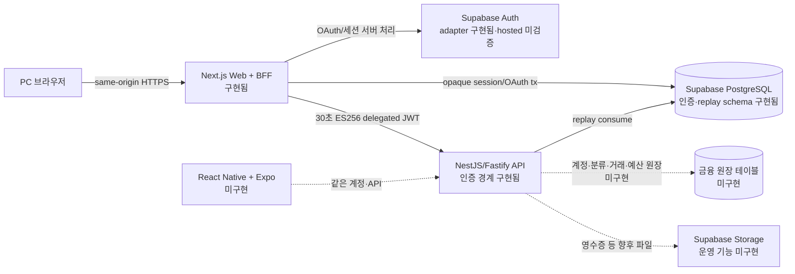
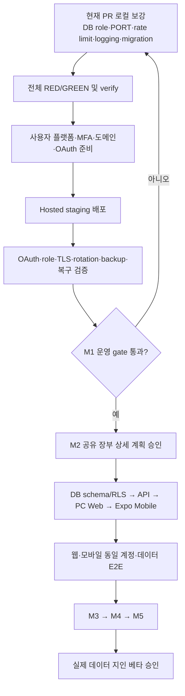

# Account Book 개발 진행 현황

> - 기준일: 2026-08-24
> - 기준 브랜치: `feature/financial-mutation-boundary`
> - 기준 커밋: `51a9667511058395c4f72e4af42e2e4c25b243dc`
> - 작업 PR: [#4 Financial mutation boundary](https://github.com/jawon0407/account-book/pull/4) — Draft
> - 문서 목적: 지금까지 구현된 범위, 아직 구현되지 않은 범위, 출시 전 차단 조건과 다음 작업 순서를 한곳에서 확인한다.

이 문서는 특정 시점의 진행 스냅샷이다. 상태가 충돌하면 해당 시점의 코드, 동일 SHA의 CI 결과, 보안 체크리스트를 우선한다. 실제 secret 값, 사용자 금융 데이터, 운영 credential은 이 문서에 기록하지 않는다.

## 1. 한눈에 보는 결론

현재 저장소는 **인증·보안 기반과 금융 변경 요청의 신뢰 경계가 구현된 상태**다. PC 웹에서 실제 거래를 생성·조회하는 장부 기능과 별도의 Android/iOS 앱은 아직 구현되지 않았다. 따라서 지금 단계는 실제 금융정보를 저장하는 지인 베타를 시작할 수 있는 제품 완성 상태가 아니다.

| 구분                       | 상태                 | 판단                                                                           |
| -------------------------- | -------------------- | ------------------------------------------------------------------------------ |
| 저장소·TypeScript·CI 기반  | ✅ 구현 및 자동 검증 | pnpm monorepo, 엄격한 TypeScript, lint/typecheck/test/build/audit gate가 있다. |
| 서버 소유 인증 경계        | ✅ 로컬·CI 구현      | opaque session, OAuth transaction, recovery, BFF 인증 경계가 구현됐다.         |
| BFF → API delegated JWT    | ✅ 로컬·CI 구현      | 30초 ES256 토큰, request binding, scope, one-time replay 방어가 구현됐다.      |
| 실제 hosted 인증·운영 검증 | 🔒 미실행            | Vercel·Heroku·Supabase와 Google·Kakao·Naver 실환경 증거가 필요하다.            |
| 금융 변경 보안 경계        | 🟡 기반 구현         | 계약·raw body·framing·검증 matrix는 있으나 운영 거래 API는 없다.               |
| PC 웹 가계부 기능          | ⬜ 미구현            | 계정·분류·거래·예산·대시보드 UI와 운영 route가 없다.                           |
| 별도 모바일 앱             | ⬜ 미구현            | `apps/mobile`과 Expo/React Native 설정이 아직 없다.                            |
| 웹·모바일 데이터 동기화    | ⬜ 미구현            | 공유 장부 데이터 모델과 양쪽 클라이언트가 없어 검증할 수 없다.                 |
| 지인 베타 출시             | 🚫 No-go             | 실제 데이터 저장 전 hosted 보안·백업·복구·운영 gate가 남아 있다.               |

상태 기호는 다음을 뜻한다.

- ✅: 코드와 자동 검증이 존재한다.
- 🟡: 일부 기반 또는 설계만 존재하며 사용자 기능은 완성되지 않았다.
- ⬜: 구현 전이다.
- 🔒: 외부 플랫폼 계정·실제 credential·사용자 결정이 있어야 검증할 수 있다.
- 🚫: 현재 상태로 출시하거나 실제 금융 데이터를 넣으면 안 된다.

## 2. 확정된 제품 방향

최신 승인 설계는 [웹·네이티브 모바일 공유 장부 설계](../superpowers/specs/2026-07-27-web-native-mobile-shared-ledger-design.md)다.

- PC: Next.js 기반 웹을 사용한다.
- 모바일: PWA 설치형이 아니라 React Native + Expo 기반의 별도 Android/iOS 앱을 만든다.
- 인증과 데이터: 같은 사용자 계정, 같은 Node API, 같은 PostgreSQL 장부를 사용한다.
- 동기화: 웹 DB와 모바일 DB를 복제하는 방식이 아니라 서버의 단일 원장을 두 클라이언트가 읽고 쓴다.
- 현재 우선순위: 웹과 Android를 먼저 완성하고, iOS도 같은 코드 기반에서 지원한다.
- 초기 범위 제외: 금융기관 자동 연동, OCR, 관리자 페이지, 복잡한 오프라인 쓰기 동기화는 핵심 가계부 완성 후 별도 단계로 진행한다.

루트 `PRODUCT.md`와 일부 이전 계획의 PWA 표현은 과거 방향을 담고 있다. 이 진행 현황과 최신 승인 설계가 현재 구현 방향이며, 제품 명세 전체 정리는 장부 구현 계획을 확정할 때 함께 수행해야 한다.

## 3. 현재와 목표 아키텍처

중요한 경계는 다음과 같다.

1. 브라우저는 Supabase PostgreSQL이나 Heroku API를 직접 호출하지 않는다.
2. Next.js BFF는 브라우저의 opaque session을 검증하고 필요한 최소 scope의 짧은 delegated JWT를 만든다.
3. API는 서명, issuer/audience, 만료, scope, method/path/query/body binding과 `jti` 재사용을 다시 검증한다.
4. 현재 API의 PostgreSQL 사용은 replay 방어 중심이다. 실제 금융 원장 repository와 테이블은 아직 없다.
5. 모바일도 완성 후에는 동일 API를 사용해야 하며 데이터베이스 credential을 앱에 포함하지 않는다.

## 4. 마일스톤 1~5 실제 상태

| 마일스톤                          | 목표                                         | 현재 상태                            | 완료에 필요한 핵심 작업                                                         |
| --------------------------------- | -------------------------------------------- | ------------------------------------ | ------------------------------------------------------------------------------- |
| M1 기반·보안·인증                 | 저장소, 인증, BFF/API 신뢰 경계              | 🟡 코드·CI 완료 / hosted gate 미완료 | 배포 준비 코드, 실제 플랫폼 배포, OAuth 3종, role·pooler·TLS·rotation·복구 검증 |
| M2 공유 장부와 두 클라이언트 기반 | 계정·분류·거래·대시보드, 웹·모바일 공통 계약 | 🟡 변경 보안 경계만 구현             | 장부 schema/RLS/repository/API, PC 웹 화면, Expo 앱, 교차 클라이언트 smoke      |
| M3 확장 가계부                    | 예산, 반복 거래, 자산, 통계                  | ⬜ 미구현                            | M2 안정화 후 도메인·화면·테스트 구현                                            |
| M4 교차 클라이언트 일관성         | 충돌·새로고침·세션·동시성 검증               | ⬜ 미구현                            | 웹·모바일 동일 데이터 E2E, 낙관적 동시성, 오류·재시도 정책                      |
| M5 가져오기·내보내기·출시 운영    | CSV, 배포·관측·복구·릴리스                   | ⬜ 미구현                            | import/export 검증, 실제 배포 파이프라인, 로그·경보·백업·복구 증거              |

M1을 “완료”라고 표현할 수 있는 범위는 로컬 코드와 disposable CI까지다. 실제 플랫폼에서 같은 보안 속성이 증명되기 전에는 운영 완료나 베타 출시 완료로 간주하지 않는다.

## 5. 지금까지 구현된 부분

### 5.1 프로젝트와 개발 기반

- pnpm workspace 기반 monorepo 구조가 있다.
- 프론트엔드는 `.ts`/`.tsx`와 엄격한 TypeScript 설정을 사용한다.
- 웹 API 통신은 `ky`, 서버 상태 관리는 TanStack Query를 사용한다.
- 구조 검사, lint, typecheck, unit/integration test, production build, production dependency audit가 CI 보안 gate에 연결돼 있다.
- `.gitignore`는 `.env`, `.env.*`를 제외하고 예시 파일만 허용한다. 현재 추적된 실제 env 파일은 없다.

### 5.2 웹 인증과 BFF

- 이메일 인증, Google·Kakao·Naver OAuth를 수용하는 서버 소유 adapter 경계가 있다.
- 로그인, callback, session, logout, recovery 등을 처리하는 14개 same-origin Next.js route가 있다.
- route는 Node.js runtime, 동적 실행, `iad1`, 최대 실행 시간 10초 정책으로 고정돼 있다.
- 브라우저에는 `__Host-ab_session` opaque cookie만 노출하고 provider token은 서버와 PostgreSQL 경계 밖으로 내보내지 않는다.
- 반응형 인증 UI와 loading/error 상태, 안전한 capability facade가 구현돼 있다.

### 5.3 API 인증 경계

- NestJS/Fastify API와 `/health`, 보호된 `/v1/me`가 있다.
- BFF가 발급하는 ES256 delegated JWT의 수명은 30초다.
- static P-256 public keyring, issuer/audience, scope, request ID, method/path/query/body binding을 검증한다.
- PostgreSQL-backed one-time `jti` replay consume은 실패 시 차단하는 fail-closed 방식이다.
- key rotation을 위한 current/previous key 구조와 kill switch 경계가 코드와 테스트에 있다.
- 내부 API 호출은 허용된 header만 전달하고 3초 timeout을 사용한다.

### 5.4 데이터베이스 기반

- opaque session, OAuth transaction, recovery/security state 관련 인증 schema와 adapter가 있다.
- delegated JWT replay 저장 schema가 있다.
- API DB 연결은 `API_DATABASE_URL`, 정확한 `app_api` 사용자, 외부 host TLS, pool 최대 5를 검증한다.
- migration/owner 권한을 런타임에서 사용하지 않는 역할 분리 설계가 문서화돼 있다.

### 5.5 금융 변경 요청 경계

- `account`, `category`, `transaction`, `dashboard`에 대한 read/write scope 계약이 정의돼 있다.
- 최대 JWT 크기, 최대 JSON body 32 KiB, canonical request binding 규칙이 있다.
- BFF signer와 fetch가 동일한 불변 body를 사용하도록 clone-on-entry 방어가 적용됐다.
- 한 바이트 body 변경, query 변경, scope 부족, replay, 만료, duplicate raw header, 초과 body를 거부하는 negative matrix가 있다.
- 이 구현은 **향후 거래 저장 API를 안전하게 만들기 위한 경계**다. 현재 운영용 거래 저장 route나 거래 repository가 생겼다는 뜻은 아니다.

## 6. 현재 PR에서 부분 완료된 작업

PR #4는 금융 변경 경계 Task 1~7의 로컬 구현과 검증을 담고 있다. 현재 Draft이며 자동 CI는 통과했지만 hosted 운영 증거가 없어 merge-ready로 판정하지 않는다.

이미 승인됐지만 아직 코드로 구현하지 않은 다음 보강 작업도 같은 PR에서 이어갈 예정이다.

- BFF 전용 연결 변수 `BFF_DATABASE_URL`로 분리한다.
- `app_session_bff`를 password 없는 migration 정의의 최소 권한 `LOGIN NOINHERIT NOBYPASSRLS` role로 전환한다.
- BFF DB 사용자는 정확히 `app_session_bff`인지 검사하고 owner, `postgres`, service-role, `BYPASSRLS` 계열을 거부한다.
- 외부 DB host에는 TLS를 강제한다.
- BFF pool을 최대 1로 제한하고 connection acquire + query 합계 2초 budget을 둔다.
- Heroku가 제공하는 `PORT`를 안전하게 읽고 시작 명령/배포 설정을 추가한다.
- BFF 인증과 API principal+route 기준 persistent rate limit을 구현한다.
- 승인된 GitHub Actions 또는 Heroku one-off 방식의 production migration 주체를 고정한다.
- 공통 request ID를 갖는 구조화 로그, redaction, 경보 기준을 추가한다.
- 백업·오프사이트 보관·복구 훈련 절차를 실행 가능한 형태로 연결한다.

위 목록은 이 문서 작성 시점의 **승인된 다음 구현 범위**이며, 완료 목록이 아니다.

## 7. 아직 개발되지 않은 제품 기능

### 7.1 M2 핵심 장부

- 금융 계정: 현금, 은행, 카드 등 사용자 계정 모델
- 카테고리: 수입·지출 분류와 사용자별 소유권
- 거래: 생성·조회·수정·삭제, 금액·일자·메모·분류
- 대시보드: 기간별 수입·지출·잔액·카테고리 집계
- PostgreSQL 금융 schema, migration, RLS/소유권 정책
- repository/use-case/controller와 운영 API route
- PC 웹의 실제 장부 화면과 입력 폼
- 모바일 React Native + Expo 프로젝트와 핵심 화면
- 같은 계정으로 웹에서 저장한 거래가 모바일에 나타나는 교차 클라이언트 E2E

### 7.2 M3~M5

- 월 예산, 반복 거래, 자산 현황, 통계·그래프
- 동시 수정 충돌, version 검사, 재시도·새로고침 정책
- CSV 가져오기·내보내기와 악성 파일·수식 주입 방어
- Android/iOS 서명, 배포 채널, 버전·릴리스 운영
- 관측성 dashboard, 오류율·지연 경보, 한국망 p95 기록
- 자동 백업, 오프사이트 암호화 백업, 실제 복구 증거

### 7.3 후속 목표

- 영수증 OCR
- 토스·카드사 등 금융기관 자동 연동
- 관리자 페이지

이 세 범위는 보안·규제·운영 부담이 크므로 기본 가계부와 지인 베타가 안정화된 뒤 별도 설계와 승인 절차로 진행한다.

## 8. 보안 상태와 출시 차단 조건

### 8.1 코드와 CI에서 확인된 통제

- 브라우저에 DB/API credential과 provider token을 노출하지 않는다.
- opaque session, server-owned PKCE/OAuth transaction, recovery state를 사용한다.
- delegated JWT는 최소 scope, 30초 수명, request binding, one-time replay 방어를 사용한다.
- duplicate/ambiguous header와 body framing 오류를 fail-closed로 거부한다.
- 프로덕션 의존성 audit와 비밀정보 패턴 검사를 CI에 포함한다.
- disposable PostgreSQL과 실제 Chromium 기반 인증 경로를 CI에서 검증한다.

### 8.2 실제 데이터 저장 전 반드시 남겨야 하는 증거

- Vercel Node.js Function, Heroku Common Runtime, Supabase hosted DB의 실제 TLS와 최소 권한 role 검증
- Supavisor/PgBouncer 연결 문자열 분리와 최대 연결 수 검증
- Google·Kakao·Naver별 callback, state, 취소, email 누락, scope 차이의 hosted smoke
- BFF 인증 brute-force 및 API abuse에 대한 persistent rate-limit regression과 관측
- current/previous key rotation, 이전 키 제거, kill switch 훈련
- 로그에 cookie, authorization, token, connection string, 금융 메모가 남지 않는지 hosted redaction 확인
- 승인된 migration SHA와 실행자·실행 위치 기록
- 자동 백업, 별도 공급자 오프사이트 백업, 암호화 키 분리, 실제 복구 훈련
- 사용자 간 금융 데이터 격리와 RLS 우회 불가 증거
- 한국 사용자 데이터가 해외 리전에 저장될 수 있다는 고지 및 개인정보·국외 이전 문안 승인
- 지인 베타 전 전문 침투 테스트 또는 이에 준하는 독립 보안 검토

세부 기준은 [보안 아키텍처](../security/security-architecture.md), [보안 검증 체크리스트](../security/verification-checklist.md), [인증 보안 테스트 가이드](../guides/security-auth-testing.md)를 따른다.

## 9. 테스트와 현재 증거

기준 SHA `51a9667511058395c4f72e4af42e2e4c25b243dc`에서 확인된 최신 증거는 다음과 같다.

| 항목                          | 결과                                                                                                      |
| ----------------------------- | --------------------------------------------------------------------------------------------------------- |
| 로컬 `pnpm verify`            | 829/829 tests, 6/6 typecheck, production build 성공                                                       |
| `pnpm audit --prod`           | 알려진 production vulnerability 0건                                                                       |
| 동일 SHA push CI              | [GitHub Actions run 32158792436](https://github.com/jawon0407/account-book/actions/runs/32158792436) 성공 |
| 동일 SHA PR CI                | [GitHub Actions run 32158800903](https://github.com/jawon0407/account-book/actions/runs/32158800903) 성공 |
| disposable PostgreSQL         | CI에서 검증됨                                                                                             |
| 실제 Chromium 인증 E2E        | CI에서 검증됨                                                                                             |
| hosted Vercel/Heroku/Supabase | 미실행                                                                                                    |
| live Google·Kakao·Naver       | 미실행                                                                                                    |

RED/GREEN은 테스트 주도 개발의 상태를 뜻한다.

- RED: 필요한 동작을 설명하는 테스트를 먼저 작성하고, 구현이 없거나 잘못돼 의도한 이유로 실패하는 단계다.
- GREEN: 필요한 최소 구현을 추가해 같은 테스트와 관련 회귀 테스트가 통과하는 단계다.
- 이후: 중복을 정리하고 다시 전체 검증해 동작과 보안 경계가 유지되는지 확인한다.

disposable CI 성공은 재현 가능한 코드 증거지만 실제 플랫폼의 role, TLS, OAuth 설정, 백업, 운영 경보를 대신하지 않는다.

## 10. 역할별 남은 작업

### 10.1 Codex가 플랫폼 계정 없이 진행할 수 있는 작업

1. 현재 PR의 BFF DB role/connection hardening을 TDD로 구현한다.
2. Heroku `PORT`와 production start/deploy 설정을 추가한다.
3. persistent rate limit, 구조화 로그·redaction, migration workflow의 코드와 테스트를 만든다.
4. hosted smoke와 rotation/kill-switch/backup drill을 실행할 스크립트·runbook을 보강한다.
5. M2 장부를 별도 승인된 실행 계획으로 분해한다.
6. 금융 schema → repository → API → PC 웹 → Expo 모바일 → 교차 클라이언트 E2E 순으로 구현한다.
7. 모든 단계에서 RED/GREEN 기록, 한국어 개발 흐름, 매개변수와 보안 판단을 문서화한다.

### 10.2 사용자가 직접 해야 하거나 최종 승인해야 하는 작업

1. Vercel·Heroku·Supabase 프로젝트 생성, 요금제·결제 승인
2. GitHub와 각 플랫폼 관리자 계정 MFA 설정 및 복구 코드의 안전한 오프라인 보관
3. 실제 도메인과 production canonical origin 결정
4. Google·Kakao·Naver 개발자 앱 생성, 필요한 심사·비즈니스 권한 처리
5. provider별 정확한 OAuth callback URL 등록
6. 실제 secret을 GitHub/Vercel/Heroku/Supabase의 secret 관리 화면에 직접 입력
7. Supabase hosted 연결 정보와 최소 권한 runtime credential 발급
8. 개인정보 처리, 국외 이전, 베타 고지 문안의 최종 승인
9. 지인 베타 대상과 실제 금융 데이터 저장 시작 시점 승인
10. Play Console 등록·배포 계정 관련 비용과 약관 승인

구체적인 플랫폼 순서는 [플랫폼·OAuth 온보딩 가이드](../guides/platform-and-oauth-onboarding.ko.md)를 따른다. secret 값은 채팅, Git, 이슈, PR, 문서에 전달하지 않고 플랫폼 secret 화면에만 입력한다.

## 11. 권장 진행 순서

바로 다음 개발 작업은 현재 PR에서 승인된 BFF 데이터베이스 경계를 구현하는 것이다. 이 작업이 끝나도 hosted 증거 없이 PR을 운영 준비 완료로 표시하지 않는다. 그다음 M2는 금융 도메인 전체를 다루므로 [금융 변경 경계 계획](../superpowers/plans/2026-07-27-financial-mutation-boundary.md)의 보안 원칙을 유지하면서 별도의 세부 구현 계획을 승인받아 진행한다.

## 12. 참고 문서

- [전체 개발 흐름 설명](../guides/full-stack-development-flow.ko.md)
- [백엔드 인증 아키텍처](../architecture/backend-authentication.ko.md)
- [인증 데이터베이스 구조](../database/auth-schema.ko.md)
- [백엔드 인증 운영 가이드](../guides/backend-auth-operations.ko.md)
- [테스트 가이드](../guides/testing.md)
- [로드맵](../roadmap/README.md)
- [웹·네이티브 모바일 공유 장부 설계](../superpowers/specs/2026-07-27-web-native-mobile-shared-ledger-design.md)
- [금융 변경 경계 구현 계획](../superpowers/plans/2026-07-27-financial-mutation-boundary.md)

## 13. 다음 점검 때 갱신할 항목

- 기준 branch/SHA/PR과 CI URL
- `pnpm verify`의 실제 테스트 수와 build/audit 결과
- M1 hosted gate의 통과·미통과 증거
- M2 schema/API/web/mobile 구현률
- 보안 체크리스트의 담당자·기한·증거 링크
- 사용자 작업과 Codex 작업 중 새롭게 해소되거나 추가된 항목
