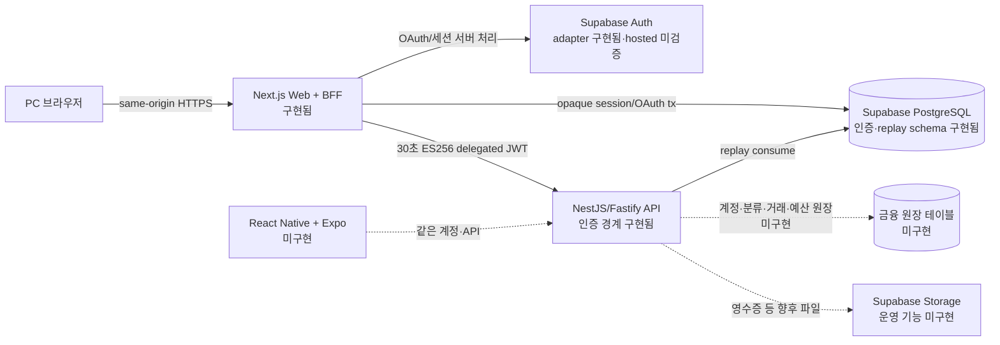
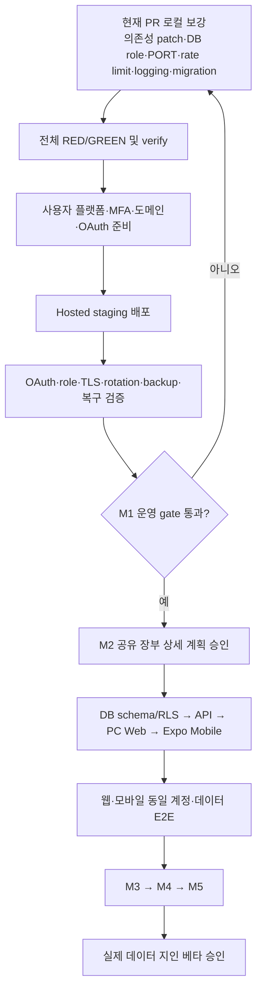

# Account Book 개발 진행 현황

> **전송 준비 추가 (2026-09-09):** 아래 미커밋 기록 이후 사용자가 커밋·푸시를 승인했다. 전송 전 verify·운영 audit 재검증은 종료 코드 0이다. 실제 전송/CI 상태는 해당 브랜치 HEAD로 확인하며, PR 생성·병합·배포는 수행 범위가 아니다. 다음 리전 설정 대안·후보 22파일·검증 순서는 [계획서 8절](../superpowers/plans/2026-09-09-next-security-update.md#8-다음-작업-사전-검토--구현-승인-대기)에 기록했다. 다음 제품 코드 변경은 승인 대기다.

> **최신 추가 (2026-09-09):** 사용자 승인 후 `hotfix/next-security-20260909`에서 Next 16.3.3·baseline-browser-mapping 2.11.0으로 보안 업데이트했다. 기준 커밋은 `a36f719`이고 수정은 아직 미커밋이다. 로컬 verify(873 tests·lint·타입·API/웹 빌드), 운영 audit 0건, 공개 인증 화면 15조합 검증을 통과했다. 실제 DB/인증 전체 E2E·새 CI·배포는 미실행이다. `preferredRegion` 사용 중단 경고의 배포 정책 검토를 별도 승인 과제로 추가했다. [검증 기록](../guides/security-auth-testing.md), [실행 계획](../superpowers/plans/2026-09-09-next-security-update.md), [상시 작업 승인 절차](../guides/change-workflow.ko.md)를 참고한다. 아래 9월 8일 안내와 1~13절은 과거 기록이다.

> **최신 안내 (2026-09-08):** 이 파일의 1~13절은 8월 24일 스냅샷이며 PR 번호·미해결 의존성 수치·다음 작업 순서는 당시 기록입니다. 현재 분야별 상태는 [문서 지도](../README.md), 최근 코드 변경은 아래 날짜별 기록을 우선합니다. 현재 작업 브랜치는 `feature/ledger-public-contracts`, 기준 HEAD는 `5cc94601c74a1e08f848a0cbc0bde191e7a47f81`입니다. PR #9 보안 패치는 병합됐고 PR #8의 해당 SHA CI가 통과했습니다. 로컬 UUID 수정과 이번 주석·문서 변경은 그 CI 이후 작업입니다.

> - 기준일: 2026-08-24
> - 기준 브랜치: `feature/financial-mutation-boundary`
> - 기준 커밋: `51a9667511058395c4f72e4af42e2e4c25b243dc`
> - 작업 PR: [#4 Financial mutation boundary](https://github.com/jawon0407/account-book/pull/4) — Draft
> - 문서 목적: 지금까지 구현된 범위, 아직 구현되지 않은 범위, 출시 전 차단 조건과 다음 작업 순서를 한곳에서 확인한다.

이 문서는 특정 시점의 진행 스냅샷이다. 상태가 충돌하면 해당 시점의 코드, 동일 SHA의 CI 결과, 보안 체크리스트를 우선한다. 실제 secret 값, 사용자 금융 데이터, 운영 credential은 이 문서에 기록하지 않는다.

## 1. 한눈에 보는 결론

현재 저장소는 **인증·보안 기반과 금융 변경 요청의 신뢰 경계가 구현된 상태**다. PC 웹에서 실제 거래를 생성·조회하는 장부 기능과 별도의 Android/iOS 앱은 아직 구현되지 않았다. 따라서 지금 단계는 실제 금융정보를 저장하는 지인 베타를 시작할 수 있는 제품 완성 상태가 아니다.

| 구분                       | 상태                 | 판단                                                                           |
| -------------------------- | -------------------- | ------------------------------------------------------------------------------ |
| 저장소·TypeScript·CI 기반  | ✅ 구현 및 자동 검증 | pnpm monorepo, 엄격한 TypeScript, lint/typecheck/test/build/audit gate가 있다. |
| 개발 의존성 보안           | ✅ patched           | brace-expansion 5.0.9·undici 7.29.0으로 개발 의존성 audit 7건을 해소했고 전체 audit가 통과했다. |
| 서버 소유 인증 경계        | ✅ 로컬·CI 구현      | opaque session, OAuth transaction, recovery, BFF 인증 경계가 구현됐다.         |
| BFF → API delegated JWT    | ✅ 로컬·CI 구현      | 30초 ES256 토큰, request binding, scope, one-time replay 방어가 구현됐다.      |
| 실제 hosted 인증·운영 검증 | 🔒 미실행            | Vercel·Heroku·Supabase와 Google·Kakao·Naver 실환경 증거가 필요하다.            |
| 금융 변경 보안 경계        | 🟡 기반 구현         | 계약·raw body·framing·검증 matrix는 있으나 운영 거래 API는 없다.               |
| PC 웹 가계부 기능          | ⬜ 미구현            | 계정·분류·거래·예산·대시보드 UI와 운영 route가 없다.                           |
| 별도 모바일 앱             | ⬜ 미구현            | `apps/mobile`과 Expo/React Native 설정이 아직 없다.                            |
| 웹·모바일 데이터 동기화    | ⬜ 미구현            | 공유 장부 데이터 모델과 양쪽 클라이언트가 없어 검증할 수 없다.                 |
| 지인 베타 출시             | 🚫 No-go             | 실제 데이터 저장 전 hosted 보안·백업·복구·운영 gate가 남아 있다.               |

상태 기호는 다음을 뜻한다.

- ✅: 코드와 자동 검증이 존재한다.
- 🟡: 일부 기반 또는 설계만 존재하며 사용자 기능은 완성되지 않았다.
- ⬜: 구현 전이다.
- 🔒: 외부 플랫폼 계정·실제 credential·사용자 결정이 있어야 검증할 수 있다.
- 🚫: 현재 상태로 출시하거나 실제 금융 데이터를 넣으면 안 된다.

## 2. 확정된 제품 방향

최신 승인 설계는 [웹·네이티브 모바일 공유 장부 설계](../superpowers/specs/2026-07-27-web-native-mobile-shared-ledger-design.md)다.

- PC: Next.js 기반 웹을 사용한다.
- 모바일: PWA 설치형이 아니라 React Native + Expo 기반의 별도 Android/iOS 앱을 만든다.
- 인증과 데이터: 같은 사용자 계정, 같은 Node API, 같은 PostgreSQL 장부를 사용한다.
- 동기화: 웹 DB와 모바일 DB를 복제하는 방식이 아니라 서버의 단일 원장을 두 클라이언트가 읽고 쓴다.
- 현재 우선순위: 웹과 Android를 먼저 완성하고, iOS도 같은 코드 기반에서 지원한다.
- 초기 범위 제외: 금융기관 자동 연동, OCR, 관리자 페이지, 복잡한 오프라인 쓰기 동기화는 핵심 가계부 완성 후 별도 단계로 진행한다.

2026-09-08에 루트 `PRODUCT.md`·활성 문서를 웹/별도 네이티브 앱 방향으로 갱신했다. 이전 계획의 PWA 표현은 과거 의사결정 기록으로 보존하며 현재 구현 방향으로 적용하지 않는다.

## 3. 현재와 목표 아키텍처

중요한 경계는 다음과 같다.

1. 브라우저는 Supabase PostgreSQL이나 Heroku API를 직접 호출하지 않는다.
2. Next.js BFF는 브라우저의 opaque session을 검증하고 필요한 최소 scope의 짧은 delegated JWT를 만든다.
3. API는 서명, issuer/audience, 만료, scope, method/path/query/body binding과 `jti` 재사용을 다시 검증한다.
4. 현재 API의 PostgreSQL 사용은 replay 방어 중심이다. 실제 금융 원장 repository와 테이블은 아직 없다.
5. 모바일도 완성 후에는 동일 API를 사용해야 하며 데이터베이스 credential을 앱에 포함하지 않는다.

## 4. 마일스톤 1~5 실제 상태

| 마일스톤                          | 목표                                         | 현재 상태                            | 완료에 필요한 핵심 작업                                                         |
| --------------------------------- | -------------------------------------------- | ------------------------------------ | ------------------------------------------------------------------------------- |
| M1 기반·보안·인증                 | 저장소, 인증, BFF/API 신뢰 경계              | 🟡 코드·CI 완료 / hosted gate 미완료 | 배포 준비 코드, 실제 플랫폼 배포, OAuth 3종, role·pooler·TLS·rotation·복구 검증 |
| M2 공유 장부와 두 클라이언트 기반 | 계정·분류·거래·대시보드, 웹·모바일 공통 계약 | 🟡 변경 보안 경계만 구현             | 장부 schema/RLS/repository/API, PC 웹 화면, Expo 앱, 교차 클라이언트 smoke      |
| M3 확장 가계부                    | 예산, 반복 거래, 자산, 통계                  | ⬜ 미구현                            | M2 안정화 후 도메인·화면·테스트 구현                                            |
| M4 교차 클라이언트 일관성         | 충돌·새로고침·세션·동시성 검증               | ⬜ 미구현                            | 웹·모바일 동일 데이터 E2E, 낙관적 동시성, 오류·재시도 정책                      |
| M5 가져오기·내보내기·출시 운영    | CSV, 배포·관측·복구·릴리스                   | ⬜ 미구현                            | import/export 검증, 실제 배포 파이프라인, 로그·경보·백업·복구 증거              |

M1을 “완료”라고 표현할 수 있는 범위는 로컬 코드와 disposable CI까지다. 실제 플랫폼에서 같은 보안 속성이 증명되기 전에는 운영 완료나 베타 출시 완료로 간주하지 않는다.

## 5. 지금까지 구현된 부분

### 5.1 프로젝트와 개발 기반

- pnpm workspace 기반 monorepo 구조가 있다.
- 프론트엔드는 `.ts`/`.tsx`와 엄격한 TypeScript 설정을 사용한다.
- 웹 API 통신은 `ky`, 서버 상태 관리는 TanStack Query를 사용한다.
- 구조 검사, lint, typecheck, unit/integration test, production build, production dependency audit가 CI 보안 gate에 연결돼 있다.
- `.gitignore`는 `.env`, `.env.*`를 제외하고 예시 파일만 허용한다. 현재 추적된 실제 env 파일은 없다.

### 5.2 웹 인증과 BFF

- 이메일 인증, Google·Kakao·Naver OAuth를 수용하는 서버 소유 adapter 경계가 있다.
- 로그인, callback, session, logout, recovery 등을 처리하는 14개 same-origin Next.js route가 있다.
- route는 Node.js runtime, 동적 실행, `iad1`, 최대 실행 시간 10초 정책으로 고정돼 있다.
- 브라우저에는 `__Host-ab_session` opaque cookie만 노출하고 provider token은 서버와 PostgreSQL 경계 밖으로 내보내지 않는다.
- 반응형 인증 UI와 loading/error 상태, 안전한 capability facade가 구현돼 있다.

### 5.3 API 인증 경계

- NestJS/Fastify API와 `/health`, 보호된 `/v1/me`가 있다.
- BFF가 발급하는 ES256 delegated JWT의 수명은 30초다.
- static P-256 public keyring, issuer/audience, scope, request ID, method/path/query/body binding을 검증한다.
- PostgreSQL-backed one-time `jti` replay consume은 실패 시 차단하는 fail-closed 방식이다.
- key rotation을 위한 current/previous key 구조와 kill switch 경계가 코드와 테스트에 있다.
- 내부 API 호출은 허용된 header만 전달하고 3초 timeout을 사용한다.

### 5.4 데이터베이스 기반

- opaque session, OAuth transaction, recovery/security state 관련 인증 schema와 adapter가 있다.
- delegated JWT replay 저장 schema가 있다.
- API DB 연결은 `API_DATABASE_URL`, 정확한 `app_api` 사용자, 외부 host TLS, pool 최대 5를 검증한다.
- migration/owner 권한을 런타임에서 사용하지 않는 역할 분리 설계가 문서화돼 있다.

### 5.5 금융 변경 요청 경계

- `account`, `category`, `transaction`, `dashboard`에 대한 read/write scope 계약이 정의돼 있다.
- 최대 JWT 크기, 최대 JSON body 32 KiB, canonical request binding 규칙이 있다.
- BFF signer와 fetch가 동일한 불변 body를 사용하도록 clone-on-entry 방어가 적용됐다.
- 한 바이트 body 변경, query 변경, scope 부족, replay, 만료, duplicate raw header, 초과 body를 거부하는 negative matrix가 있다.
- 이 구현은 **향후 거래 저장 API를 안전하게 만들기 위한 경계**다. 현재 운영용 거래 저장 route나 거래 repository가 생겼다는 뜻은 아니다.

## 6. 현재 PR에서 부분 완료된 작업

PR #4는 금융 변경 경계 Task 1~7의 로컬 구현과 검증을 담고 있다. 현재 Draft이며 자동 CI는 통과했지만 hosted 운영 증거가 없어 merge-ready로 판정하지 않는다.

이미 승인됐지만 아직 코드로 구현하지 않은 다음 보강 작업도 같은 PR에서 이어갈 예정이다.

- BFF 전용 연결 변수 `BFF_DATABASE_URL`로 분리한다.
- `app_session_bff`를 password 없는 migration 정의의 최소 권한 `LOGIN NOINHERIT NOBYPASSRLS` role로 전환한다.
- BFF DB 사용자는 정확히 `app_session_bff`인지 검사하고 owner, `postgres`, service-role, `BYPASSRLS` 계열을 거부한다.
- 외부 DB host에는 TLS를 강제한다.
- BFF pool을 최대 1로 제한하고 connection acquire + query 합계 2초 budget을 둔다.
- Heroku가 제공하는 `PORT`를 안전하게 읽고 시작 명령/배포 설정을 추가한다.
- BFF 인증과 API principal+route 기준 persistent rate limit을 구현한다.
- 승인된 GitHub Actions 또는 Heroku one-off 방식의 production migration 주체를 고정한다.
- 공통 request ID를 갖는 구조화 로그, redaction, 경보 기준을 추가한다.
- 백업·오프사이트 보관·복구 훈련 절차를 실행 가능한 형태로 연결한다.

위 목록은 이 문서 작성 시점의 **승인된 다음 구현 범위**이며, 완료 목록이 아니다.

## 7. 아직 개발되지 않은 제품 기능

### 7.1 M2 핵심 장부

- 금융 계정: 현금, 은행, 카드 등 사용자 계정 모델
- 카테고리: 수입·지출 분류와 사용자별 소유권
- 거래: 생성·조회·수정·삭제, 금액·일자·메모·분류
- 대시보드: 기간별 수입·지출·잔액·카테고리 집계
- PostgreSQL 금융 schema, migration, RLS/소유권 정책
- repository/use-case/controller와 운영 API route
- PC 웹의 실제 장부 화면과 입력 폼
- 모바일 React Native + Expo 프로젝트와 핵심 화면
- 같은 계정으로 웹에서 저장한 거래가 모바일에 나타나는 교차 클라이언트 E2E

### 7.2 M3~M5

- 월 예산, 반복 거래, 자산 현황, 통계·그래프
- 동시 수정 충돌, version 검사, 재시도·새로고침 정책
- CSV 가져오기·내보내기와 악성 파일·수식 주입 방어
- Android/iOS 서명, 배포 채널, 버전·릴리스 운영
- 관측성 dashboard, 오류율·지연 경보, 한국망 p95 기록
- 자동 백업, 오프사이트 암호화 백업, 실제 복구 증거

### 7.3 후속 목표

- 영수증 OCR
- 토스·카드사 등 금융기관 자동 연동
- 관리자 페이지

이 세 범위는 보안·규제·운영 부담이 크므로 기본 가계부와 지인 베타가 안정화된 뒤 별도 설계와 승인 절차로 진행한다.

## 8. 보안 상태와 출시 차단 조건

### 8.1 코드와 CI에서 확인된 통제

- 브라우저에 DB/API credential과 provider token을 노출하지 않는다.
- opaque session, server-owned PKCE/OAuth transaction, recovery state를 사용한다.
- delegated JWT는 최소 scope, 30초 수명, request binding, one-time replay 방어를 사용한다.
- duplicate/ambiguous header와 body framing 오류를 fail-closed로 거부한다.
- 프로덕션 의존성 audit와 비밀정보 패턴 검사를 CI에 포함한다.
- disposable PostgreSQL과 실제 Chromium 기반 인증 경로를 CI에서 검증한다.

### 8.2 실제 데이터 저장 전 반드시 남겨야 하는 증거

- 현재 feature 브랜치의 개발 의존성 7건(High 3, Moderate 4)을 brace-expansion 5.0.9·undici 7.29.0으로 해소하고 전체 audit와 production audit를 통과
- Vercel Node.js Function, Heroku Common Runtime, Supabase hosted DB의 실제 TLS와 최소 권한 role 검증
- Supavisor/PgBouncer 연결 문자열 분리와 최대 연결 수 검증
- Google·Kakao·Naver별 callback, state, 취소, email 누락, scope 차이의 hosted smoke
- BFF 인증 brute-force 및 API abuse에 대한 persistent rate-limit regression과 관측
- current/previous key rotation, 이전 키 제거, kill switch 훈련
- 로그에 cookie, authorization, token, connection string, 금융 메모가 남지 않는지 hosted redaction 확인
- 승인된 migration SHA와 실행자·실행 위치 기록
- 자동 백업, 별도 공급자 오프사이트 백업, 암호화 키 분리, 실제 복구 훈련
- 사용자 간 금융 데이터 격리와 RLS 우회 불가 증거
- 한국 사용자 데이터가 해외 리전에 저장될 수 있다는 고지 및 개인정보·국외 이전 문안 승인
- 지인 베타 전 전문 침투 테스트 또는 이에 준하는 독립 보안 검토

세부 기준은 [보안 아키텍처](../security/security-architecture.md), [보안 검증 체크리스트](../security/verification-checklist.md), [인증 보안 테스트 가이드](../guides/security-auth-testing.md)를 따른다.

## 9. 테스트와 현재 증거

기능 코드·CI 증거의 기준 SHA는 `51a9667511058395c4f72e4af42e2e4c25b243dc`이며, 아래 표의 hosted 이전 기능 검증과 CI 결과는 이 SHA에만 귀속된다. 개발 의존성 patch의 별도 로컬 GREEN 증거는 patch 커밋 `af4f059d80b87e1812b18fcfc52d6b50aeec8eb3`에서 확인했다.

| 항목                          | 결과                                                                                                      |
| ----------------------------- | --------------------------------------------------------------------------------------------------------- |
| 로컬 `pnpm verify`            | 829/829 tests, 6/6 typecheck, production build 성공                                                       |
| `pnpm audit --prod`           | 알려진 production vulnerability 0건                                                                       |
| 전체 `pnpm audit`             | 개발 의존성 7건: High 3, Moderate 4 — 당시 미해결                                                          |
| 동일 SHA push CI              | [GitHub Actions run 32158792436](https://github.com/jawon0407/account-book/actions/runs/32158792436) 성공 |
| 동일 SHA PR CI                | [GitHub Actions run 32158800903](https://github.com/jawon0407/account-book/actions/runs/32158800903) 성공 |
| disposable PostgreSQL         | CI에서 검증됨                                                                                             |
| 실제 Chromium 인증 E2E        | CI에서 검증됨                                                                                             |
| hosted Vercel/Heroku/Supabase | 미실행                                                                                                    |
| live Google·Kakao·Naver       | 미실행                                                                                                    |
의존성 patch 커밋 `af4f059d80b87e1812b18fcfc52d6b50aeec8eb3`의 pinned-runtime GREEN 증거:

| 항목 | 결과 |
| --- | --- |
| 런타임 | Node `22.15.1`, pnpm `11.9.0` |
| `pnpm why brace-expansion -r` | singleton `brace-expansion@5.0.9` |
| `pnpm why undici -r` | singleton `undici@7.29.0` |
| `pnpm audit` | 0 findings |
| `pnpm audit --prod` | 0 findings |
| `pnpm verify` | 829/829 tests, 6/6 typecheck, production build 성공 |

RED/GREEN은 테스트 주도 개발의 상태를 뜻한다.

- RED: 필요한 동작을 설명하는 테스트를 먼저 작성하고, 구현이 없거나 잘못돼 의도한 이유로 실패하는 단계다.
- GREEN: 필요한 최소 구현을 추가해 같은 테스트와 관련 회귀 테스트가 통과하는 단계다.
- 이후: 중복을 정리하고 다시 전체 검증해 동작과 보안 경계가 유지되는지 확인한다.

disposable CI 성공은 재현 가능한 코드 증거지만 실제 플랫폼의 role, TLS, OAuth 설정, 백업, 운영 경보를 대신하지 않는다.

## 10. 역할별 남은 작업

### 10.1 Codex가 플랫폼 계정 없이 진행할 수 있는 작업

1. 현재 PR의 BFF DB role/connection hardening을 TDD로 구현한다.
2. Heroku `PORT`와 production start/deploy 설정을 추가한다.
3. persistent rate limit, 구조화 로그·redaction, migration workflow의 코드와 테스트를 만든다.
4. hosted smoke와 rotation/kill-switch/backup drill을 실행할 스크립트·runbook을 보강한다.
5. M2 장부를 별도 승인된 실행 계획으로 분해한다.
6. 금융 schema → repository → API → PC 웹 → Expo 모바일 → 교차 클라이언트 E2E 순으로 구현한다.
7. 모든 단계에서 RED/GREEN 기록, 한국어 개발 흐름, 매개변수와 보안 판단을 문서화한다.

### 10.2 사용자가 직접 해야 하거나 최종 승인해야 하는 작업

1. Vercel·Heroku·Supabase 프로젝트 생성, 요금제·결제 승인
2. GitHub와 각 플랫폼 관리자 계정 MFA 설정 및 복구 코드의 안전한 오프라인 보관
3. 실제 도메인과 production canonical origin 결정
4. Google·Kakao·Naver 개발자 앱 생성, 필요한 심사·비즈니스 권한 처리
5. provider별 정확한 OAuth callback URL 등록
6. 실제 secret을 GitHub/Vercel/Heroku/Supabase의 secret 관리 화면에 직접 입력
7. Supabase hosted 연결 정보와 최소 권한 runtime credential 발급
8. 개인정보 처리, 국외 이전, 베타 고지 문안의 최종 승인
9. 지인 베타 대상과 실제 금융 데이터 저장 시작 시점 승인
10. Play Console 등록·배포 계정 관련 비용과 약관 승인

구체적인 플랫폼 순서는 [플랫폼·OAuth 온보딩 가이드](../guides/platform-and-oauth-onboarding.ko.md)를 따른다. secret 값은 채팅, Git, 이슈, PR, 문서에 전달하지 않고 플랫폼 secret 화면에만 입력한다.

## 11. 권장 진행 순서

개발 의존성 취약 경로는 patched version으로 올리고 전체 audit와 회귀 검증을 통과했다. 그다음 현재 PR에서 승인된 BFF 데이터베이스 경계를 구현한다. 이 작업들이 끝나도 hosted 증거 없이 PR을 운영 준비 완료로 표시하지 않는다. M2는 금융 도메인 전체를 다루므로 [금융 변경 경계 계획](../superpowers/plans/2026-07-27-financial-mutation-boundary.md)의 보안 원칙을 유지하면서 별도의 세부 구현 계획을 승인받아 진행한다.

## 12. 참고 문서

- [전체 개발 흐름 설명](../guides/full-stack-development-flow.ko.md)
- [백엔드 인증 아키텍처](../architecture/backend-authentication.ko.md)
- [인증 데이터베이스 구조](../database/auth-schema.ko.md)
- [백엔드 인증 운영 가이드](../guides/backend-auth-operations.ko.md)
- [테스트 가이드](../guides/testing.md)
- [로드맵](../roadmap/README.md)
- [웹·네이티브 모바일 공유 장부 설계](../superpowers/specs/2026-07-27-web-native-mobile-shared-ledger-design.md)
- [금융 변경 경계 구현 계획](../superpowers/plans/2026-07-27-financial-mutation-boundary.md)

## 13. 다음 점검 때 갱신할 항목

- 기준 branch/SHA/PR과 CI URL
- `pnpm verify`의 실제 테스트 수와 build/audit 결과
- M1 hosted gate의 통과·미통과 증거
- M2 schema/API/web/mobile 구현률
- 보안 체크리스트의 담당자·기한·증거 링크
- 사용자 작업과 Codex 작업 중 새롭게 해소되거나 추가된 항목

## 14. 2026-08-25 인증 화면 디자인 최신화

- 사용자 승인에 따라 B안 `Accessible Instrument Neumorphism`을 인증 화면에 적용했다.
- 메인 배경은 푸른색 대신 중립 오프화이트 `#F7F7F5`, 패널 표면은 `#FAFAF8`로 확정했다.
- 패널, 입력창, 기본 버튼, 소셜 로그인 버튼에 낮은 강도의 그림자 토큰을 적용했다.
- 포커스, 입력 오류, 성공·오류·대기 상태는 그림자만 사용하지 않고 기존 테두리·색상·문구와 함께 표현한다.
- 1080~1920px의 `60vw`, 1921px 이상의 `1080px` 너비와 모바일 단일 열 규칙은 변경하지 않았다.
- 인증 요청, BFF, OAuth, 세션, 오류 코드 매핑과 React 컴포넌트 구조는 변경하지 않았다.
- 사용자 작업 기준에 따라 이번 간단한 CSS 수정에는 새 테스트 코드를 추가하지 않고 기존 검증만 실행한다.
- 최초 `pnpm` 실행은 Node `24.19.0`, pnpm `11.19.0`으로 인식되어 프로젝트 고정 버전 검사에서 차단되었다.
- Corepack으로 고정 pnpm `11.9.0`을 선택하고 Node `22.15.1`에서 전체 테스트 범위를 분해 실행해 829/829를 통과했다: 레거시·보안 53, 워크스페이스 691, E2E 사전 검사 85.
- 웹 타입 검사, 웹 소스 ESLint, Next.js 프로덕션 빌드도 통과했다.
- 루트 `pnpm test` 한 번 실행은 내부 중첩 명령이 시스템 pnpm을 선택해 사용할 수 없었지만, 같은 세 단계를 고정 Corepack 명령으로 모두 실행했다.
- 실행 중인 로컬 서버가 `#F7F7F5`와 `--shadow-raised`를 포함한 갱신 CSS를 제공하는 것을 확인했다.
- 최초 PR CI는 `.auth-shell`의 1px 테두리가 `clientWidth`를 좌우 2px 줄여 데스크톱 너비 E2E 2개에서 실패했다.
- 테두리를 레이아웃 크기에 영향을 주지 않는 내부 `outline`으로 교체했으며 Chromium에서 1080→648, 1920→1152, 1921→1080을 다시 확인했다.

## 2026-08-26 M2.1 공개 계약 진행

- 브랜치: `feature/ledger-public-contracts`
- Task 5 구현 커밋: `c2db82c`
- 공개 schema 수: common 10개, account 9개, category 7개, transaction 10개
- contracts 집중 검증: `corepack pnpm@11.9.0 --filter @account-book/contracts exec vitest run src/errors.test.ts` — 13/13 tests 통과
- contracts 전체 검증: `corepack pnpm@11.9.0 --filter @account-book/contracts test` — 7 files, 61 tests 통과; typecheck/build 통과
- 전체 저장소 lint: `corepack pnpm@11.9.0 lint` — 통과
- 전체 저장소 legacy test — 53/53 통과; workspace test — contracts 61, database 12, API 147, web 509 통과; E2E preflight 85/85 통과
- Task 6 fix round에서 auth-controller가 auth-only 오류 코드 subset을 사용하고 ledger 오류를 `AUTH_PROVIDER_UNAVAILABLE`로 정규화하도록 보강했다. 고정 runtime workaround로 workspace typecheck/build를 다시 실행해 통과했다.
- DB 금융 schema/RLS, API controller/service/repository, PC web 장부 기능, mobile 앱은 아직 미구현이다.
- 다음 계획: PostgreSQL 금융 schema, roles, grants, RLS, indexes.

## 2026-09-08 개발 재개 — M2.1 UUID 검증 보완

### 사용자 요청과 범위

- 추가 침투 테스트·실제 디바이스 연결 테스트는 보류하고 개발을 우선한다.
- 기능 수정에 직접 필요한 단위 회귀 검증·타입 검사·lint는 유지한다.
- `feature/ledger-public-contracts`의 기존 worktree에서 수정했다. 별도 DB나 운영 서비스는 변경하지 않았다.
- 이번 작업은 제품 코드 1개, 테스트 2개, 설명/진행 문서 2개 파일의 소규모 수정이다.
- Impeccable live 개발 도구의 보안 문제는 아직 미수정이며 해당 도구를 실행하지 않는다.

### 원리와 변경 사항

- 문제: UUID는 대소문자와 무관하게 같은 식별자인데 기존 코드는 문자열을 그대로 비교했다.
- `LedgerIdSchema`를 `z.uuid().toLowerCase()`로 변경해 유효한 리소스 ID를 소문자로 통일한다.
- 따라서 동일 계좌 이체, 동일 거래 ID를 사용한 이체 응답 쌍을 대소문자로 우회할 수 없게 한다.
- 같은 transferId의 대소문자 차이를 잘못 불일치로 거부하던 문제도 함께 해결한다.
- 공통 계약에서 통일하므로 계좌·카테고리·거래의 소비자가 각자 비교 함수를 복제하지 않는다.
- 공개 타입은 string으로 유지되며 인증 UUID/토큰, 멱등성 키, DB 스키마는 변경하지 않는다.
- 소비자는 입력 원본이 아닌 파싱 결과 `data`를 사용해야 한다. 소유권·원자성·사용자 격리는 후속 API/DB 계층의 별도 책임이다.

### RED → GREEN 기록

| 검증 | 결과 |
|---|---|
| 수정 전 두 테스트 파일 | 28개 중 신규 5개가 의도한 이유로 실패, 기존 23개 통과 |
| 수정 후 contracts 전체 | 7개 파일, 66/66 통과 |
| `pnpm typecheck` | 공통 package build 및 6개 workspace 타입 검사 통과 |
| `pnpm lint` | 통과 |

신규 사례는 공통 UUID 정규화, 같은 계좌 이체 거부, 응답의 동일 거래 ID 거부,
응답의 동일 계좌 ID 거부, 같은 이체 참조의 대소문자 혼용 허용이다.
이번 변경에 전체 `pnpm verify`, DB 통합, 브라우저·기기·침투 테스트를 재실행했다고 주장하지 않는다.
이전 감사의 899개 통과 기록은 이전 SHA의 증거이며 이번 로컬 변경에 그대로 적용하지 않는다.

### 다음 개발 범위

다음 M2 단계는 승인된 웹·네이티브 공용 원장 설계를 바탕으로 PostgreSQL 금융 저장 계층을 구체화하는 것이다.

1. 계좌·카테고리·거래·이체 그룹·멱등성 저장의 관계와 migration 단위를 정한다.
2. `user_id NOT NULL`, 사용자 경계를 포함한 복합 FK, ENABLE/FORCE RLS, 비owner API role을 적용한다.
3. BIGINT 원화 금액·DATE 거래일·UTC 이벤트 시각·version·삭제/보관 규칙을 공개 계약과 맞춘다.
4. 그다음 repository → API/BFF → `/app` PC 원장 화면 → Expo 모바일 순서로 구현한다.

이는 후속 작업 목록이며 금융 DB·원장 화면·모바일 앱의 구현 완료를 의미하지 않는다.

## 2026-09-08 최신 설계 문서화·한국어 함수 주석

### 사용자 요청과 범위

- 최신 승인 방향과 실제 코드를 대조해 기획·디자인·프론트·백엔드·DB·보안·개발 흐름 MD를 갱신했다.
- [문서 지도](../README.md), [초급 코드 읽기](../guides/code-reading.ko.md), [프론트 구현 설명](../architecture/frontend.ko.md)을 추가했다.
- PWA·오프라인 큐를 현재 방향에서 제외하고 PC 웹 + 별도 Expo 앱 + 서버 단일 원장으로 정리했다.
- 실제 인증/위임 JWT/replay 구현과 금융 계약만 존재하는 상태, 미구현 금융 DB/API/화면/모바일을 구분했다.
- 원래 계획서와 날짜별 검증 증거는 역사 기록으로 보존했다. 과거 테스트 수를 현재 변경의 통과 증거로 재사용하지 않는다.

### 코드 주석을 읽는 법

제품 소스·개발 스크립트·테스트의 명명 도우미에 한국어 JSDoc으로 역할, 작동 원리, `@param`, `@returns`, 필요한 오류/부작용을 설명했다. 포트·콜백 타입은 호출 규약을 설명한다. 단순 `it`/`describe` 익명 콜백은 테스트 이름이 의도를 설명하므로 똑같은 주석을 반복하지 않았다. 생성물·외부 라이브러리·AST 검사용 문자열 fixture는 변경하지 않았다.

문서·주석만 수정했으며 기존 UUID 정규화 수정은 보존했다. 금융 기능·DB migration·런타임 설정·보안 정책 코드를 새로 구현하거나 변경하지 않았다. Impeccable live 도구의 미해결 문제도 수정 완료로 표시하지 않는다.

### 검증 경계

이 작업은 작업 시작 시 소스 기준선과 주석을 제거한 TypeScript AST 출력의 해시를 비교하고, 명명 함수 JSDoc 유무·문서 로컬 링크·typecheck·lint·diff 공백 오류를 확인한다. 개발 스크립트도 비교 대상이다. 새 기능 테스트는 추가하지 않았고 전체 기능 테스트·DB·브라우저·기기·침투 테스트는 재실행하지 않았다. 커밋·푸시·PR 변경은 별도 요청 전까지 하지 않는다.

최종 정적 검증 결과:

- TS/TSX/MJS 167개 파일의 주석 제거 AST 출력 비교: 실행 코드 차이 0. 기존 UUID 수정이 포함된 작업 시작 상태와 비교했다.
- 명명 함수·메서드·생성자·화살표 선언 687개에 설명 주석 존재(익명 테스트 콜백·문자열 fixture는 별도 범위).
- 변경/추가 Markdown 24개, 로컬 링크 175개 대상 누락 0.
- Node 22.15.1·pnpm 11.9.0에서 공통 package build와 6개 workspace typecheck, lint, `git diff --check` 통과.
- 독립 문서 검토에서 replay 중복의 `ON CONFLICT DO NOTHING` 처리와 HttpOnly 설명을 더 정확하게 정정했다.

## 2026-09-08 커밋·푸시 전 재검증

사용자가 문서·주석 작업의 커밋·푸시를 요청했다. 기존 기능 브랜치 `feature/ledger-public-contracts`에서 UUID 기능 수정과 문서·주석 보강을 구분해 커밋하며, 기존 Draft PR #8을 유지한다. 병합·배포나 다음 금융 기능 구현은 이번 작업에 포함하지 않는다.

### 이번 실행에서 확인한 증거

- Node 22.15.1·pnpm 11.9.0의 `pnpm verify` 종료 코드 0: lint, 타입 검사, 테스트, API·웹 프로덕션 빌드 통과.
- 테스트 합계 872개: 레거시·보안 53 + contracts 66 + database 단위 12 + API 147 + web 509 + E2E 사전 검사 85. E2E 사전 검사는 브라우저 본 실행이 아니다.
- `pnpm audit --prod`: 알려진 운영 의존성 취약점 0건. 전체 보안 무결성이나 Impeccable live 문제 해결을 뜻하지 않는다.
- 주석 제거 AST 비교 167개 파일에서 추가 실행 코드 차이 0, 명명 선언 687개 주석 확인, Markdown 24개·로컬 링크 175개 누락 0.
- `.env`, `.env.*` 제외 규칙과 루트·웹·API 환경 파일 경로의 ignore 적용을 확인했다. `.env.example`만 예외 허용하며 현재 실제 env 파일은 추적하지 않는다.
- 실제 DB·브라우저·기기·침투 테스트는 이 로컬 재검증에서 실행하지 않았다. 푸시 후 기존 CI가 실행하는 disposable 검사는 별도 SHA의 결과로 판단한다.
- 위 결과는 커밋 직전 작업 트리 기준이다. 커밋 SHA·원격 푸시·CI 성공은 이후 Git/GitHub 조회 결과로 확인하며 미리 성공으로 기록하지 않는다.

### 다음 개발 제안과 승인 경계

승인된 순서인 **공용 계약 → PostgreSQL/RLS → repository → API → PC 웹 → Expo 앱**을 유지한다. 다음은 M2.2 금융 저장 계층의 상세 설계이며, M2.1 승인을 후속 DB 설계 승인으로 간주하지 않는다.

1. 계좌·카테고리·거래·이체 그룹·멱등 기록의 관계도와 컬럼·제약 조건을 한국어로 설명한다.
2. 사용자 격리(RLS·복합 FK·최소 DB 권한), 금액·날짜·버전, 이체 원자성, 중복 요청·동시 수정의 처리 규칙을 비교하고 승인받는다.
3. 승인 후 migration·DB 통합 테스트부터 구현하고 repository/API를 연결한다. 운영 DB가 아닌 폐기 가능한 테스트 DB에서 검증한다.
4. 첫 수입·지출의 생성과 조회를 PC 웹까지 연결한 뒤 범위를 넓히고, Expo 앱이 같은 계정의 원장을 사용하도록 연결한다.

DB 우선은 데이터 무결성과 사용자 격리를 먼저 고정하는 장점이 있지만 화면 결과를 보는 시점이 늦다. UI 우선은 시연이 빠르지만 서버 규칙 확정 후 재작업 가능성이 있다. 전체 기능을 한 번에 만드는 대신 저장 기반 확정 후 작은 기능 단위로 연결하면 유지보수·검증 범위를 제한할 수 있다. 실제 금융정보 베타는 M1 hosted 인증·권한·백업·복구 등 운영 gate가 해소되기 전까지 시작하지 않는다.
