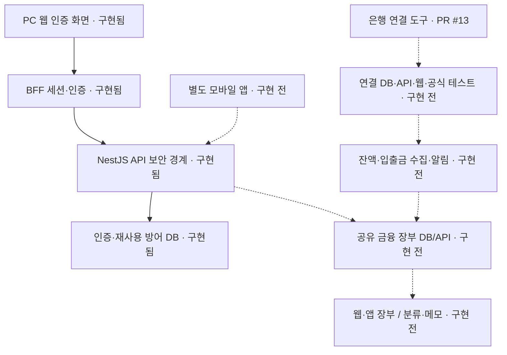
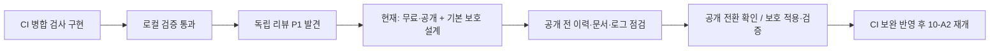

# 가계부 프로젝트 진행 지도

기준일: 2026-09-24. 현재 작업 브랜치 `feature/ci-merge-provenance`, 문서 작성 전 HEAD `f653c0a`. 코드·로컬 기록·Notion 실행 기록·GitHub PR 상태를 대조했다. 이번에 전체 테스트를 새로 실행한 보고서는 아니다.

## 1. 먼저 알아둘 결론

인증과 보안 기반은 많이 구현됐지만, 실제 입출금 장부를 사용하는 제품은 아직 완성되지 않았다. 별도 모바일 앱도 구현 전이다. 현재 실제 금융정보를 넣는 베타는 시작하지 않는다.

사용자 목표는 PC 웹과 별도 Android/iOS 앱이 같은 계정과 하나의 서버 장부를 공유하는 것이다. 계좌 연결로 잔액·입출금을 조회하고, 사용자가 거래를 분류·메모하는 기능을 포함한다. 송금·출금 실행은 범위 밖이다. raon-app은 이 앱을 대체하는 것이 아니라 향후 연결할 외부 서비스다.

이전 PRODUCT/로드맵의 “은행 연동은 모든 마일스톤 이후” 문장은 최근 10-A 착수 결정 이전의 기록이다. 현재는 계좌 연결 기반 10-A1이 별도 PR로 구현됐으며, 보안 CI 보완 다음에 10-A2를 이어가는 순서다. 제품 전체 로드맵 재작성은 이번 문서 범위에 포함하지 않는다.

## 2. 상태를 읽는 방법

- **구현·검증:** 코드와 해당 범위의 검증 기록이 있다. 운영 서비스 완성을 뜻하지 않는다.
- **별도 PR:** 코드가 있지만 main에 아직 합쳐지지 않았다.
- **보완 중:** 구현은 있어도 중요한 미해결 조건이 있다.
- **구현 전:** 현재 기능 경로가 없다. 설계 문서가 있다고 구현된 것은 아니다.
- **운영 검증 전:** 실제 공급자·배포 환경에서 증명이 필요하다.

서로 다른 크기의 작업을 세어 전체 완료율을 계산하지 않는다. 테스트 통과율·인증 분기 커버리지도 제품 완성률이 아니다.

## 3. 분야별 현재 상태

| 분야 | 상태 | 현재 있는 것 | 남은 핵심 작업 |
| --- | --- | --- | --- |
| 개발 기반 | 구현·검증 | TypeScript 모노레포, lint·타입·테스트·빌드·보안 CI | 공개 전 검토, 원격 보호 적용·검증 |
| PC 웹·디자인 | 인증 화면 구현 | 로그인·가입·이메일 확인·복구·비밀번호 재설정, 중립 오프화이트·얕은 뉴모피즘 | 로그인 후 장부, 계좌 연결 UI, 분류·메모·대시보드 |
| 인증 | 구현·검증 / 운영 전 | BFF 세션, OAuth 흐름, 5초 제한, 복구·오류 경계 | 실제 Google·Kakao·Naver와 hosted 환경 검증 |
| 백엔드 | 보안 기반 구현 | Node.js + NestJS/Fastify, health·보호된 사용자 조회, JWT 요청 결속·재사용 방어 | 실제 금융 저장·조회·집계 API |
| 데이터베이스 | 인증 기반 구현 | 인증·OAuth·보안 상태·JWT replay migration 4개 | 은행 연결 DB/RLS, 금융 원장·카테고리·거래 저장 |
| 금융 공용 계약 | 구현·검증 | 계좌·분류·거래·이체의 입력·응답 검증 | 실제 DB·API·화면 연결. 수동 장부의 이체 기록은 실제 은행 송금과 다름 |
| 은행 연결 10-A1 | 별도 PR / 검증 기록 있음 | 공개 상태 계약, 난수·해시·만료 도구, API 전용 암호화 봉투 | PR #13 병합, DB·일회성 소비·API·BFF 연결 |
| 은행 연결 10-A2~6 | 구현 전 | 승인 로드맵 | DB → API → 웹 → 통합 테스트 → 공식 테스트 환경 연결 |
| 입출금 자동 수집·알림 | 구현 전 | 목표와 단계별 기획 | 수집·중복 제거·장애 복구·알림·거래 분류 연결 |
| 모바일 앱·기기 간 동기화 | 구현 전 | React Native + Expo 및 공통 서버 사용 설계 | apps/mobile, 로그인·장부 화면, 웹·앱 동일 데이터 검증 |
| 예산·통계·반복 거래·CSV | 구현 전 | 마일스톤 계획 | 도메인·화면·검증 구현 |
| 실제 배포·베타 | 운영 검증 전 | Vercel + Heroku + Supabase 방향과 운영 문서 | 공급자 설정, 최소 권한, 백업·복구, 경보, 고지, 출시 승인 |

## 4. 구현 관계 지도

실선은 현재 기반의 연결, 점선은 후속 구현 관계다. 실선도 실제 운영 배포가 검증됐다는 뜻은 아니다.

## 5. 지금 보안 작업은 어디까지 왔나

P1은 중요한 보안 지적이라는 뜻이다. 현재 CI는 PR과 커밋의 관계는 검사하지만, 직접 main에 들어온 커밋이 GitHub에서 간접 병합으로 표시될 수 있다. 그래서 테스트가 통과했어도 병합 가능한 상태로 판정하지 않았다.

후속 방향은 무료 플랜을 유지하고 공개 저장소의 GitHub 기본 보호를 사용하는 것이다. **현재 저장소는 여전히 비공개이며 보호 설정도 이번에 변경하지 않았다.** [제안 설계](../superpowers/specs/2026-09-24-public-repository-branch-protection-design.md)를 먼저 검토한다.

## 6. 검증 증거와 한계

| 증거 | 결과 | 의미 / 한계 |
| --- | --- | --- |
| PR #12 | 병합됨, main 기준 9e2ff81 | 인증 시간 제한·커버리지 보완 이력 |
| PR #13 | 2026-09-24 조회 OPEN, head 7491903 | 은행 보안 도구 9파일. 아직 main 미반영 |
| PR #13 CI | 실행 35832153212 성공 기록 | 폐기용 DB·인증 브라우저 테스트 포함. 은행 공급자 연결 성공이 아님 |
| 현재 CI 보완 로컬 verify | 1,128개 테스트·lint·타입·빌드 통과 기록 | 현재 턴 재실행 아님. 별도 은행 PR 신규 테스트와 합산하지 않음 |
| 현재 CI 보완 집중 검사 | 164/164 통과 기록 | 독립 리뷰 P1 해결을 의미하지 않음 |
| 웹 인증 분기 커버리지 | 825/825, 100% 기록 | 측정 대상 인증 코드 기준. 앱 전체 보안 100%가 아님 |
| 실제 공급자·실계좌·운영 | 미검증 | 테스트 포털 키 발급은 실제 연동 완료와 다름 |

현재 브랜치의 변경은 원격에 올리지 않았다. 최근 main push CI의 실패는 모든 main push를 막던 기존 정책의 정상 병합 오탐으로 분석했으며, 새 정책의 P1과 구분한다.

## 7. 다음 작업과 사용자 확인

1. 기본 보호 설계 검토 → 구현 계획: 공개 전 점검 목록, 필수 검사 이름·출처, 관리자 적용, 검증 절차를 확정한다.
2. 공개 전 안전성 점검: 현재 파일뿐 아니라 공개될 모든 브랜치·태그·이력, PR·로그·첨부 자료를 검토한다. 실제 키가 발견되면 공개 전에 폐기·교체하고 이력 정리를 별도 승인받는다.
3. 공개 전환과 보호 적용: 공개될 범위를 보고하고 최종 확인 후 실행한다. 코드 공개는 배포·개인정보 공개·실계좌 접근 허가가 아니다.
4. CI/보호 조합 검증 및 승인된 PR 처리: 미해결 P1을 재검토하고 새 main CI까지 확인한다. 보호 규칙만 켰다는 이유로 자동 종결하지 않는다.
5. 10-A2: 은행 연결 요청·연결·암호문 저장, 사용자 격리, 최소 권한, 원자적 일회성 처리, 만료 정리와 요청 제한을 설계·구현한다.
6. 10-A3~6 이후: API·웹 연결·통합 검증·금융결제원 공식 테스트 어댑터를 순서대로 진행한다. 실계좌 이용 자격·승인 확인은 별도다.

계약·개인정보 고지·운영 플랫폼·실제 secret 등록 등 사용자만 할 수 있는 단계는 코드 개발과 분리해 안내한다. 관리자 페이지·raon-app 연결·금융기관 송금 기능을 이번 범위에 추가하지 않는다.

## 8. 근거

- [현재 CI 구현·독립 리뷰 기록](2026-09-24-ci-merge-provenance.ko.md)
- [인증 커버리지 결과](2026-09-23-auth-coverage-completion.ko.md)
- [분야별 기존 문서 지도](../README.md) — 이전 날짜 상태는 이 문서와 최근 실행 기록을 우선한다.
- [은행 기반 PR #13](https://github.com/jawon0407/account-book/pull/13)
- [Notion 10-A 실행 기록](https://app.notion.com/p/3e4323168ba6814ba087f38c024ab1b3)

이번 산출물은 진행 현황 설명이다. 새 보안 감사·침투 테스트·성능 측정·운영 검증을 수행했다는 보고서가 아니다.
