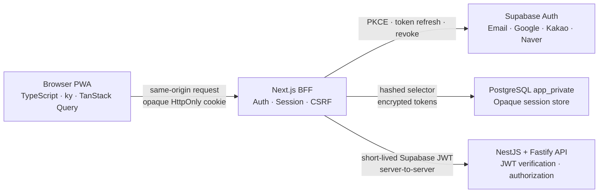

# 보안·인증 기반 설계

작성일: 2026-07-20

상태: 사용자 설계 승인 완료, 문서 검토 대기

대상 브랜치: `feature/security-auth-foundation`

## 1. 목적

이 설계는 Account Book의 첫 애플리케이션 구현 단계에서 인증과 세션 경계를 확립한다. 이메일·비밀번호, Google, Kakao, Naver 로그인을 지원할 수 있는 Next.js BFF와 NestJS API 기반을 만들고, 브라우저 JavaScript가 access token, refresh token, Supabase service credential 또는 데이터베이스 자격 증명에 접근하지 못하게 한다.

보안은 기능과 일정에 우선한다. 인증 주체가 불명확하거나 세션·CSRF·OAuth·JWT 검증의 필수 증거가 없으면 기능을 완료로 표시하거나 병합하지 않는다.

## 2. 성공 기준

- 모든 프런트엔드 코드는 `.ts` 또는 `.tsx`로 작성되고 TypeScript strict 검사를 통과한다.
- 브라우저는 `ky`로 같은 origin의 Next.js BFF만 호출한다.
- TanStack Query가 현재 사용자처럼 서버에서 유래한 상태를 관리한다.
- 브라우저 저장소와 JavaScript 응답에서 Supabase access token과 refresh token을 찾을 수 없다.
- 브라우저 쿠키에는 추측 불가능한 불투명 세션 식별자만 저장된다.
- 이메일 가입·로그인·이메일 확인·비밀번호 재설정과 Google·Kakao·Naver OAuth 경로가 같은 인증 경계를 사용한다.
- NestJS API가 BFF에서 전달된 JWT를 독립적으로 재검증한다.
- CSRF, Origin, OAuth 거래 재사용, JWT 변조, 세션 회전 경쟁, 계정 열거, 로그 마스킹 테스트가 통과한다.
- 로컬 자동 테스트는 외부 OAuth 비밀값 없이 재현할 수 있다.
- 실제 OAuth 활성화는 개발용 Supabase 프로젝트와 공급자 비밀값을 사용한 별도 smoke test가 통과한 뒤에만 완료로 표시한다.

## 3. 범위

### 3.1 포함

- Next.js App Router 기반 `apps/web`
- NestJS와 Fastify 기반 `apps/api`
- 공유 TypeScript·lint·test 설정
- 런타임 검증이 포함된 인증 요청·응답 계약
- `ky` same-origin API client와 TanStack Query provider
- 로그인, 가입, 이메일 확인, 비밀번호 재설정 최소 화면
- Google, Kakao, Naver 로그인 시작과 callback
- PostgreSQL 불투명 세션, OAuth 거래, 인증 속도 제한 저장소
- 세션 ID 해시, 토큰 암호화, 회전, 폐기
- CSRF, Origin, Fetch Metadata, 보안 헤더, 인증 응답 캐시 차단
- NestJS JWT guard와 보호된 `GET /v1/me`
- 로컬 Supabase 구성과 호스팅 개발 프로젝트 설정 안내
- 세션 ADR, 위협 모델 갱신, 환경 변수와 RED/GREEN 테스트 기록

### 3.2 제외

- 거래, 카테고리, 예산, 통계, CSV와 오프라인 동기화
- 동일 이메일을 근거로 한 자동 계정 병합
- 로그인 공급자 연결·해제 설정 화면
- 관리자 페이지와 관리자 권한
- 실제 운영 배포
- 사용자 승인 없이 외부 Supabase·Google·Kakao·Naver 설정을 변경하는 작업

로그인 공급자 연결·해제는 인증 기반을 재사용하는 후속 설정 기능으로 구현한다. 마지막 로그인 수단 해제 방지와 최근 재인증은 그 후속 설계에서 다룬다.

## 4. 채택한 접근법

### 4.1 하이브리드 검증 환경

자동 테스트는 Supabase Auth와 데이터 저장소를 포트 뒤에 두고 결정적인 fake 구현으로 실행한다. 데이터베이스 마이그레이션과 저장소 통합 테스트는 로컬 Supabase 환경에서 실행할 수 있게 한다. 실제 Google·Kakao·Naver 로그인은 개발용 호스팅 Supabase 프로젝트에서 공급자별 smoke test로 검증한다.

이 방식은 외부 서비스 장애와 비밀값 없이 RED/GREEN 주기를 반복하면서도 실제 redirect URI, 공급자 동의 화면, callback과 사용자 정보 매핑을 최종 검증할 수 있다.

### 4.2 PostgreSQL 불투명 세션

브라우저에는 256비트 암호학적 난수로 생성한 세션 selector만 저장한다. PostgreSQL에는 selector 원문이 아니라 SHA-256 해시를 저장한다. 난수 공간이 충분하므로 데이터베이스 유출 시 해시에서 selector를 현실적으로 복구할 수 없다.

Supabase access token과 refresh token은 BFF가 서버 암호화 키로 암호화해 비공개 스키마에 저장한다. 세션은 서버에서 즉시 폐기할 수 있고, 브라우저 JavaScript는 토큰을 읽거나 Supabase에 직접 요청할 수 없다.

### 4.3 제외한 세션 접근법

- 암호화된 무상태 쿠키는 별도 조회가 없지만 쿠키 크기, 즉시 폐기, 키 교체와 refresh token 동시 회전 처리가 복잡해 채택하지 않는다.
- 표준 `@supabase/ssr` 브라우저 공유 쿠키는 Supabase client가 브라우저에서 토큰을 유지하는 일반 SSR 모델을 전제로 한다. 브라우저 JavaScript에 토큰을 노출하지 않는 이 프로젝트의 승인된 보안 경계와 맞지 않아 채택하지 않는다.

## 5. 아키텍처와 신뢰 경계



### 5.1 브라우저

- Supabase URL, publishable key와 토큰을 사용하는 인증 client를 생성하지 않는다.
- `ky` instance는 상대 URL만 허용하고 BFF의 `/api/*`만 호출한다.
- TanStack Query는 현재 사용자와 인증 작업 결과처럼 서버에서 유래한 상태를 관리한다.
- 인증 단계에는 별도 전역 client state store를 추가하지 않는다. 오프라인 대기열이나 여러 화면에 걸친 UI 설정이 실제로 필요해질 때 Zustand를 추가한다.
- `localStorage`, `sessionStorage`, IndexedDB에 인증 토큰이나 세션 selector를 복사하지 않는다.

### 5.2 Next.js BFF

- 인증 시작, OAuth callback, 세션 조회·갱신·폐기와 CSRF 검증의 유일한 브라우저 진입점이다.
- Supabase Auth client, 세션 저장소 client와 사용자별 상태를 모듈 전역에 보관하지 않고 요청마다 생성한다.
- 토큰을 응답 body, URL, redirect query, 로그와 분석 이벤트에 넣지 않는다.
- 인증과 사용자별 응답에 `Cache-Control: private, no-store`, `Pragma: no-cache`, `Expires: 0`을 적용한다.
- 인증된 NestJS 요청에만 복호화한 access JWT를 `Authorization` header로 전달한다.

### 5.3 NestJS API

- BFF 네트워크 위치를 권한 근거로 신뢰하지 않는다.
- JWT의 허용 알고리즘, 서명, `issuer`, `audience`, `exp`, `nbf`, 필수 `sub`와 세션 식별 claim을 검증한다.
- JWKS는 제한된 시간 동안 안전하게 cache하되, 알 수 없는 `kid`와 갱신 실패를 허용으로 바꾸지 않는다.
- 사용자 ID는 검증된 `sub`에서만 가져오고 body, query, header의 사용자 ID를 권한 근거로 사용하지 않는다.
- 이번 범위에서는 보호 경계를 입증하는 `GET /v1/me`만 제공한다.

### 5.4 PostgreSQL 역할 분리

- `app_private` schema는 public, `anon`, `authenticated` 역할에서 접근할 수 없다.
- BFF 세션 역할은 인증 세션·OAuth 거래·rate-limit 테이블의 필요한 명령만 수행한다.
- NestJS 애플리케이션 역할은 암호화된 인증 토큰 열을 읽을 수 없다.
- Supabase service-role key를 일반 세션 조회나 금융 데이터 조회에 사용하지 않는다.

## 6. 컴포넌트 경계

### 6.1 `apps/web`

- `auth-domain`: 인증 명령, 오류 매핑과 상태 전이
- `auth-adapters/supabase`: Supabase Auth API를 감싸는 server-only adapter
- `session-domain`: 세션 생성, 조회, 갱신, 폐기 정책
- `session-adapters/postgres`: 불투명 세션 저장소 구현
- `security/csrf`: CSRF token 발급·검증
- `security/origin`: Origin, Referer와 Fetch Metadata 검증
- `http/api-client`: 브라우저용 `ky` instance와 안전한 오류 역직렬화
- `queries/auth`: TanStack Query의 현재 사용자 query와 인증 mutation

UI와 Route Handler는 위 use case를 호출할 뿐 Supabase 또는 SQL 세부 구현을 직접 참조하지 않는다.

### 6.2 `apps/api`

- `auth/jwt-verifier`: JWKS와 JWT claim 검증
- `auth/auth-guard`: 검증된 principal을 request scope에 설정
- `common/errors`: 안전한 공통 오류 envelope
- `me`: 보호 경계 확인용 현재 사용자 endpoint

### 6.3 `packages/contracts`

- 이메일 가입·로그인·재설정 입력 schema
- OAuth provider enum: `google | kakao | naver`
- 현재 사용자 응답 schema
- 공통 오류 schema
- API와 BFF가 공유하는 인증 principal type

공유 package는 framework, 데이터베이스와 Supabase SDK에 의존하지 않는다.

### 6.4 `packages/database`

- migration source와 typed session repository contract
- DB 행과 domain 객체의 명시적 mapping
- raw SQL이 필요하면 정적 SQL과 bound parameter만 사용

## 7. 세션 데이터 모델

### 7.1 `app_private.auth_sessions`

| 필드 | 목적 |
| --- | --- |
| `id` | 내부 UUID, 암호화 AAD와 감사 상관관계에 사용 |
| `selector_hash` | browser selector의 SHA-256, unique |
| `user_id` | Supabase 사용자의 UUID |
| `supabase_session_id` | 검증된 JWT의 session claim |
| `encrypted_access_token` | AES-256-GCM 암호문 envelope |
| `encrypted_refresh_token` | AES-256-GCM 암호문 envelope |
| `access_token_expires_at` | 갱신 판단 기준 |
| `created_at` | UTC 생성 시각 |
| `last_seen_at` | idle timeout 판단 기준 |
| `absolute_expires_at` | 최대 세션 수명 |
| `revoked_at` | 로컬 폐기 시각 |
| `revocation_pending_at` | 외부 폐기 재시도 필요 시각 |
| `rotation_version` | 동시 갱신 compare-and-swap용 정수 |

활성 세션 조회는 `selector_hash` unique index와 `revoked_at IS NULL` 조건을 사용한다. 기본 로컬 정책은 7일 idle timeout과 30일 absolute timeout이며, 이후 제품 정책 변경은 명시적 migration과 보안 검토를 요구한다.

### 7.2 `app_private.oauth_transactions`

- `state_hash` unique 값
- 브라우저 interaction selector hash
- 허용된 provider enum
- 암호화된 PKCE verifier
- allowlist를 통과한 상대 return path
- 생성·만료·소비 시각

거래는 10분 후 만료되고 한 번만 소비한다. callback 실패도 민감한 code나 provider 원문을 저장하지 않고 안전한 결과 코드만 기록한다.

### 7.3 `app_private.auth_rate_limits`

- 비밀 pepper로 HMAC 처리한 IP·계정 식별자 fingerprint
- 제한 종류, window 시작, count와 `blocked_until`
- 원문 IP와 이메일을 rate-limit key로 저장하지 않는다.

만료된 bucket은 제한된 batch로 정리한다. Supabase 자체 rate limit을 유지하면서 BFF에서도 로그인, 가입, 비밀번호 재설정과 OAuth 시작을 제한한다.

## 8. 암호화와 키 관리

- Node.js의 검증된 crypto API로 AES-256-GCM을 사용한다.
- 각 암호화마다 새로운 96비트 IV를 생성한다.
- envelope에는 `keyId`, IV, ciphertext와 authentication tag를 저장한다.
- AAD는 내부 session UUID, token 종류와 envelope version을 결합해 ciphertext 바꿔치기를 막는다.
- 현재 키와 제한된 이전 키를 환경 변수로 주입해 읽기 중 rotation을 지원한다.
- 새 token 저장은 항상 현재 키를 사용한다.
- 암호화 키, CSRF HMAC 키와 rate-limit pepper를 저장소, 이미지, 로그와 client bundle에 넣지 않는다.
- 복호화나 key lookup 실패는 세션 폐기로 끝나며 평문 fallback을 허용하지 않는다.

구체적인 환경 변수 형식과 키 교체 절차는 세션 ADR과 운영 guide에 기록한다. 예제 파일에는 길이·인코딩 설명만 두고 실제 값과 실제 형식의 secret을 넣지 않는다.

## 9. 쿠키와 CSRF

### 9.1 세션 쿠키

- 이름: `__Host-ab_session`
- 값: 256비트 난수의 base64url 표현
- `HttpOnly=true`
- 운영 `Secure=true`; localhost 개발에서만 명시적 개발 설정으로 예외
- `SameSite=Lax`
- `Path=/`
- `Domain` 미설정
- 애플리케이션 local session 만료보다 긴 browser persistence를 부여하되 서버 만료가 최종 권한을 가진다.

### 9.2 로그인 전 interaction 쿠키

로그인 전 CSRF와 OAuth browser binding을 위해 `__Host-ab_interaction` HttpOnly 쿠키를 사용한다. 값은 별도의 256비트 난수이며 인증 성공, 거래 만료 또는 명시적 취소 시 제거한다.

### 9.3 CSRF token

`GET /api/auth/csrf`는 현재 session selector 또는 interaction selector에 바인딩된 짧은 수명의 HMAC token을 body로 반환한다. 브라우저는 이후 상태 변경 요청의 `X-CSRF-Token` header에만 이를 넣는다.

BFF는 다음을 모두 만족할 때만 요청을 처리한다.

1. CSRF token의 서명, 바인딩과 만료가 유효하다.
2. `Origin`이 정확한 same-origin allowlist와 일치한다.
3. Origin이 없는 제한된 fallback에서는 `Referer`가 같은 origin이다.
4. Fetch Metadata가 cross-site navigation 또는 resource 요청을 나타내지 않는다.
5. content type과 HTTP method가 endpoint 계약과 일치한다.

`SameSite`는 보조 통제이며 단독 CSRF 방어로 취급하지 않는다. 애플리케이션이 직접 시작하는 상태 변경과 세션 갱신은 `POST`에서만 수행한다. OAuth·이메일 확인·비밀번호 복구 callback은 외부 공급자 protocol이 요구하는 `GET` 예외다. 이 callback은 임의의 업무 데이터를 변경하지 않고, state 또는 일회용 code, PKCE, interaction binding, 만료와 단일 소비를 모두 검증한 뒤 제한된 인증 상태만 전이한다. `HEAD`와 `OPTIONS`는 상태를 변경하지 않는다.

## 10. HTTP 계약

### 10.1 BFF route

| Method | Path | 역할 |
| --- | --- | --- |
| `GET` | `/api/auth/csrf` | interaction/session에 바인딩된 CSRF token 발급 |
| `POST` | `/api/auth/sign-up` | 이메일 가입 요청 |
| `POST` | `/api/auth/sign-in` | 이메일 로그인과 불투명 세션 생성 |
| `GET` | `/api/auth/email/callback` | 이메일 확인 code의 일회성 교환 |
| `POST` | `/api/auth/oauth/:provider/start` | 검증된 OAuth 거래 생성과 redirect 시작 |
| `GET` | `/api/auth/callback` | OAuth code·state·PKCE 교환과 세션 생성 |
| `GET` | `/api/auth/session` | 갱신 없이 현재 세션 상태 조회 |
| `POST` | `/api/auth/session/refresh` | token pair의 직렬화된 회전 |
| `POST` | `/api/auth/sign-out` | 현재 local·Supabase 세션 폐기 |
| `POST` | `/api/auth/password/reset-request` | 계정 열거 없는 재설정 메일 요청 |
| `GET` | `/api/auth/password/callback` | recovery code의 일회성 교환 |
| `POST` | `/api/auth/password/update` | 제한된 recovery context에서 비밀번호 변경 |

`GET /api/auth/session`이 `AUTH_SESSION_REFRESH_REQUIRED`를 반환하면 `ky`의 인증 복구 계층이 한 번만 refresh POST를 수행하고 원래 요청을 한 번만 재시도한다. 인증·권한·검증 오류는 반복 재시도하지 않는다.

### 10.2 NestJS route

| Method | Path | 역할 |
| --- | --- | --- |
| `GET` | `/health` | 민감 정보가 없는 프로세스 상태 |
| `GET` | `/v1/me` | JWT guard로 보호된 principal 확인 |

## 11. 상세 데이터 흐름

### 11.1 이메일 가입

1. 브라우저가 CSRF token을 받는다.
2. BFF가 CSRF, Origin, Fetch Metadata, content type, 입력 schema와 rate limit을 검증한다.
3. Supabase Auth에 이메일 가입을 요청한다.
4. 이메일 확인이 필요하면 app session을 생성하지 않는다.
5. 이미 존재하는 계정과 신규 계정이 구분되지 않는 안전한 안내를 반환한다.

### 11.2 이메일 로그인

1. BFF가 요청 방어와 rate limit을 통과시킨다.
2. Supabase Auth가 자격 증명을 검증한다.
3. 이메일 미확인 계정에는 app session을 발급하지 않는다.
4. BFF가 token pair를 암호화해 session row를 생성한다.
5. selector cookie만 설정하고 token이 포함되지 않은 현재 사용자 응답을 반환한다.

이메일 확인 callback은 Supabase가 보낸 일회용 code를 BFF에서 교환하고 URL에서 즉시 제거한다. code의 용도와 만료를 확인한 뒤에만 일반 app session을 생성하며, 이미 소비했거나 다른 용도의 code는 동일한 안전한 오류로 거부한다.

### 11.3 OAuth 시작과 callback

1. CSRF가 적용된 POST 요청으로만 provider 시작을 허용한다.
2. BFF가 provider allowlist, 상대 return path allowlist와 rate limit을 확인한다.
3. state와 PKCE verifier를 생성하고 server-side OAuth transaction에 저장한다.
4. callback은 state hash, interaction binding, provider, 만료와 미소비 상태를 확인한다.
5. Supabase가 code를 token pair로 교환하면 거래를 원자적으로 소비한다.
6. 동일 이메일의 다른 identity를 자동 병합하지 않는다.
7. 공급자가 email을 제공하지 않거나 신뢰할 수 없어도 provider identity와 Supabase user ID를 기준으로 별도 계정을 유지한다.
8. token pair를 session store에 저장하고 selector cookie만 browser에 전달한다.

Google과 Kakao는 Supabase 기본 provider를 사용한다. Naver는 Supabase Custom OAuth2 provider `custom:naver`로 구성하며 최소 profile scope만 요청한다. Naver의 실제 userinfo mapping과 email optional 동작은 개발 프로젝트 smoke test로 검증한다.

### 11.4 세션 조회와 갱신

1. BFF가 selector를 hash하고 활성·미만료 session을 조회한다.
2. access JWT가 안전한 잔여 수명을 가지면 NestJS 요청에만 전달한다.
3. 만료가 가까우면 browser는 CSRF가 적용된 refresh POST를 호출한다.
4. BFF가 session row를 잠그거나 rotation version compare-and-swap을 사용해 동시 갱신을 직렬화한다.
5. Supabase가 반환한 새 token pair와 expiry를 한 DB transaction으로 교체한다.
6. 복호화 실패, refresh replay 신호, 사용자·session claim 불일치 또는 외부 갱신 실패는 fail closed로 처리한다.

`last_seen_at`은 성공한 refresh 또는 CSRF가 검증된 상태 변경 요청에서만 갱신한다. 단순 `GET /api/auth/session` 조회는 세션 수명을 연장하거나 token을 회전하지 않는다.

### 11.5 로그아웃

1. CSRF와 Origin을 검증한다.
2. local session을 먼저 `revoked_at`으로 폐기하고 browser cookie를 만료시킨다.
3. 보유한 server-side token으로 Supabase의 현재 session 폐기를 요청한다.
4. 외부 폐기가 실패하면 local session을 되살리지 않고 `revocation_pending_at`을 기록한다.
5. 오류 응답과 로그에는 token과 provider 원문을 넣지 않는다.

### 11.6 비밀번호 재설정

- 요청 응답은 계정 존재 여부와 무관하게 동일하다.
- recovery code는 callback에서 즉시 교환하고 URL에서 제거한다.
- 제한된 recovery context는 일반 app session 권한을 갖지 않는다.
- 비밀번호 변경 성공 후 해당 사용자의 기존 local session을 모두 폐기한다.

## 12. 오류 모델

모든 BFF와 API 오류는 다음 envelope를 사용한다.

```ts
type ApiError = {
  code: string;
  message: string;
  requestId: string;
  retryable: boolean;
  fieldErrors: Array<{
    field: string;
    code: string;
  }>;
};
```

외부로 허용하는 인증 오류 코드는 다음과 같다.

- `AUTH_INVALID_CREDENTIALS`
- `AUTH_EMAIL_VERIFICATION_REQUIRED`
- `AUTH_SESSION_EXPIRED`
- `AUTH_SESSION_REFRESH_REQUIRED`
- `AUTH_CSRF_REJECTED`
- `AUTH_OAUTH_TRANSACTION_INVALID`
- `AUTH_RATE_LIMITED`
- `AUTH_PROVIDER_UNAVAILABLE`

Supabase 원문, stack, SQL, 내부 경로, token, cookie, OAuth code와 계정 존재 여부는 응답에 포함하지 않는다. 일시적인 provider 장애만 `retryable=true`가 될 수 있고, 브라우저는 명시적 사용자 동작 없이 인증 mutation을 자동 반복하지 않는다.

## 13. 보안 헤더와 UI 상태

- CSP nonce 기반 정책과 `frame-ancestors 'none'`
- `X-Content-Type-Options: nosniff`
- 엄격한 `Referrer-Policy`
- 최소 `Permissions-Policy`
- 운영 환경 HSTS
- 인증 route와 page의 `private, no-store`

로그인 UI는 loading, 성공, 이메일 확인 필요, rate limited, provider unavailable, session expired를 구분한다. 내부 원인을 숨기되 사용자가 다음 행동을 이해할 수 있는 한국어 문장을 제공한다. 애니메이션은 상태 전환을 설명하는 150~250ms 범위로 제한하고 `prefers-reduced-motion`에서 즉시 전환 또는 짧은 fade로 축소한다.

## 14. 테스트 전략

### 14.1 TDD 기록

각 구현 task는 다음 증거를 `docs/guides/testing.md` 또는 기능별 테스트 기록에 남긴다.

1. RED: 기대하는 보안·동작 테스트와 실패 이유
2. GREEN: 최소 구현 후 통과 명령과 결과
3. REFACTOR: 계약을 유지한 구조 개선과 재검증 결과

### 14.2 단위 테스트

- session selector 생성 길이와 hash 저장
- AES-GCM round trip, tamper, 잘못된 AAD와 알 수 없는 key ID 거부
- cookie 이름과 `HttpOnly`, `Secure`, `SameSite`, `Path`, Domain 미설정
- CSRF signature, binding, expiry와 변조 거부
- Origin, Referer와 Fetch Metadata allow/deny matrix
- provider와 return path allowlist
- 외부 오류의 안전한 오류 코드 mapping
- 로그 redaction과 token 직렬화 금지

### 14.3 통합 테스트

- 로그인 성공 시 token 대신 selector cookie만 반환
- 이메일 미확인과 잘못된 자격 증명의 안전한 응답
- OAuth state·PKCE의 만료, 변조, provider 불일치와 재사용 거부
- 동시 refresh에서 token pair가 한 번만 유효하게 회전
- 로그아웃과 비밀번호 변경 후 기존 session 거부
- NestJS의 변조·만료·잘못된 issuer·audience·algorithm JWT 거부
- `GET /v1/me`가 검증된 `sub`만 반환
- 인증 응답의 no-store와 보안 header
- DB 역할이 암호화 token table 경계를 우회하지 못함

### 14.4 E2E와 실제 공급자 smoke test

- fake Auth adapter로 가입, 로그인, 확인 안내, reset과 로그아웃 UI를 자동화한다.
- 개발용 Supabase에서 email 가입·확인·로그인·reset을 검증한다.
- Google, Kakao, Naver 각각 authorization 시작, callback, 취소, 오류, email 누락 동작을 검증한다.
- redirect URL, browser history, 개발자 도구 response와 application storage에 token이 없는지 확인한다.

실제 provider secret이 없으면 live smoke test는 `미실행`으로 기록한다. 이를 성공으로 간주하지 않으며 운영 출시와 인증 기능 완료의 blocker로 유지한다.

### 14.5 품질 게이트

- security-critical custom module branch coverage 목표 100%
- TypeScript strict typecheck, lint, unit·integration test와 production build 통과
- secret scan과 production dependency audit에서 치명적·높음 위험 0건
- 치명적·높음 위험, 인증 회귀, 누락된 사용자 격리 또는 미검증 migration이 있으면 병합 금지
- Node 22.15.1과 pnpm 11.9.0을 CI의 권위 있는 실행환경으로 사용

로컬 기준선은 2026-07-20에 기존 46개 테스트와 구조 검증이 통과했다. 당시 desktop shell의 Node 24.14.0은 저장소 고정 Node 22.15.1과 달라 engine 경고가 발생했으므로, 새 의존성의 최종 호환성 판단은 Node 22 CI 결과를 따른다.

## 15. 주석과 문서화 원칙

- 보안 관련 exported 함수와 class에는 행동 원리, 각 매개변수, 반환값과 실패 조건을 TSDoc으로 기록한다.
- 주석은 코드가 무엇을 하는지 반복하지 않고 왜 해당 검증 순서와 fail-closed 동작이 필요한지 설명한다.
- token, cookie, email, IP, provider 오류를 예시로 적을 때 실제 credential 형태나 개인 데이터를 사용하지 않는다.
- 환경 변수 guide는 public/server-only 구분, 길이, 인코딩, 회전과 누락 시 실패 동작을 설명한다.
- 세션 ADR은 대안, 채택 이유, 잔여 위험과 재검토 조건을 포함한다.
- 테스트 문서는 RED/GREEN/REFACTOR 명령과 결과를 재현 가능하게 기록한다.

## 16. 환경 변수 경계

브라우저 bundle에 인증 환경 변수를 넣지 않는다. 다음 값은 server-only다.

- Supabase Auth base URL과 server-side publishable key
- PostgreSQL session role connection URL
- 허용 issuer, audience와 JWKS URL
- 현재·이전 session encryption key
- CSRF HMAC key
- rate-limit HMAC pepper
- 정확한 application origin allowlist

OAuth client secret은 Supabase 개발 프로젝트의 provider 설정 또는 승인된 secret manager에만 둔다. 저장소의 `.env.example`에는 변수 이름과 안전한 생성 지침만 기록한다.

## 17. 잔여 위험과 후속 조치

- 불투명 cookie가 탈취되면 만료·폐기 전까지 세션 탈취가 가능하다. HttpOnly, Secure, CSP, CSRF, 짧은 idle policy, 회전과 사용자 로그아웃으로 위험을 줄인다.
- PostgreSQL session lookup은 요청당 지연과 가용성 의존성을 추가한다. 실제 지표가 병목을 증명하기 전에는 Redis를 추가하지 않는다.
- BFF의 암호화 키가 노출되면 저장된 token을 복호화할 수 있다. 키 접근 최소화, 버전 rotation, 로그 배제와 사고 시 전체 세션 폐기 절차가 필요하다.
- Supabase 무료 플랜의 server-side session lifetime 기능 제한을 local session policy로 보완하지만 Supabase token 자체의 잔여 수명은 별도로 관리해야 한다.
- Naver userinfo와 email 신뢰 특성은 실제 custom provider smoke test 전까지 외부 의존 위험으로 남는다.
- 관리자 페이지는 핵심 사용자 앱과 보안 검증 후 별도 trust boundary로 설계한다.

## 18. 참고 자료

- [Supabase Custom OAuth/OIDC Providers](https://supabase.com/docs/guides/auth/custom-oauth-providers)
- [Supabase User Sessions](https://supabase.com/docs/guides/auth/sessions)
- [Supabase Server-side Auth Advanced Guide](https://supabase.com/docs/guides/auth/server-side/advanced-guide)
- [Supabase Auth Architecture](https://supabase.com/docs/guides/auth/architecture)
- [Next.js Cookies](https://nextjs.org/docs/app/api-reference/functions/cookies)
- [OWASP Session Management Cheat Sheet](https://cheatsheetseries.owasp.org/cheatsheets/Session_Management_Cheat_Sheet.html)
- [OWASP CSRF Prevention Cheat Sheet](https://cheatsheetseries.owasp.org/cheatsheets/Cross-Site_Request_Forgery_Prevention_Cheat_Sheet.html)

## 19. 승인 기록

- 2026-07-20: 하이브리드 검증 환경 승인
- 2026-07-20: PostgreSQL 불투명 세션 승인
- 2026-07-20: 아키텍처와 신뢰 경계 승인
- 2026-07-20: 인증 데이터 흐름 승인
- 2026-07-20: 오류, 테스트와 구현 범위 승인
