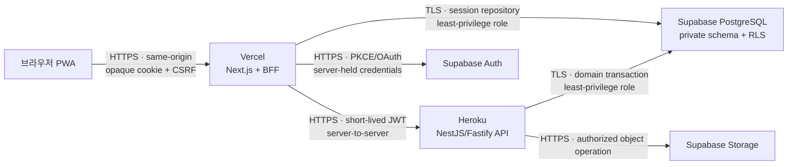

# 관리형 배포 플랫폼 설계

> **English summary:** The private beta deploys the Next.js same-origin BFF to Vercel Hobby, the NestJS/Fastify API to an always-on Heroku Basic dyno, and Auth, PostgreSQL, and Storage to Supabase Pro. Dynamic workloads are initially co-located in AWS `us-east-1` through Vercel `iad1`, Heroku Common Runtime `us`, and a Supabase `us-east-1` project. The browser never calls Heroku or the financial database directly. Public launch requires paid frontend hosting, an API tier with production rollout and metrics support, measured latency acceptance, tested backups, and all security release gates. Hostinger, Firestore, and Firebase SQL Connect remain documented alternatives rather than current runtime dependencies.

- 상태: 사용자 승인
- 승인일: 2026-07-23
- 적용 범위: 비상업 비공개 베타부터 일반 공개 직전까지의 배포·운영 경계
- 비적용 범위: 관리자 페이지, 실제 서비스 계정 생성·결제, 프로덕션 배포 실행

## 1. 결정

이 프로젝트의 관리형 런타임은 다음 세 서비스를 기준으로 한다.

| 책임 | 플랫폼 | 비공개 베타 | 일반 공개 전 |
| --- | --- | --- | --- |
| Next.js 화면·same-origin BFF | Vercel | Hobby | Pro |
| NestJS/Fastify API | Heroku | Basic, always-on | Standard-1X 이상 또는 승인된 동등 티어 |
| Auth·PostgreSQL·Storage | Supabase | Pro | Pro, 사용량에 따라 compute·PITR 별도 승인 |

Vercel Hobby는 개인·비상업 베타에만 사용한다. 유료화나 사업 목적 사용을 시작하기 전에 Pro로 승격한다. Heroku Eco는 30분 비활성 후 휴면하므로 인증과 금융 API에는 사용하지 않는다. Supabase Free는 자동 백업이 플랜에 포함되지 않고 저활동 프로젝트가 정지될 수 있으므로 실제 금융 데이터를 받는 환경에는 사용하지 않는다.

공식 근거:

- [Vercel 플랜](https://vercel.com/docs/plans)
- [Vercel 가격과 Hobby 사용 범위](https://vercel.com/pricing)
- [Heroku Dyno 가격과 티어](https://www.heroku.com/pricing/)
- [Supabase 가격과 백업 보존](https://supabase.com/pricing)
- [Supabase 데이터베이스 백업](https://supabase.com/docs/guides/platform/backups)

## 2. 결정 동인

1. 소수 지인 단계부터 실제 수입·지출 내역을 저장한다.
2. 당분간 한 명이 개발, 배포, 보안, 장애 대응을 담당한다.
3. 보안과 데이터 복구 가능성을 월 서버 자원 가격보다 우선한다.
4. 이미 구현된 Next.js BFF, NestJS/Fastify API, Supabase Auth adapter, PostgreSQL migrations, Drizzle repository와 테스트를 유지한다.
5. 나중에 일반 사용자에게 공개하더라도 인증·DB를 다시 작성하지 않고 런타임 티어만 승격할 수 있어야 한다.
6. 플랫폼을 교체하더라도 애플리케이션 계약과 데이터 소유권 규칙은 유지한다.

## 3. 런타임 토폴로지

브라우저는 Heroku 도메인, PostgreSQL, Supabase service credential을 직접 사용하지 않는다. 브라우저의 유일한 애플리케이션 API는 Vercel의 same-origin BFF다. BFF는 opaque selector cookie를 해석하고 짧은 수명의 서버 간 JWT를 Heroku API에 전달한다. API는 BFF를 암묵적으로 신뢰하지 않고 JWT 서명·클레임·사용자 소유권·입력 버전을 다시 검증한다. PostgreSQL 역할과 RLS가 마지막 사용자 격리 경계다.

## 4. 리전 전략

비공개 베타의 동적 런타임은 내부 왕복 지연을 줄이기 위해 다음처럼 맞춘다.

| 서비스 | 리전 |
| --- | --- |
| Vercel Functions | Washington D.C. `iad1` |
| Heroku Common Runtime | `us`, 공급자 리전 `us-east-1` |
| Supabase project | East US, North Virginia `us-east-1` |

정적 자산은 Vercel CDN으로 전달하되, 인증·SSR·BFF 함수는 API와 데이터베이스 가까이 배치한다. Heroku Common Runtime은 `us`와 `eu`만 제공하고 아시아 리전은 Private Spaces 범주이므로, 현재 비용 단계에서는 미국 동부 정렬을 선택한다.

공식 근거:

- [Vercel `iad1` 리전](https://vercel.com/docs/pricing/regional-pricing/iad1)
- [Heroku 리전](https://devcenter.heroku.com/articles/regions)
- [Heroku Platform API의 `us` → `us-east-1` 매핑](https://devcenter.heroku.com/articles/platform-api-reference)
- [Supabase 리전](https://supabase.com/docs/guides/platform/regions)

한국 사용자 체감 지연은 베타에서 측정한다. 일반 공개 전 대표 인증된 조회에 대해 한국 네트워크 기준 end-to-end p95가 1초를 지속적으로 넘거나 BFF에서 API까지의 p95가 250ms를 넘으면 Heroku의 아시아 대체 PaaS 또는 배포 토폴로지 변경을 별도 설계로 검토한다. 리전 변경은 환경변수 교체만으로 끝나지 않을 수 있으며, Supabase 리전 변경은 새 프로젝트 생성과 데이터 마이그레이션을 요구한다.

## 5. 인증과 비밀정보

### 5.1 브라우저 경계

- 브라우저에는 provider access·refresh token, Supabase service-role key, DB URL, Heroku credential을 제공하지 않는다.
- 세션 cookie는 `Secure`, `HttpOnly`, `SameSite`와 `__Host-` 조건을 유지한다.
- OAuth callback URL은 canonical `APP_ORIGIN`에서만 만든다.
- Preview deployment는 운영 OAuth callback과 운영 secret을 사용하지 않는다.
- Vercel Preview에는 폐기 가능한 개발 프로젝트 또는 fake provider만 연결한다.

### 5.2 플랫폼 관리자

- GitHub, Vercel, Heroku, Supabase 관리자 계정에 MFA를 적용한다.
- 배포 토큰과 개인 관리자 토큰을 분리한다.
- 장기 토큰을 저장소, 문서, 명령 인자, CI 로그에 넣지 않는다.
- 플랫폼 secret은 환경별로 분리하고 담당자·생성일·회전일을 기록한다.
- secret 회전은 새 값 배포, smoke 검증, 이전 값 폐기 순서로 수행한다.

### 5.3 데이터베이스

- 애플리케이션은 owner, superuser, migration principal, `BYPASSRLS` 역할로 실행하지 않는다.
- BFF 세션 저장소와 API 도메인 쿼리에 서로 필요한 최소 권한만 부여한다.
- PostgreSQL SSL enforcement를 활성화한다.
- Supabase dashboard 관리자 MFA를 필수로 한다.
- 공개 schema에 금융 테이블을 노출하지 않는다.
- Supabase service-role credential을 일반 런타임 쿼리에 사용하지 않는다.

## 6. 백업·복구

Supabase Pro의 자동 일일 백업과 최근 7일 보관을 기본 복구선으로 사용한다. 단일 공급자의 백업만 신뢰하지 않고 다음 절차를 추가한다.

1. 주 1회 암호화한 논리 백업을 별도 공급자 저장소에 보관한다.
2. 백업 파일에는 데이터베이스 credential을 포함하지 않는다.
3. Supabase Storage 객체는 DB 백업에 포함되지 않으므로 별도 manifest와 객체 백업을 만든다.
4. 월 1회 폐기 가능한 환경에서 DB·Storage 복구 훈련을 실행한다.
5. 복구 결과에 migration 버전, row count, 무결성 검사, 소요 시간, 담당자를 기록한다.
6. 백업 삭제와 보존 기간 변경은 중요 작업으로 승인받는다.

비공개 베타의 목표는 RPO 24시간, RTO 4시간이다. PITR은 일일 백업보다 더 작은 RPO가 필요하거나 일반 공개 위험 검토에서 요구될 때 별도 비용과 함께 승인한다. 사용자가 입력한 최근 데이터가 최대 24시간 손실될 수 있다는 잔여 위험은 베타 운영 기록에 남긴다.

## 7. 배포와 릴리스 게이트

모든 프로덕션 배포는 저장된 동일 commit SHA를 사용한다. 다음 중 하나라도 실패하면 배포하지 않는다.

- lockfile 고정과 production dependency audit
- secret·credential·고위험 패턴 탐지
- lint, typecheck, unit, integration, build
- disposable PostgreSQL migration 001부터 최신까지
- 실제 브라우저 인증 E2E
- Google·Kakao·Naver 승인 provider smoke
- 최소 권한 DB 역할과 RLS 사용자 격리 검사
- 백업 생성과 최근 복구 훈련 증거
- Vercel BFF, Heroku API, Supabase 상태 확인

DB migration은 애플리케이션 시작 시 자동 실행하지 않는다. 승인된 migration job이 순서대로 실행하고, 파괴적 변경은 백업·rollback 분석·호환 배포 순서를 요구한다.

## 8. 관측성과 개인정보 보호

- Vercel, Heroku, Supabase 요청을 연결하는 무작위 request ID를 사용한다.
- request ID에 사용자 ID, 이메일, 세션 selector, token을 인코딩하지 않는다.
- 인증 성공·실패, 권한 거부, 관리자 변경, 배포 SHA, migration 결과를 감사한다.
- 로그에 수입·지출 메모, provider token, cookie, Authorization header, DB URL을 기록하지 않는다.
- 외부 오류 추적 도구를 추가하면 payload redaction과 데이터 처리 위치를 별도 승인한다.
- 비공개 베타에서도 API 오류율, p95 지연, 인증 실패 급증, DB 연결 실패, 백업 실패를 경보한다.

## 9. 비용·플랜 승격

### 9.1 비공개 베타

- Vercel Hobby는 비상업 범위에서만 사용한다.
- Heroku Basic은 always-on API를 제공한다.
- Supabase Pro는 자동 백업, 7일 보존, 비정지 프로젝트를 제공한다.
- 각 플랫폼의 spend alert 또는 사용량 알림을 활성화한다.

### 9.2 일반 공개 전 필수 승격

- Vercel Pro로 전환한다.
- Heroku Standard-1X 이상으로 전환해 metrics, preboot, zero-downtime rollout, 수평 확장 경로를 확보한다.
- Supabase Pro의 실제 DB·Storage·egress 사용량과 연결 수를 검토한다.
- RPO 요구가 24시간보다 짧아지면 PITR 비용을 승인한다.
- 개인정보 처리방침, 이용약관, 데이터 삭제·내보내기 절차와 보안 연락처를 공개한다.
- 공개 전 독립적인 보안 검토 또는 전문 침투 테스트 범위를 승인한다.

## 10. 대안과 재검토 조건

### 10.1 Hostinger KVM 2

서버 자원 대비 비용과 싱가포르 리전은 유리하지만, 한 명이 OS, Docker, TLS, 방화벽, 모니터링, 배포 복구를 책임지고 Web/API 단일 장애점을 만든다. 현재는 보류한다.

다음 조건이 모두 충족될 때 재검토한다.

- Heroku 비용 또는 측정된 리전 지연이 승인된 한도를 지속적으로 초과한다.
- 자동 패치, immutable 배포, 외부 백업, 복구 훈련, 경보를 코드와 문서로 운영할 준비가 됐다.
- 장애 시 Web/API 동시 중단을 허용하거나 두 번째 인스턴스로 제거한다.
- 운영 시간까지 포함한 총비용이 관리형 PaaS보다 낮다는 측정 근거가 있다.

### 10.2 Firebase Firestore

오프라인·실시간 모바일 경험은 강하지만, 금융 관계·집계·RLS 중심 설계를 문서 비정규화와 Security Rules 중심으로 다시 작성해야 한다. 서버 SDK가 Firestore Security Rules를 우회하는 점도 현재 서버 중심 경계와 맞지 않는다. 데이터베이스와 인증 대체재로 채택하지 않는다.

### 10.3 Firebase SQL Connect

Cloud SQL PostgreSQL과 Firebase Auth를 제공하지만 GraphQL operation, 생성 SDK, `@auth` 권한 모델로 기존 Drizzle, 직접 SQL migration, PostgreSQL 역할·RLS, Supabase Auth adapter를 다시 설계해야 한다. 신규 프로젝트라면 비교 가치가 있으나 현재 전환 이익이 비용보다 작다.

Firebase Cloud Messaging, Crashlytics 등 모바일 운영 기능은 향후 네이티브 앱 설계에서 개별적으로 승인할 수 있다. 이 승인은 Firebase를 인증 또는 금융 데이터 기준점으로 바꾸지 않는다.

## 11. 테스트 전략

- Vercel adapter와 Heroku adapter가 application contract를 바꾸지 않는지 단위 테스트한다.
- Preview 환경은 운영 secret 없이도 빌드·smoke가 가능해야 한다.
- BFF가 Heroku 오류를 allowlisted public error로 변환하고 upstream body를 브라우저에 전달하지 않는지 검사한다.
- Heroku API가 누락·만료·잘못된 issuer/audience/signature JWT를 거부하는지 검사한다.
- RLS 격리 테스트는 서로 다른 두 사용자와 관리자 아닌 런타임 역할로 실행한다.
- OAuth callback, logout, replay, refresh, account recovery를 실제 브라우저에서 검사한다.
- 배포 후 synthetic login을 사용한다면 실제 사용자 credential 대신 전용 최소권한 test principal을 사용하고 결과에서 token을 제거한다.
- 백업 복구 훈련은 복원된 데이터에 대해 migration과 사용자 격리 테스트를 다시 실행한다.

## 12. 운영 완료 조건

다음 조건을 만족해야 이 배포 설계를 구현 완료로 간주한다.

1. Vercel·Heroku·Supabase 환경이 production, preview, test로 분리됐다.
2. production secret이 Preview와 pull request workflow에 노출되지 않는다.
3. 비공개 베타 플랜과 리전이 문서의 결정과 일치한다.
4. 실제 Supabase Auth·PostgreSQL과 동일 SHA 인증 E2E가 통과한다.
5. 자동 일일 백업과 별도 암호화 백업이 존재한다.
6. 복구 훈련이 RTO 목표 안에 성공한다.
7. 사용자 데이터 격리와 로그 redaction 검사가 통과한다.
8. 비용 알림, 장애 경보, incident runbook 연락 경로가 활성화됐다.
9. 관리자 페이지는 이 설계 범위에 포함되지 않고 기존 기능 완료 후 별도 설계한다.
