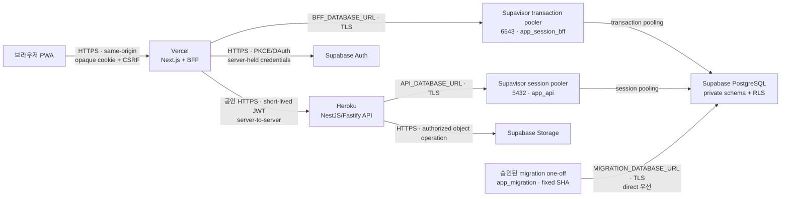

# 관리형 배포 플랫폼 설계

> **English summary:** The private beta deploys the Next.js same-origin BFF to Vercel Hobby, the NestJS/Fastify API to an always-on Heroku Basic dyno, and Auth, PostgreSQL, and Storage to Supabase Pro. Dynamic workloads are initially co-located in AWS `us-east-1` through Vercel `iad1`, Heroku Common Runtime `us`, and a Supabase `us-east-1` project. The browser never calls Heroku or the financial database directly. Public launch requires paid frontend hosting, an API tier with production rollout and metrics support, measured latency acceptance, tested backups, and all security release gates. Hostinger, Firestore, and Firebase SQL Connect remain documented alternatives rather than current runtime dependencies.

- 상태: 사용자 검토 반영
- 승인일: 2026-07-23
- 적용 범위: 비상업 비공개 베타부터 일반 공개 직전까지의 배포·운영 경계
- 비적용 범위: 관리자 페이지, 실제 서비스 계정 생성·결제, 프로덕션 배포 실행

## 1. 결정

이 프로젝트의 관리형 런타임은 다음 세 서비스를 기준으로 한다.

| 책임 | 플랫폼 | 비공개 베타 | 일반 공개 전 |
| --- | --- | --- | --- |
| Next.js 화면·same-origin BFF | Vercel | Hobby | Pro |
| NestJS/Fastify API | Heroku | Basic, always-on | Standard-1X 이상 또는 승인된 동등 티어 |
| Auth·PostgreSQL·Storage | Supabase | Pro | Pro, 사용량에 따라 compute·PITR 별도 승인 |

Vercel Hobby는 개인·비상업 베타에만 사용한다. 유료화나 사업 목적 사용을 시작하기 전에 Pro로 승격한다. Heroku Eco는 30분 비활성 후 휴면하므로 인증과 금융 API에는 사용하지 않는다. Supabase Free는 자동 백업이 플랜에 포함되지 않고 저활동 프로젝트가 정지될 수 있으므로 실제 금융 데이터를 받는 환경에는 사용하지 않는다.

공식 근거:

- [Vercel 플랜](https://vercel.com/docs/plans)
- [Vercel 가격과 Hobby 사용 범위](https://vercel.com/pricing)
- [Heroku Dyno 가격과 티어](https://www.heroku.com/pricing/)
- [Supabase 가격과 백업 보존](https://supabase.com/pricing)
- [Supabase 데이터베이스 백업](https://supabase.com/docs/guides/platform/backups)

## 2. 결정 동인

1. 소수 지인 단계부터 실제 수입·지출 내역을 저장한다.
2. 당분간 한 명이 개발, 배포, 보안, 장애 대응을 담당한다.
3. 보안과 데이터 복구 가능성을 월 서버 자원 가격보다 우선한다.
4. 이미 구현된 Next.js BFF, NestJS/Fastify API, Supabase Auth adapter, PostgreSQL migrations, Drizzle repository와 테스트를 유지한다.
5. 나중에 일반 사용자에게 공개하더라도 인증·DB를 다시 작성하지 않고 런타임 티어만 승격할 수 있어야 한다.
6. 플랫폼을 교체하더라도 애플리케이션 계약과 데이터 소유권 규칙은 유지한다.

## 3. 런타임 토폴로지

브라우저는 Heroku 도메인, PostgreSQL, Supabase service credential을 직접 사용하지 않는다. 브라우저의 유일한 애플리케이션 API는 Vercel의 same-origin BFF다. BFF는 opaque selector cookie를 해석하고 짧은 수명의 서버 간 JWT를 Heroku API에 전달한다. API는 BFF를 암묵적으로 신뢰하지 않고 JWT 서명·클레임·사용자 소유권·입력 버전을 다시 검증한다. PostgreSQL 역할과 RLS가 마지막 사용자 격리 경계다.

### 3.1 Heroku API 공개 노출면

Heroku Common Runtime의 web dyno는 Heroku Router가 전달하는 공인 HTTPS 요청을 받는다. 따라서 “브라우저가 호출하지 않는다”는 네트워크 격리가 아니며 다음 통제를 동시에 적용한다.

- 모든 보호 경로는 BFF가 발급한 짧은 수명의 JWT를 요구하고, API가 허용 algorithm, signature, issuer, audience, expiry와 canonical subject를 독립 검증한다.
- 인증 후에는 `route template + JWT subject`를 기준으로 rate limit을 적용한다. 초기값은 조회 120회/분·burst 20, 변경 30회/분·burst 10이다. 인증 전 실패 요청은 원시 IP를 저장하지 않는 keyed-HMAC fingerprint로 경로당 30회/분·burst 5로 제한하고 `429`와 `Retry-After`를 반환한다. 비공개 베타의 단일 dyno는 bounded in-memory token bucket을 사용하되, 일반 공개나 2개 이상 dyno로 확장하기 전에는 Heroku Key-Value Store 기반 shared limiter로 교체한다.
- 브라우저 origin에는 CORS를 허용하지 않고 `Access-Control-Allow-Origin`을 반환하지 않는다. 다만 CORS와 `Origin`은 비브라우저 클라이언트가 우회할 수 있으므로 인증 수단으로 취급하지 않는다.
- body 크기, 처리 시간, 허용 content type을 제한하고 upstream 오류 본문을 외부에 전달하지 않는다.
- Vercel Hobby와 일반 Pro의 egress IP는 고정돼 있다고 가정하지 않는다. Heroku 보호를 Vercel IP allowlist에 의존하지 않으며, 향후 Pro Static IPs add-on 또는 Enterprise Secure Compute를 별도 승인한 경우에만 네트워크 allowlist를 보조 통제로 재검토한다.

공식 근거:

- [Heroku Common Runtime 네트워킹](https://devcenter.heroku.com/articles/networking)
- [Vercel 고정 IP와 Static IPs](https://vercel.com/kb/guide/can-i-get-a-fixed-ip-address)

### 3.2 PostgreSQL 연결 경로

Vercel Functions는 짧은 실행 인스턴스가 수평 증가하므로 `BFF_DATABASE_URL`을 Supavisor transaction mode `:6543`에 연결한다. Heroku API는 지속형 프로세스이므로 IPv4에서 동작하는 Supavisor session mode `:5432`를 사용한다. migration, `pg_dump`, 복구는 direct endpoint `:5432`를 우선 사용하고 실행 환경에서 IPv6 연결을 검증할 수 없을 때만 사전에 DDL·rollback 시험을 통과한 session pooler를 사용한다. migration과 백업에는 transaction pooler를 사용하지 않는다.

`BFF_DATABASE_URL`, `API_DATABASE_URL`, `MIGRATION_DATABASE_URL`은 사용자명·암호·권한이 모두 다른 secret이다. 한 URL을 여러 이름으로 복제하거나 한 런타임에 다른 주체의 URL을 주입하지 않는다. 현재 구현의 일반 `DATABASE_URL`과 Drizzle/node-postgres 암묵적 pool 설정은 프로덕션 연결 전에 역할별 변수와 명시적 `pg.Pool` 설정으로 교체해야 하며, 이 변경이 완료되지 않으면 배포 게이트를 통과할 수 없다.

초기에는 Dedicated PgBouncer를 Supavisor와 함께 사용하지 않는다. 두 pooler의 동시 사용은 연결 예산과 장애 분석을 복잡하게 하며 현재 부하 요구가 전용 pooler를 정당화하지 않는다. 실제 Supavisor client/backend connection 포화 또는 pooler p95가 임계값을 넘는 증거가 생기면 Supavisor transaction 경로를 Dedicated PgBouncer로 대체하는 방식만 검토하고, 두 transaction pooler를 병행하지 않는다.

Supavisor transaction mode는 named prepared statement를 지원하지 않는다. BFF의 node-postgres query에는 `name`을 지정하지 않고 이를 정적 검사와 실제 pooler 통합 테스트로 검증한다.

공식 근거:

- [Supabase PostgreSQL 연결 방식](https://supabase.com/docs/guides/database/connecting-to-postgres)
- [Supavisor transaction mode의 prepared statement 제한](https://supabase.com/docs/guides/troubleshooting/disabling-prepared-statements-qL8lEL)

## 4. 리전 전략

비공개 베타의 동적 런타임은 내부 왕복 지연을 줄이기 위해 다음처럼 맞춘다.

| 서비스 | 리전 |
| --- | --- |
| Vercel Functions | Washington D.C. `iad1` |
| Heroku Common Runtime | `us`, 공급자 리전 `us-east-1` |
| Supabase project | East US, North Virginia `us-east-1` |

정적 자산은 Vercel CDN으로 전달하되, 인증·SSR·BFF 함수는 API와 데이터베이스 가까이 배치한다. Heroku Common Runtime은 `us`와 `eu`만 제공하고 아시아 리전은 Private Spaces 범주이므로, 현재 비용 단계에서는 미국 동부 정렬을 선택한다.

공식 근거:

- [Vercel `iad1` 리전](https://vercel.com/docs/pricing/regional-pricing/iad1)
- [Heroku 리전](https://devcenter.heroku.com/articles/regions)
- [Heroku Platform API의 `us` → `us-east-1` 매핑](https://devcenter.heroku.com/articles/platform-api-reference)
- [Supabase 리전](https://supabase.com/docs/guides/platform/regions)

한국 사용자 체감 지연은 베타에서 측정한다. 일반 공개 전 대표 인증된 조회에 대해 한국 네트워크 기준 end-to-end p95가 1초를 지속적으로 넘거나 BFF에서 API까지의 p95가 250ms를 넘으면 Heroku의 아시아 대체 PaaS 또는 배포 토폴로지 변경을 별도 설계로 검토한다. 리전 변경은 환경변수 교체만으로 끝나지 않을 수 있으며, Supabase 리전 변경은 새 프로젝트 생성과 데이터 마이그레이션을 요구한다.

이 선택으로 한국 사용자의 거래 금액·분류·금융 메모, 인증 metadata와 일부 운영 로그가 미국 동부에서 저장 또는 처리되는 잔여 위험이 생긴다. 지인 베타 초대 전부터 저장·처리 국가, 이전되는 데이터 항목과 목적, 보유·삭제·백업 기간, 동의 거부 시 제한과 문의 경로를 쉬운 한국어로 고지하고 동의를 기록한다. 일반 공개 전에 한국 개인정보·국외 이전 요건에 대한 별도 법률·개인정보 검토를 완료한다. 이 문단은 법률 적합성을 확정하는 자문이 아니라 기술 설계상 데이터 위치와 고지 의무를 누락하지 않기 위한 release gate다.

## 5. 인증과 비밀정보

### 5.1 브라우저 경계

- 브라우저에는 provider access·refresh token, Supabase service-role key, DB URL, Heroku credential을 제공하지 않는다.
- production은 하나의 사용자 소유 custom domain을 canonical origin으로 고정하고 `APP_ORIGIN`에 path·query·fragment가 없는 exact HTTPS origin만 넣는다. Vercel 기본 도메인과 Preview URL을 production callback으로 등록하지 않는다.
- `__Host-ab_session`과 `__Host-ab_interaction`은 `Secure`, `HttpOnly`, `Path=/`, no `Domain` 조건을 유지하며 약한 이름으로 대체하지 않는다.
- OAuth·email confirmation·recovery callback URL은 검증된 canonical `APP_ORIGIN`에서만 만든다.
- Vercel Preview에는 production provider callback, production Supabase project, production DB와 production secret을 주입하지 않는다.
- 현재 Preview에서는 실인증을 비활성화한다. 빌드·smoke는 loopback test server의 fake adapter와 폐기 가능한 DB/IdP에서 수행하고, 공개 Preview가 실인증 경로에 접근하면 고정된 unavailable 응답으로 실패해야 한다.
- 향후 Preview에서 실인증이 필요해지면 별도의 HTTPS 개발 도메인, 개발 IdP/Supabase project, exact 개발 `APP_ORIGIN`, 폐기용 secret을 갖춘 별도 설계를 승인한다. 이 경우에도 `__Host-` cookie 정책은 완화하지 않는다.

### 5.2 플랫폼 관리자

- GitHub, Vercel, Heroku, Supabase 관리자 계정에 MFA를 적용한다.
- 배포 토큰과 개인 관리자 토큰을 분리한다.
- 장기 토큰을 저장소, 문서, 명령 인자, CI 로그에 넣지 않는다.
- 플랫폼 secret은 환경별로 분리하고 담당자·생성일·회전일을 기록한다.
- secret 회전은 새 값 배포, smoke 검증, 이전 값 폐기 순서로 수행한다.

### 5.3 데이터베이스

| 주체 | 런타임 secret | 허용 범위 | 금지 범위 |
| --- | --- | --- | --- |
| Vercel BFF `app_session_bff` | `BFF_DATABASE_URL` | `app_private`의 인증 세션, OAuth/email/recovery transaction, auth rate limit, user security state에 필요한 DML | 금융 도메인 테이블, DDL, owner·`BYPASSRLS` |
| Heroku API `app_api` | `API_DATABASE_URL` | 금융 계정·거래·분류·예산 테이블의 사용자 범위 DML과 승인된 Storage 작업 | provider token ciphertext, 인증 session/transaction, DDL, owner·`BYPASSRLS` |
| migration one-off `app_migration` | `MIGRATION_DATABASE_URL` | 승인 migration의 DDL·grant·revoke와 migration metadata | Vercel·Heroku 일반 runtime, Preview, PR workflow |
| Supabase project owner | runtime secret 없음 | 최초 provisioning과 break-glass 복구 | 애플리케이션·일반 CI·일상 migration |

- 애플리케이션은 owner, superuser, migration principal, `BYPASSRLS` 역할로 실행하지 않는다.
- 새 금융 테이블은 `app_api`에만 명시적으로 grant하고 `app_session_bff`와 `public`, `anon`, `authenticated`, `service_role`의 불필요한 권한을 revoke한다.
- PostgreSQL SSL enforcement를 활성화한다.
- Supabase dashboard 관리자 MFA를 필수로 한다.
- 공개 schema에 금융 테이블을 노출하지 않는다.
- Supabase service-role credential을 일반 런타임 쿼리에 사용하지 않는다.

#### 연결 수 예산

프로젝트를 provision한 날 Supabase Dashboard와 `SHOW max_connections`로 실제 DB 상한 `M`을 운영 기록에 고정한다. 공급자 내부 서비스와 관리자·migration을 위해 최소 30%를 예약하고, 정상 runtime의 관측된 총 DB 연결은 `floor(M × 0.70)`을 넘지 않는다.

- Vercel BFF: warm function instance당 application pool `max=1`; transaction pooler가 backend connection을 공유한다.
- Heroku API: dyno당 application pool `max=5`에서 시작하며, dyno 수를 늘리기 전에 `5 × dyno 수`와 Supavisor backend pool이 70% 상한 안인지 확인한다.
- migration·backup·복구: 동시에 한 작업만 실행하고 runtime 예산과 별도로 1개 연결을 예약한다.
- 총 연결 60%에서 경고하고 70%에서 dyno/function 동시성 확대와 배포를 중단한다. Supabase 내부 baseline `C_base`를 측정해 runtime 가용치는 `floor(M × 0.70) - C_base`로 계산한다.
- Supabase Observability의 role별 direct·pooled connection과 `pg_stat_activity`를 함께 확인한다. 실제 플랜의 client/pool limit가 위 예산보다 작으면 더 작은 값을 hard limit로 사용한다.

## 6. 백업·복구

Supabase Pro의 자동 일일 백업과 최근 7일 보관을 기본 복구선으로 사용한다. 단일 공급자의 백업만 신뢰하지 않고 다음 절차를 추가한다.

1. 주 1회 논리 DB dump와 Storage manifest·객체를 client-side 암호화해 private Cloudflare R2 bucket에 보관한다. R2는 Supabase의 AWS 기반 운영 장애와 분리된 off-site 공급자로 사용한다.
2. 백업 파일에는 데이터베이스 credential을 포함하지 않는다.
3. `age` recipient public key로 업로드 전에 암호화한다. 복호화 private key는 Vercel·Heroku·Supabase·GitHub·Cloudflare secret에 두지 않고 사용자 소유 오프라인 password manager와 분리된 recovery medium에만 보관한다.
4. R2 API token은 백업 bucket에만 최소 쓰기 권한을 부여하고 production backup runner에만 주입한다. bucket은 public access를 비활성화하고 90일 bucket lock을 적용하며 날짜와 commit SHA가 포함된 새 object key만 생성한다.
5. Supabase Storage 객체는 DB 백업에 포함되지 않으므로 별도 manifest와 객체 백업을 만든다.
6. 월 1회 폐기 가능한 환경에서 DB·Storage 복구 훈련을 실행한다.
7. 복구 결과에 migration 버전, row count, checksum·무결성 검사, 소요 시간, 담당자를 기록한다.
8. 백업 삭제, lock과 보존 기간 변경은 중요 작업으로 승인받는다.

비공개 베타의 목표는 RPO 24시간, RTO 4시간이다. PITR은 일일 백업보다 더 작은 RPO가 필요하거나 일반 공개 위험 검토에서 요구될 때 별도 비용과 함께 승인한다. 사용자가 입력한 최근 데이터가 최대 24시간 손실될 수 있다는 잔여 위험은 베타 운영 기록에 남긴다.

Cloudflare R2는 자체적으로 TLS와 AES-256 at-rest 암호화를 제공하지만, 공급자 계정 탈취와 키 관리 경계를 분리하기 위해 위 client-side 암호화를 추가한다.

공식 근거:

- [Cloudflare R2 데이터 보안](https://developers.cloudflare.com/r2/reference/data-security/)
- [Cloudflare R2 bucket locks](https://developers.cloudflare.com/r2/buckets/bucket-locks/)

## 7. 배포와 릴리스 게이트

모든 프로덕션 배포는 저장된 동일 commit SHA를 사용한다. 다음 중 하나라도 실패하면 배포하지 않는다.

- lockfile 고정과 production dependency audit
- secret·credential·고위험 패턴 탐지
- lint, typecheck, unit, integration, build
- disposable PostgreSQL migration 001부터 최신까지
- 실제 브라우저 인증 E2E
- Google·Kakao·Naver 승인 provider smoke
- 최소 권한 DB 역할과 RLS 사용자 격리 검사
- 백업 생성과 최근 복구 훈련 증거
- Vercel BFF, Heroku API, Supabase 상태 확인

DB migration은 애플리케이션 시작 시 자동 실행하지 않는다. 승인된 migration job이 순서대로 실행하고, 파괴적 변경은 백업·rollback 분석·호환 배포 순서를 요구한다.

정상적인 production migration 실행 주체는 승인된 GitHub Actions one-off다. `workflow_dispatch`만 허용하는 `production-migration` workflow가 입력받은 full commit SHA를 detached checkout하고, 배포 예정 Vercel·Heroku release SHA와 같은지 검증한 뒤 migration을 한 번 실행한다. job 권한은 `contents: read`, concurrency는 1이며 third-party action은 full SHA로 pin한다. `MIGRATION_DATABASE_URL`은 production migration job에만 주입하고 PR·push·schedule workflow에는 제공하지 않는다. 실행 기록에는 secret이나 SQL parameter를 제외한 SHA, migration 범위, 시작·종료 시각, 결과만 남긴다.

GitHub Free의 비공개 저장소에서는 environment secret과 required reviewer를 사용할 수 없으므로 repository-level migration secret으로 우회하지 않는다. 이 제약이 유지되는 비공개 베타에서는 저장소 소유자가 신뢰된 작업 PC에서 다음 one-off를 수행한다: clean detached checkout으로 배포 SHA 고정 → OS credential manager의 production migration secret을 해당 process에만 주입 → migration 실행 → schema version 검증 → process secret 제거 → 비밀정보 없는 실행 증거 저장. GitHub의 보호 환경을 사용할 수 있게 되면 위 Actions 경로로 전환한다.

Heroku one-off dyno는 정상 migration 경로가 아니다. 장애 복구 시 배포된 release SHA와 정확히 같은 image에서 migration credential을 app config에 남기지 않고 일회성 주입할 방법이 검증된 경우에만 break-glass 절차로 허용한다. owner credential과 `MIGRATION_DATABASE_URL`을 일반 web dyno config에 저장하는 방식은 금지한다.

공식 근거:

- [GitHub Actions deployment environments](https://docs.github.com/en/actions/reference/workflows-and-actions/deployments-and-environments)
- [GitHub Actions deployment 구성](https://docs.github.com/en/actions/how-tos/deploy/configure-and-manage-deployments/control-deployments)

## 8. 관측성과 개인정보 보호

- day-1 수집 위치는 Vercel Functions runtime log, Heroku Logplex, Supabase Database·Auth log다. 외부 통합이 없어도 세 위치에서 같은 무작위 request ID로 한 요청을 추적할 수 있어야 한다.
- 모든 구조화 로그는 `request_id`, `service`, `environment`, `commit_sha`, `route_template`, `status`, `duration_ms` 필드를 같은 이름과 형식으로 기록한다. BFF가 유효한 외부 ID를 받지 못하면 새 ID를 만들고 Heroku와 DB query context에 전달한다.
- request ID에 사용자 ID, 이메일, 세션 selector, token을 인코딩하지 않는다.
- 인증 성공·실패, 권한 거부, 관리자 변경, 배포 SHA, migration 결과를 감사한다.
- 로그에 수입·지출 메모, provider token, cookie, Authorization header, DB URL을 기록하지 않는다.
- 외부 오류 추적 도구를 추가하면 payload redaction과 데이터 처리 위치를 별도 승인한다.
- 비공개 베타에서도 API 오류율, p95 지연, 인증 실패 급증, DB 연결 60% 경고·70% 중단, migration·백업 실패를 경보한다.
- day-1 경보 채널은 저장소 소유자의 별도 운영 이메일 하나로 고정하고 Vercel·Heroku·Supabase·백업 job 알림을 이 주소에 모은다. 팀 운영을 시작하면 Slack은 보조 채널로 추가할 수 있지만 이메일을 유일하게 대체하지 않는다.
- incident runbook에는 서비스별 로그 위치, request ID 검색법, 경보 소유자, 최초 확인 시간과 escalation 기준을 기록한다. 공개 전에는 보존 기간이 짧은 PaaS 로그를 보완할 외부 log sink를 별도 개인정보 검토 후 승인한다.

## 9. 비용·플랜 승격

### 9.1 비공개 베타

- Vercel Hobby는 비상업 범위에서만 사용한다.
- Heroku Basic은 always-on API를 제공한다.
- Supabase Pro는 자동 백업, 7일 보존, 비정지 프로젝트를 제공한다.
- 각 플랫폼의 spend alert 또는 사용량 알림을 활성화한다.

### 9.2 일반 공개 전 필수 승격

- Vercel Pro로 전환한다.
- Heroku Standard-1X 이상으로 전환해 metrics, preboot, zero-downtime rollout, 수평 확장 경로를 확보한다.
- Supabase Pro의 실제 DB·Storage·egress 사용량과 연결 수를 검토한다.
- RPO 요구가 24시간보다 짧아지면 PITR 비용을 승인한다.
- 개인정보 처리방침, 이용약관, 데이터 삭제·내보내기 절차와 보안 연락처를 공개한다.
- 공개 전 독립적인 보안 검토 또는 전문 침투 테스트 범위를 승인한다.

## 10. 대안과 재검토 조건

### 10.1 Hostinger KVM 2

서버 자원 대비 비용과 싱가포르 리전은 유리하지만, 한 명이 OS, Docker, TLS, 방화벽, 모니터링, 배포 복구를 책임지고 Web/API 단일 장애점을 만든다. 현재는 보류한다.

다음 조건이 모두 충족될 때 재검토한다.

- Heroku 비용 또는 측정된 리전 지연이 승인된 한도를 지속적으로 초과한다.
- 자동 패치, immutable 배포, 외부 백업, 복구 훈련, 경보를 코드와 문서로 운영할 준비가 됐다.
- 장애 시 Web/API 동시 중단을 허용하거나 두 번째 인스턴스로 제거한다.
- 운영 시간까지 포함한 총비용이 관리형 PaaS보다 낮다는 측정 근거가 있다.

### 10.2 Firebase Firestore

오프라인·실시간 모바일 경험은 강하지만, 금융 관계·집계·RLS 중심 설계를 문서 비정규화와 Security Rules 중심으로 다시 작성해야 한다. 서버 SDK가 Firestore Security Rules를 우회하는 점도 현재 서버 중심 경계와 맞지 않는다. 데이터베이스와 인증 대체재로 채택하지 않는다.

### 10.3 Firebase SQL Connect

Cloud SQL PostgreSQL과 Firebase Auth를 제공하지만 GraphQL operation, 생성 SDK, `@auth` 권한 모델로 기존 Drizzle, 직접 SQL migration, PostgreSQL 역할·RLS, Supabase Auth adapter를 다시 설계해야 한다. 신규 프로젝트라면 비교 가치가 있으나 현재 전환 이익이 비용보다 작다.

Firebase Cloud Messaging, Crashlytics 등 모바일 운영 기능은 향후 네이티브 앱 설계에서 개별적으로 승인할 수 있다. 이 승인은 Firebase를 인증 또는 금융 데이터 기준점으로 바꾸지 않는다.

## 11. 테스트 전략

- Vercel adapter와 Heroku adapter가 application contract를 바꾸지 않는지 단위 테스트한다.
- Preview 환경은 운영 secret 없이도 빌드·smoke가 가능해야 한다.
- Preview에서 production `APP_ORIGIN`, provider callback, 실인증 secret을 주입하면 startup 또는 smoke가 실패하는지 검사한다.
- BFF가 Heroku 오류를 allowlisted public error로 변환하고 upstream body를 브라우저에 전달하지 않는지 검사한다.
- Heroku API가 누락·만료·잘못된 issuer/audience/signature JWT를 거부하는지 검사한다.
- Heroku API의 browser CORS preflight가 허용되지 않고, CORS header가 없어도 JWT 없는 직접 요청은 401 또는 403인지 검사한다.
- BFF가 Supavisor transaction mode에서 named prepared statement 없이 동작하고 연결 폭주 시 pool `max=1`을 지키는지 검사한다.
- API dyno의 pool `max=5`, connection timeout, graceful shutdown과 60%·70% 연결 임계 경보를 부하 시험한다.
- RLS 격리 테스트는 서로 다른 두 사용자와 관리자 아닌 런타임 역할로 실행한다.
- `app_session_bff`가 금융 테이블에, `app_api`가 인증 token·session 테이블에, 두 runtime 역할이 DDL에 접근하지 못하는지 negative test한다.
- OAuth callback, logout, replay, refresh, account recovery를 실제 브라우저에서 검사한다.
- 배포 후 synthetic login을 사용한다면 실제 사용자 credential 대신 전용 최소권한 test principal을 사용하고 결과에서 token을 제거한다.
- 백업 복구 훈련은 복원된 데이터에 대해 migration과 사용자 격리 테스트를 다시 실행한다.

## 12. 운영 완료 조건

다음 조건을 만족해야 이 배포 설계를 구현 완료로 간주한다.

1. Vercel·Heroku·Supabase 환경이 production, preview, test로 분리됐다.
2. production secret이 Preview와 pull request workflow에 노출되지 않는다.
3. 비공개 베타 플랜과 리전이 문서의 결정과 일치한다.
4. 실제 Supabase Auth·PostgreSQL과 동일 SHA 인증 E2E가 통과한다.
5. 자동 일일 백업과 별도 암호화 백업이 존재한다.
6. 복구 훈련이 RTO 목표 안에 성공한다.
7. 사용자 데이터 격리와 로그 redaction 검사가 통과한다.
8. 비용 알림, 장애 경보, incident runbook 연락 경로가 활성화됐다.
9. 관리자 페이지는 이 설계 범위에 포함되지 않고 기존 기능 완료 후 별도 설계한다.
10. 한국 네트워크에서 대표 인증 조회를 측정한 날짜, commit SHA, 리전, 표본 수, end-to-end p50·p95와 BFF→API p95가 운영 기록에 남고 §4의 재검토 임계값을 충족한다.
11. 지인 베타 사용자에게도 미국 동부 저장·처리와 RPO 24시간의 잔여 위험을 사전 고지하고 동의 기록과 삭제 문의 경로를 마련했다.
12. `BFF_DATABASE_URL`, `API_DATABASE_URL`, `MIGRATION_DATABASE_URL`이 서로 다른 역할과 secret으로 분리되고 pool `max`, 실제 `M`, `C_base`, 60% 경고와 70% 중단 값이 운영 기록에 고정됐다.
13. 현재 GitHub 플랜에 맞는 production migration one-off가 fixed SHA와 migration 전용 secret으로 실행되고, 일반 runtime과 PR workflow에 해당 secret이 없다는 증거가 남았다.
