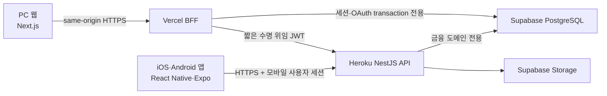

# PC 웹·네이티브 모바일 공용 가계부 설계

- 작성일: 2026-07-27
- 상태: 사용자 작성본 승인 완료
- 적용 범위: 마일스톤 2~5
- 선행 조건: `feature/security-auth-foundation`의 TASK 14 완료와 `main` 통합

## 1. 결정 요약

가계부는 PWA 하나를 PC와 모바일에 공통 배포하지 않는다. PC는 Next.js 웹 애플리케이션으로, 모바일은 React Native·Expo 기반 iOS/Android 애플리케이션으로 각각 구현한다. 두 클라이언트는 같은 계정으로 로그인하고 같은 Node.js API와 PostgreSQL 원장을 사용한다.

운영 플랫폼은 다음으로 고정한다.

- PC 웹과 BFF: Vercel
- 도메인 API: Heroku의 Node.js·NestJS
- 인증·PostgreSQL·Storage: Supabase Pro
- 모바일: React Native·Expo, TypeScript·TSX
- Android 최초 공개 채널: Google Play
- iOS: 동일 코드베이스와 계약을 유지하되 App Store 공개는 후속 출시 게이트로 둔다.

Firebase Firestore와 Firebase Authentication은 원본 금융 데이터나 사용자 신원의 저장소로 사용하지 않는다. FCM, Crashlytics, App Distribution, App Check 같은 모바일 보조 기능은 별도 설계 승인을 받은 경우에만 추가한다.

## 2. 제품 범위

### 2.1 이번 범위에 포함

- 같은 사용자가 PC 웹과 모바일 앱에서 동일한 계좌·거래·예산·통계를 조회하고 수정
- 계좌, 카테고리, 거래, 원자적 이체, 기본 대시보드
- 예산, 반복 거래, 자산 스냅샷, 기간·분류 통계
- 서버 기준 버전·멱등성·충돌 처리와 기기 간 데이터 일관성
- CSV 가져오기·내보내기
- PC 웹과 iOS·Android의 접근성·반응성·보안 테스트
- Android 서명 빌드, 내부 배포, Google Play 제출 준비
- 운영·백업·복구·관측성·보안 릴리스 게이트

### 2.2 이번 범위에서 제외

- PWA 설치, 웹 앱 manifest, service worker
- IndexedDB 금융 데이터와 오프라인 mutation queue
- 모바일 영구 금융 캐시와 오프라인 쓰기
- WebSocket·Realtime을 이용한 즉시 기기 간 push
- 금융기관·카드사 자동연동
- 영수증 OCR
- 가족·커플 공유 가계부
- 관리자 페이지
- iOS App Store 실제 제출

제외 항목은 UI에 비활성 메뉴나 예고 카드로 노출하지 않는다. 금융기관 자동연동과 OCR은 핵심 가계부가 안정화된 뒤 별도 위협 모델과 설계 승인을 거친다.

## 3. 시스템 구조

브라우저와 모바일은 PostgreSQL·Storage에 직접 접근하지 않는다. BFF의 DB 역할은 웹 세션과 OAuth transaction만 접근하고, API의 DB 역할은 금융 도메인만 접근한다. migration·owner 역할은 런타임에 사용하지 않는다.

PC와 모바일의 데이터 공유는 별도 복제 DB나 양방향 sync 엔진으로 구현하지 않는다. 두 클라이언트가 같은 서버 원장을 조회하고 수정하는 것이 기본 동기화 모델이다.

## 4. 클라이언트 경계

### 4.1 PC 웹

- Next.js App Router와 TypeScript·TSX
- 브라우저 API 통신은 ky
- 서버 상태는 TanStack React Query
- 필터·dialog·폼 draft 같은 일시 상태는 로컬 state
- 여러 화면에 걸친 비서버 UI 상태가 실제로 생길 때만 Zustand 도입
- 인증 credential은 `HttpOnly`, `Secure`, `SameSite` cookie
- 브라우저 저장소에 access token, refresh token, 금융 response 저장 금지

### 4.2 모바일

- React Native·Expo와 TypeScript·TSX
- Expo Router를 이용한 모바일 전용 화면·네비게이션
- API 통신은 ky, 서버 상태는 TanStack React Query
- 인증은 시스템 브라우저, Authorization Code, PKCE
- credential은 iOS Keychain·Android Keystore 기반 secure storage에만 보관
- AsyncStorage에 token, selector, 금융 response 저장 금지
- 앱 background·foreground 전환 시 세션 상태와 활성 query 재검증
- 로그아웃·계정 전환·탈퇴 시 credential과 메모리 query cache 제거

웹 컴포넌트를 모바일에 재사용하지 않는다. 다음 항목만 공유한다.

- Zod 계약과 TypeScript 타입
- 공개 오류 코드
- 금액·날짜·기간 계산
- query key와 API SDK 규칙
- 디자인 token의 이름과 의미
- 보안 로그 필드 규약

## 5. 인증과 사용자 식별

Google·Kakao·Naver는 플랫폼별 redirect URI와 client credential을 분리한다. 하나의 공급자 계정을 연결하더라도 서버의 canonical `user_id`는 PC와 모바일에서 동일해야 한다.

### 5.1 웹

1. 브라우저가 Vercel BFF에서 OAuth를 시작한다.
2. BFF가 PKCE·state·nonce transaction을 서버에 저장한다.
3. callback 검증 뒤 opaque 웹 세션을 생성한다.
4. BFF는 고정 route·method·scope·body digest에 결속된 짧은 수명 위임 JWT로 API를 호출한다.

### 5.2 모바일

1. 앱이 OS 시스템 브라우저에서 OAuth를 시작한다.
2. PKCE·state·nonce와 검증된 app/universal link를 사용한다.
3. 서버가 provider token을 검증하고 canonical `user_id`에 연결한다.
4. 모바일 세션 credential은 secure storage에 저장한다.
5. Heroku API는 모바일 토큰의 issuer, audience, subject, expiry, session 상태와 route scope를 검증한다.

웹의 opaque cookie와 모바일 credential은 서로 다른 selector를 사용하지만 같은 사용자와 서버 session family에 연결된다. 한 기기 로그아웃은 해당 세션만 폐기하고, 전체 로그아웃·비밀번호 또는 provider 위험 이벤트는 모든 session family를 폐기할 수 있어야 한다.

## 6. 금융 데이터 원칙

- 모든 사용자 소유 테이블은 `user_id NOT NULL`
- 사용자 경계를 포함한 복합 FK
- `ENABLE ROW LEVEL SECURITY`와 `FORCE ROW LEVEL SECURITY`
- API의 `app_api` 역할은 `NOBYPASSRLS`, 비owner
- 요청 body의 `userId`, owner, audit actor는 strict schema에서 거부
- 금액은 KRW 최소 단위의 PostgreSQL `BIGINT`
- 거래일은 `DATE`, 서버 이벤트 시각은 UTC `timestamptz`
- UUID, `version`, timestamps, `deleted_at`을 공통으로 유지
- 생성·이체는 멱등성 키를 요구
- 수정·삭제는 expected version을 요구
- 이체는 동일 금액의 반대 부호 두 행과 transfer group을 하나의 DB transaction에서 처리
- opening balance는 별도 잔액 필드가 아니라 원장의 명시적 거래
- 금융 response는 `Cache-Control: private, no-store`

PC·모바일·향후 금융기관 연동은 같은 canonical ledger를 사용한다. 특정 공급자 이름이나 외부 payload 구조를 핵심 거래 테이블에 고정하지 않는다.

## 7. 기기 간 데이터 일관성

초기 버전은 온라인 서버 원장을 source of truth로 사용한다.

- mutation 성공 후 관련 계좌·거래·대시보드 query 무효화
- 화면 진입과 앱 foreground 복귀 시 stale query 재조회
- 사용자가 명시적으로 새로고침 가능
- cursor는 서버가 생성한 불투명 값
- 동일 멱등성 키 재전송은 동일 결과
- stale version은 조용히 덮어쓰지 않고 최신 서버 값과 충돌 표시
- PC에서 변경한 내용은 모바일의 다음 재조회에서, 모바일 변경은 PC의 다음 재조회에서 반영
- 사용자 전환 시 이전 사용자의 메모리 캐시 즉시 폐기

초기 버전에는 WebSocket과 실시간 구독을 넣지 않는다. 측정 결과 사용자가 foreground 재조회로 불편을 겪을 때 별도 계획으로 추가한다.

## 8. 수정된 마일스톤

### 마일스톤 2 — 공용 원장과 두 클라이언트 기반

- body-bearing delegated JWT와 금융 mutation 신뢰 경계
- 공용 contracts와 금융 오류 모델
- 계좌·카테고리·거래·이체·opening balance schema와 RLS
- Node API CRUD, cursor, 멱등성, optimistic version
- 기본 대시보드
- PC 웹 app shell과 원장 화면
- 모바일 app shell, secure session, 원장 화면
- PC·Android·iOS 계약 테스트와 사용자 A/B 격리

### 마일스톤 3 — 예산·반복 거래·자산·통계

- 예산과 ledger reconciliation
- 반복 거래 exactly-once 생성
- 자산 스냅샷
- 기간·카테고리·계좌 통계
- PC와 모바일의 동일 계산 결과
- 월말·윤년·시간대·이체 제외·대량 데이터 성능 테스트

### 마일스톤 4 — PC·모바일 데이터 일관성

- 서버 cursor와 version conflict
- 요청 재전송·중복·역순·동시 수정 테스트
- 앱 foreground·화면 진입 재조회
- session revoke·logout·account switch cache 제거
- 두 브라우저/모바일 device context의 교차 클라이언트 E2E
- 네트워크 중단 시 안전한 오류와 재시도
- 금융 데이터 영구 캐시 없음 검증

### 마일스톤 5 — 입출력·릴리스·운영

- CSV preview·commit·export와 formula injection 방어
- PC 웹 WCAG 2.2 AA
- 모바일 스크린리더·동적 글꼴·터치 영역·reduced motion
- Android release signing과 내부 배포
- Google Play listing·privacy·financial features declaration 자료
- iOS release build 검증, App Store 제출은 후속 게이트
- SAST, SCA, secret scan, SBOM, DAST
- 백업·격리 복원·key rotation·kill switch·incident drill
- Vercel·Heroku·Supabase 동일 SHA 배포 증거

## 9. 테스트 전략

모든 기능은 RED → GREEN → 리팩터링 → 집중 검증 → 전체 검증 순서로 개발한다.

| 계층 | 필수 검증 |
|---|---|
| Contracts | strict schema, 금액·날짜·UUID·cursor·version·멱등성 |
| Database | migration, role grant, RLS force, 사용자 A/B, 복합 FK, transaction rollback |
| API | 인증·scope·소유권·raw body, idempotency, conflict, safe error |
| Web BFF | CSRF·Origin, cookie, 고정 proxy, 위임 JWT, no-store |
| PC 웹 | query invalidation, 키보드, 접근성, 반응형, 오류·로딩 |
| 모바일 | PKCE, secure storage, foreground refresh, 로그아웃 purge, Android·iOS UI |
| 교차 클라이언트 | 모바일 생성→PC 조회, PC 수정→모바일 조회, 동시 수정 충돌 |
| 운영 | exact SHA, SAST/SCA/SBOM/DAST, 백업 복원, secret·로그 마스킹 |

실제 금융 데이터는 로컬·CI 증거만으로 허용하지 않는다. Hosted role·RLS, 실제 OAuth, rate limit, 백업 복원, 관리자 MFA, 로그 경보와 동일 SHA 배포 증거가 추가로 필요하다.

## 10. Google Play 배포 경계

Google Play Console 개발자 계정 등록비는 계정당 1회 납부한다. 앱을 만들거나 업데이트할 때마다 등록비를 다시 내는 구조는 아니다.

다만 다음은 반복된다.

- 새 앱 생성과 package name 등록
- 최초 앱 심사
- 업데이트별 정책·자동·수동 심사 가능성
- target API·Data safety·개인정보처리방침 유지
- 금융 기능 declaration 유지
- 앱 signing과 release artifact 관리

2023-11-13 이후 생성한 개인 개발자 계정은 production 공개 전에 최소 12명의 tester가 14일 연속 opt-in한 closed test와 production access 신청을 완료해야 한다. 내부 테스트는 이 조건 없이 시작할 수 있다.

앱은 Google Play 등록 전에도 서명된 Android APK와 Firebase App Distribution으로 본인·지인에게 배포할 수 있다. 실제 금융 데이터 베타는 Expo Go나 debug build가 아니라 release-equivalent signed build에서만 허용한다.

## 11. 브랜치·실행 원칙

1. TASK 14 인증 E2E 경계를 승인된 설계대로 완료한다.
2. `feature/security-auth-foundation` exact HEAD 검증 후 PR #2를 `main`에 통합한다.
3. 최신 `main`에서 `feature/financial-mutation-boundary`를 생성한다.
4. 독립 계획마다 짧은 `feature/{기능명}` 브랜치와 PR을 사용한다.
5. contracts → database/RLS → API/BFF → PC 웹 → 모바일 → 통합 E2E 순서로 public contract를 동결한다.
6. maintenance는 `maintenance-branch`, 긴급 수정은 `hotfix/{수정명}`에서 수행한다.

각 마일스톤마다 기획자, 프로젝트 리더, 백엔드 개발자, 프론트엔드·모바일 개발자, 보안 개발자 역할의 새 서브에이전트를 사용한다. 공유 파일을 동시에 수정하지 않고 읽기 전용 검토와 단일 구현자를 wave로 분리한다.

## 12. 사용자 결정 게이트

다음 값은 코드나 외부 등록을 시작하기 전에 사용자 승인을 받는다.

- 앱 공개 이름과 Android package name
- Google Play 개인·조직 계정 유형
- Google Play 최초 배포 국가
- 모바일 Google·Kakao·Naver callback URI
- Android 내부 beta 사용자
- iOS Developer Program 시작 시점
- Firebase 보조 기능 채택 여부
- 실제 금융 데이터 저장 시작일

이 결정 전에도 contracts, DB, API, PC 웹과 합성 데이터 기반 모바일 구현·테스트는 진행할 수 있다. 서명 배포, OAuth 운영 연결, 실제 데이터 저장만 해당 결정에 의해 차단된다.
