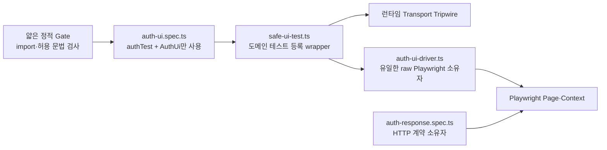

# 안전한 인증 UI Capability Facade 설계

## 1. 배경과 결정

M1.1의 목표는 UI E2E 테스트가 화면과 사용자 관찰 가능 상태만 검증하고,
HTTP 응답 객체·본문·상태·credential 원문을 소유하지 못하게 하는 것이다.

기존 `ui-network-boundary.ts`는 임의 TypeScript/JavaScript 코드의 별칭,
구조분해, import/export, computed member를 문자열 provenance로 추적했다.
직접 전역 접근, 선언 순서, 기본 매개변수, namespace import/re-export와
구조분해를 보완할 때마다 동일 계열의 새로운 우회가 발견됐다. 이는 개별
mutation 누락이 아니라 임의 JavaScript 코드를 정적으로 안전하다고 증명하려는
경계 자체가 지나치게 넓다는 신호다.

따라서 M1.1은 raw Playwright capability를 UI spec에 제공하지 않는
**인증 도메인 전용 capability facade**로 전환한다. 방어는 다음 세 계층을
동시에 사용한다.

1. `AuthUi` 도메인 API만 전달하는 테스트 등록 wrapper
2. UI spec의 허용 문법만 검사하는 얇은 정적 Gate
3. UI callback 실행 중 Node transport global을 차단하는 런타임 Tripwire

이 설계는 현재 인증 UI에 필요한 기능만 제공한다. 거래, 차트, 필터, 모달과
같은 향후 UI capability는 사용하는 마일스톤에서 별도 보안 검토와 mutation을
거쳐 추가한다.

## 2. 목표와 비목표

### 2.1 목표

- UI spec이 `Page`, `Locator`, `BrowserContext`, `Request`, `Response`,
  `APIRequestContext`를 얻지 못하게 한다.
- UI spec이 Node 또는 브라우저 transport를 직접 생성하지 못하게 한다.
- cookie, header, storage, Axe 결과의 원문이 UI spec·오류·artifact로
  전달되지 않게 한다.
- UI와 HTTP 계약 테스트의 책임을 분리한다.
- 새 UI 동작은 명시적인 facade 메서드와 보안 테스트를 통해서만 추가한다.
- 기존 문자열 provenance 분석기를 단순한 facade 문법 검사로 대체한다.

### 2.2 비목표

- 악의적인 저장소 관리자나 CI workflow 수정 권한 보유자를 이 Gate 하나로
  방어하지 않는다. 이 위협은 PR review, branch protection, 최소 권한 CI와
  감사 로그가 담당한다.
- UI 프로젝트에서 HTTP status, response body, CSRF, logout, selector replay
  계약을 다시 검증하지 않는다.
- 이번 설계에서 거래·예산·차트 화면용 범용 UI DSL을 만들지 않는다.
- 자동화된 Gate가 전문 침투 테스트를 대체한다고 간주하지 않는다.

## 3. 신뢰 경계와 구성 요소



### 3.1 `auth-ui.spec.ts`

- `tests/e2e/ui/auth-ui.spec.ts`는
  `../support/safe-ui-test.js`의 `authTest`만 import한다.
- callback은 `{ authUi }`만 받는다.
- 테스트용 email/password 문자열은 로컬 상수로 둘 수 있다.
- 승인된 `AuthUi` 메서드를 직접 `await`하는 문장만 사용한다.
- raw selector, URL 결과, DOM 값, cookie, request, response를 다루지 않는다.

### 3.2 `tests/e2e/support/safe-ui-test.ts`

Playwright의 `test.extend()`를 그대로 export하지 않는다. 기본 Playwright
fixture 타입에는 `page`, `context`가 계속 포함될 수 있기 때문이다.

대신 다음 개념의 등록 함수를 export한다.

```ts
authTest(title, async ({ authUi }) => {
  // AuthUi만 사용
});
```

wrapper 내부에서만 base Playwright test의 `page`와 `context`를 받아 driver를
생성한다. callback에는 runtime에서도 `authUi` 한 항목만 가진 고정 객체를
전달한다.

### 3.3 `tests/e2e/support/auth-ui-driver.ts`

raw Playwright와 AxeBuilder를 소유할 수 있는 유일한 UI facade 구현 파일이다.
모든 원문 데이터는 이 파일 내부에서 boolean 또는 고정 판정으로 즉시 축약한다.
UI spec으로 객체나 원문을 반환하지 않는다.

### 3.4 얇은 정적 Gate

Gate는 capability provenance를 추적하지 않는다. `auth-ui.spec.ts`의 module
형태와 callback 문법이 승인된 DSL인지 검사한다. facade 구현은 별도의 좁은
감사 대상이며 UI spec root에 포함하지 않는다.

새 검사는 `tests/e2e/ui-facade-boundary.ts`와 그 mutation test가 소유한다.
기존 `ui-network-boundary.ts`는 이전 완료와 독립 리뷰 뒤 제거한다.

### 3.5 HTTP 계약 프로젝트

`auth-response.spec.ts`는 계속 다음 항목을 소유한다.

- 로그인 성공·실패 status와 공개 response shape
- `/api/me`
- CSRF
- logout
- opaque selector replay 거부
- response raw/parsed credential 비노출

## 4. 공개 `AuthUi` API

초기 공개 API는 다음으로 고정한다.

```ts
type TestCredentials = Readonly<{
  email: string;
  password: string;
}>;

interface AuthUi {
  openLogin(): Promise<void>;
  assertLoginUsable(): Promise<void>;
  submit(credentials: TestCredentials): Promise<void>;
  assertRejected(): Promise<void>;
  assertAuthenticated(): Promise<void>;
  assertNoBrowserCredentials(): Promise<void>;
  assertNoAuthorizationHeaders(): Promise<void>;
}
```

각 메서드의 책임은 하나로 제한한다.

- `openLogin`: 로그인 화면으로 이동하고 준비 상태만 확인한다.
- `assertLoginUsable`: label, keyboard focus, responsive overflow와 axe-clean
  여부를 검사한다.
- `submit`: credential을 입력하고 submit한다. 인수는 저장·로그·반환하지 않는다.
- `assertRejected`: 고정 실패 상태와 로그인 경로 유지만 검사한다.
- `assertAuthenticated`: 애플리케이션 경로, session cookie 정책과 opaque
  고정 길이 형식을 내부 검사한다.
- `assertNoBrowserCredentials`: local/session storage에 credential material이
  없는지 내부 검사한다.
- `assertNoAuthorizationHeaders`: request recorder가 보존한 boolean만 검사한다.

새 메서드는 실제 UI 요구, 최소 공개 capability, 실패 코드, RED mutation,
실제 Chromium 검증을 함께 추가해야 한다.

## 5. 민감 데이터 흐름

### 5.1 Credential

테스트 credential은 `submit`에서 DOM 입력에만 사용한다. driver field,
전역 변수, 반환값, 오류 메시지, logger에 저장하지 않는다.

### 5.2 Cookie

driver는 cookie의 다음 항목만 내부에서 검사한다.

- 이름
- `HttpOnly`
- `Secure`
- `SameSite`
- 경로
- opaque 고정 길이 형식

cookie 값과 cookie 객체는 facade 밖으로 반환하지 않는다.

### 5.3 Storage

DOM storage 항목은 `page.evaluate` 내부에서 투영하고 driver 내부에서
credential material 존재 여부로 축약한다. storage entry와 serialized 값은
오류나 spec으로 전달하지 않는다.

### 5.4 Authorization request 관찰

request listener는 `headerValue("authorization")` 결과를 즉시
`value !== null` boolean으로 축약한다. header value와 `Request` 객체를
저장·반환하지 않는다.

### 5.5 Accessibility

Axe 결과는 `violations.length === 0`만 판정한다. violation node, HTML,
selector와 상세 설명은 CI 출력이나 오류에 포함하지 않는다.

## 6. 정적 Gate 문법

### 6.1 허용

- `safe-ui-test`에서 정확히 `authTest` named import
- 테스트용 문자열 상수
- `authTest` 직접 호출
- 고정 문자열 테스트 제목
- 정확히 `async ({ authUi }) => { ... }` callback
- 승인된 `AuthUi` 메서드의 직접 `await` 호출
- `submit`에 로컬 credential 상수로 만든 고정 객체 전달

### 6.2 금지

- `@playwright/test`, AxeBuilder, 로컬 helper, Node module과 다른 외부 import
- default·namespace·alias import
- dynamic `import()`, `require`, `process`, `module`
- `fetch`, `XMLHttpRequest`, `Request`, `Response`, `WebSocket`
- `globalThis`, `global`, `window`, `self`를 통한 transport 접근
- `eval`, `Function`과 동적 script 실행
- 별칭, 구조분해 재할당, computed member, unknown `AuthUi` method
- `authUi` 또는 메서드의 저장·전달·반환
- callback 내부 임의 함수 호출, 조건 분기와 반복문

Gate 진단은 고정 `category/capability`만 출력한다. source expression,
동적 key, URL, selector, credential, header, cookie, storage 값은 출력하지 않는다.

## 7. 런타임 Transport Tripwire

wrapper는 다음 순서를 지킨다.

1. Playwright가 raw fixture를 생성한다.
2. facade driver를 생성한다.
3. Node transport global의 property descriptor를 저장한다.
4. 고정 오류를 발생시키는 tripwire를 설치한다.
5. `{ authUi }`만 전달해 UI callback을 실행한다.
6. 성공·실패와 무관하게 `finally`에서 원 descriptor를 복원한다.
7. 예상하지 못한 오류도 고정 안전 코드로 정규화한다.

초기 tripwire 대상은 다음이다.

- `fetch`
- `XMLHttpRequest`
- `Request`
- `Response`
- `WebSocket`
- 실행 환경에 존재할 경우 `EventSource`

tripwire는 descriptor가 원래 없던 global도 정확히 삭제 복원해야 한다. 중첩
설치는 금지하거나 명시적인 depth를 관리해 이전 테스트 상태를 오염시키지 않는다.

Tripwire가 Playwright 또는 Axe 동작과 충돌하면 특정 global에 예외를 열지 않는다.
구현을 중단하고 격리 방식 설계로 되돌아온다.

## 8. 오류와 Artifact 정책

인증 UI 프로젝트는 다음 artifact를 항상 비활성화한다.

- screenshot
- video
- trace

공개 오류 코드는 다음으로 고정한다.

```text
AUTH_UI_LOGIN_NOT_READY
AUTH_UI_LAYOUT_FAILED
AUTH_UI_ACCESSIBILITY_FAILED
AUTH_UI_REJECTION_FAILED
AUTH_UI_SESSION_POLICY_FAILED
AUTH_UI_BROWSER_CREDENTIAL_DETECTED
AUTH_UI_AUTHORIZATION_HEADER_DETECTED
AUTH_UI_TRANSPORT_BLOCKED
AUTH_UI_UNEXPECTED_FAILURE
```

각 driver 메서드는 내부 오류를 잡고 `cause` 없이 해당 단계의 고정 오류로
바꾼다. wrapper는 알려진 `SafeAuthUiError` 코드만 그대로 전달하고, facade
callback에서 빠져나오는 그 밖의 오류를 `AUTH_UI_UNEXPECTED_FAILURE`로
바꾼다. 오류 메시지에 실제 URL, selector, 입력값, header, cookie, storage,
DOM, Axe node를 넣지 않는다.

## 9. TDD와 보안 검증

### 9.1 RED

다음 항목이 허용되면 테스트가 실패해야 한다.

- 현재 raw Playwright UI spec
- Playwright·AxeBuilder·로컬 helper·Node module import
- 직접·computed·aliased global transport 접근
- dynamic import, require, process, eval, Function
- raw `page`, `context`, `request`, `response` fixture 요구
- unknown `AuthUi` method
- `authUi` 저장·전달·반환
- wrapper callback에 `authUi` 외 runtime key 전달
- tripwire 대상 transport 호출
- tripwire callback 실패 후 descriptor 미복구
- raw Playwright 오류 또는 민감 sentinel이 공개 오류에 포함되는 경우

각 mutation은 구현 전 실제 RED를 관찰하고 기대한 고정 진단이 없어서
실패했음을 기록한다.

### 9.2 GREEN

- 정적 Gate mutation 전체
- Tripwire 단위 테스트와 descriptor 복구 테스트
- facade 공개 API와 오류 정규화 테스트
- 실제 `auth-ui.spec.ts` Gate 검사
- E2E TypeScript typecheck
- lint와 `git diff --check`
- legacy/security, contracts, database package, API, web 전체 테스트
- disposable PostgreSQL 기반 HTTP/UI Playwright
- 모바일 390×844와 데스크톱 1440×900
- production dependency audit

로컬 환경에서 PostgreSQL, Chromium, package manager spawn 또는 registry 검사가
불가능하면 성공으로 추정하지 않는다. 저장소 고정 Node 버전과 정확히 같은
commit SHA의 GitHub `security-gate`를 권위 증거로 사용한다.

## 10. 이전 순서

1. 새 Gate mutation과 실제 raw spec RED를 고정한다.
2. `authTest` wrapper와 runtime callback shape를 구현한다.
3. Tripwire RED/GREEN과 복구 테스트를 구현한다.
4. `AuthUi` driver를 메서드별 최소 기능으로 구현한다.
5. 실제 auth UI spec을 도메인 API로 이전한다.
6. 실제 모바일·데스크톱 Chromium과 HTTP 프로젝트를 함께 검증한다.
7. 새 경계가 기존 위협 mutation을 대체함을 독립 리뷰한다.
8. 그 후에만 기존 provenance analyzer와 대체된 mutation을 제거한다.
9. code SHA와 documentation SHA 각각 push/PR gate를 통과시킨다.

중간 단계에서는 두 경계를 동시에 유지하며, 새 경계가 완전히 GREEN이 되기 전에
기존 경계를 제거하지 않는다.

## 11. 완료 조건

M1.1은 다음을 모두 충족해야 완료할 수 있다.

1. UI spec이 `authTest` 외 module을 import하지 않는다.
2. callback이 runtime과 TypeScript 양쪽에서 `AuthUi`만 받는다.
3. raw Playwright와 AxeBuilder는 감사 대상 facade 구현에서만 사용된다.
4. UI spec은 response, request, cookie, storage, Axe 원문을 받을 수 없다.
5. 정적 Gate와 runtime Tripwire mutation이 모두 GREEN이다.
6. artifact가 screenshot·video·trace 모두 비활성화돼 있다.
7. 실제 모바일·데스크톱 인증 UI와 HTTP 계약 프로젝트가 모두 GREEN이다.
8. code SHA와 최종 documentation SHA의 push/PR `security-gate`가 모두 성공한다.
9. 독립 리뷰에 미해결 Critical 또는 Important가 없다.
10. D2 hosted provider/TLS와 beta-before 전문 침투 테스트가 별도 production
    release blocker로 유지된다.

M1.1이 완료되기 전에는 M1을 닫거나 M2를 시작하지 않는다.
