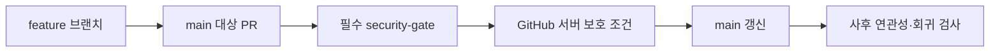

# 무료·공개 저장소의 기본 브랜치 보호 설계안

상태: 2026-09-28 로컬 보완과 T5 노출 감사 완료, G2 라이선스 고지 로컬 반영. G1 개인정보·G3 권리/최종 목록·P1 원격 보호는 미종결이다. 비공개 초안 PR 전송 계획은 승인됐지만 공개 전환·원격 보호 변경은 별도 승인 대상이다. [승인 보완 기록](../plans/2026-09-27-public-repository-autoplan-review.md), [실행 계획](../plans/2026-09-28-public-repository-local-hardening.md).

## 1. 사용자 의도와 범위

사용자는 무료 GitHub 플랜을 유지하며 비공개는 필수 조건이 아니라고 밝혔다. 선택한 “A안”의 핵심인 GitHub 기본 보호를 무료로 사용하기 위해 공개 저장소를 전제로 설계한다. 앞선 비교표의 이름과 혼동하지 않도록 이 문서에서는 “무료·공개 + 기본 보호”라고 부른다. 유료 업그레이드는 하지 않는다.

이는 저장소·CI의 보안 구조 변경이다. 앱 기능·금융 DB·실계좌 연결·운영 배포는 변경하지 않는다. 현재 저장소는 아직 비공개다. 공개할 정보의 검토 및 최종 공개 전환 확인 전에는 설정을 바꾸지 않는다.

## 2. 문제와 보장 범위

현 CI는 실제 merged 상태, PR/base/SHA, 커밋 부모를 대조하지만 간접 병합에서는 허용 경로를 증명하지 못한다. 이 P1을 기본 보호 활성화만으로 자동 해결 처리하지 않는다.

새 보안 목표는 **PR 요구·필수 품질 검사 등 서버 보호 조건을 충족하지 않은 main 변경을 차단**하는 것이다. “항상 웹 병합 버튼/API만 사용했다”는 전송 경로 증명과 구분한다. GitHub의 기본 보호는 일부 동일한 로컬 병합 결과를 허용할 수 있으며, 그 자체를 우회라고 단정하지 않는다. 버튼/API만 허용하는 절대적 경로 증명이 필요하면 이 설계만으로 충족하지 않으므로 별도 설계로 중단한다.

기존 증빙 코드는 보조적인 PR/커밋 연관성 검사다. 문서·명칭·테스트에서 직접 push 전체 탐지를 보장한다고 쓰지 않는다. 보호를 끄거나 변경할 수 있는 관리자 계정 침해는 MFA·접근 최소화·설정 점검으로 별도 관리하며 이 설계가 제거하지 못하는 위험으로 남긴다.

## 3. 대안 결정

| 방향 | 장점 | 비용·위험 | 결정 |
| --- | --- | --- | --- |
| 공개 + 기본 보호 | 무료, 별도 승인 서버·서명키 불필요, 유지보수 작음 | 소스·이력 공개, 공개 전 검토 필수 | 사용자 선택 방향 |
| 비공개 + GitHub Pro | 소스 비공개와 기본 보호 | 유료 플랜 | 무료 요구로 제외 |
| 비공개 + 자체 승인/배포 검증 | 소스 비공개 유지 | 직접 push 자체 차단과 다름, 별도 키·운영 부담 | 비권장 |

공개해도 서비스 데이터베이스를 공개하지 않는다. 하지만 저장소에 이미 들어 있는 데이터·키는 공개되므로 이를 별도 점검해야 한다. 다시 비공개로 돌려도 타인이 복제한 사본을 회수할 수 없다.

## 4. 공개 전 차단 조건

1. 공개 대상 main만 아니라 모든 공개될 브랜치·태그·Git 이력을 검사한다. 탐지 도구 결과는 값 없이 종류·경로·커밋으로 보고한다. 현재 env가 추적되지 않는 사실만으로 과거도 안전하다고 판단하지 않는다.
2. 실제 키·인증 토큰·계좌번호·개인정보·고객/raon 자료, DB 덤프·백업, 스크린샷·첨부파일·PR 본문·댓글·Actions 로그/artifact·배포 로그 연결을 검토한다. 접근 불가 자료는 미검증으로 기록하며 공개 승인 전 해결한다.
3. 실제 비밀값 발견 시 폐기·교체가 선행한다. 이력 수정·삭제·강제 push는 별도 승인 대상으로 둔다. 새 커밋에서 파일만 지우는 것으로 종결하지 않는다.
4. 외부 문서·이미지·라이선스의 공개 권리를 검토한다. 소스 공개와 오픈소스 라이선스 부여를 같은 행위로 취급하지 않고 새 라이선스는 임의 추가하지 않는다.
5. 공개 PR을 받는 Actions는 최소 읽기 권한, SHA 고정 Action, 운영 secret 없는 폐기용 DB를 유지한다. 신뢰하지 않는 PR 코드에 secret을 주거나 pull_request_target으로 실행하지 않는다. 외부 기여자 실행 승인 정책·self-hosted runner 사용 여부도 점검한다.
6. 최종 공개 대상 목록을 확정하는 시점부터 보호 확인까지 변경을 동결한다. 목록에는 refs SHA·감사 시각·검토 완료/미검증 자료를 기록한다. 공개 직전 변경분을 재검사하고 차이가 있으면 감사·최종 확인을 갱신한다. 공개와 보호를 원자적으로 바꿀 수 있다고 가정하지 않는다. 보호 적용 실패 시 중단하고 main push·병합·배포를 하지 않는다.

[T5 감사](../../security/2026-09-28-public-exposure-audit.ko.md)를 수행했고 라이선스 원문·출처 고지를 로컬에 보완했다. 감사 완료는 공개 승인이 아니다. G1/G3 확인과 최종 refs·새 PR/CI 로그의 delta 검사를 거친 뒤 실제 공개 전환의 최종 확인을 받는다.

## 5. 제안 보호 구성

기존 `.github/settings/main-protection.json`을 갱신하는 단일 classic 보호 규칙을 우선한다. ruleset을 중복 추가하지 않는다. 실제 원격 규칙은 적용 전 조회해 충돌이 있으면 중단한다.

- 대상: 정확히 main.
- PR 요구: 활성화. 1인 개발에 맞춰 필수 타인 승인 수 0을 확정했다. 독립적인 사람의 승인을 강제하지 못하므로 본인 최종 확인을 절차로 유지한다. H(PR head)·B(검사 base)·C(실제 checkout)·run ID/event/URL·확인자/시각을 기록한다. PR merge-ref에서는 H와 C가 다를 수 있다. head/base/검사 정의 변경 시 이전 확인은 무효다.
- 필수 상태 검사: `security-gate`, strict=true. 2026-09-28 실제 main check 조회의 GitHub Actions app_id=15368을 로컬 checks에 고정했다(contexts=[]). [관측 실행](https://github.com/jawon0407/account-book/actions/runs/35832112508/job/107086890347)은 failure로 출처 확인일 뿐 품질 통과 증거가 아니다. 원격 적용 직전 다시 조회하고 app ID를 추측하거나 any-source로 완화하지 않는다.
- 관리자에게도 규칙 적용, force push·삭제 비허용, 미해결 대화 해결 필수.
- 일반 merge와 squash 지원, 여러 커밋 rebase·merge queue는 현 증빙 계약상 미지원. linear-history=false로 로컬 목표를 고쳤다. rebase merging 비활성화는 별도 승인된 원격 단계에서 적용·재조회한다.
- main push에서만 실행되는 `main-provenance`는 PR 필수 검사로 지정하지 않는다. 사후 작업을 선행 조건으로 지정해 영원히 병합할 수 없게 되는 문제를 막는다.
- 필수 job이 skipped/neutral로 통과 처리될 수 있는 플랫폼 특성에 대비해, PR 품질 job이 실제 실행되고 필수 단계 누락·취소·실패가 실패로 귀결되는지 검증한다. 이름만 같은 체크를 성공 조건으로 신뢰하지 않는다.

기존 required_status_checks=null은 로컬 설정에서 교정했다. 같은 Actions 앱/체크 이름/검토 digest는 승인된 검사 내용을 증명하지 못한다. 본인이 workflow·보안 scripts·package scripts 최종 diff와 실제 필수 단계 실행을 확인한다. skipped/neutral도 GitHub 필수 체크를 만족할 수 있어 본인 확인에서 검사 미실행을 거부해야 한다. JSON 테스트와 PR 양식은 원격 보호 적용이나 독립 사람 승인 강제의 증거가 아니다.

## 6. 구성 흐름과 오류 처리

실패·시간 초과·권한 부족·조회 불가를 성공으로 취급하지 않는다. 설정 적용 후 원격 값을 다시 읽어 목표 값과 비교한다. 규칙 불일치 시 보호가 완료됐다고 보고하지 않는다. 쓰기 토큰·운영 secret을 workflow에 새로 넣지 않으며 관리자 설정 작업은 승인된 로컬 세션에서만 수행한다.

사후 CI는 main 변경을 되돌리는 보안 장치가 아니다. CI 실패를 자동 force push·규칙 완화로 복구하지 않고 원인 확인과 별도 수정 PR 절차를 따른다.

기존 main-provenance→security-gate 순서를 유지한다. 증빙 API 장애로 후속 품질 검사가 미실행될 수 있으며 보고에서 이를 구분한다. 원인 해소 뒤 동일 이벤트를 수동 재실행하고, 새 코드는 새 승인 PR/이벤트로 검사한다. 이번 보완에서는 workflow를 수정하지 않는다.

## 7. 예상 파일 범위와 작업 규모

아래 표는 2026-09-24 후보 기록이다. 2026-09-28 확정 범위는 상세 실행 계획의 로컬 13파일과 후속 공개 점검 보고 1파일이다. workflow는 읽기 전용, 새 설정 정책 테스트는 별도 파일로 분리한다. 사용자 기존 .gitignore 변경은 보존한다.

구현은 중간 규모다. 새 서비스·DB·의존성은 없다. 실제 변경량과 검증 결과는 [진행 기록](../../status/2026-09-24-ci-merge-provenance.ko.md)에 남긴다.

| 후보 파일 | 변경 목적 |
| --- | --- |
| .github/settings/main-protection.json | PR/필수 검사/관리자/병합 형태 목표 설정 |
| .github/workflows/security-gate.yml | 실제 PR 필수 검사와 사후 검사 관계 보완 |
| scripts/security/workflow-policy.test.mjs | 필수 단계 누락·검사 출처·실행 조건 회귀 |
| scripts/security/merge-evidence.test.mjs | 간접 병합의 보장 한계·기본 보호와의 책임 구분 |
| docs/security/free-plan-compensating-controls.md | 무료·비공개 대체 통제에서 공개 기본 보호 운영으로 갱신 |
| docs/superpowers/specs/2026-09-24-ci-merge-provenance-design.md | 원 설계 보장 범위 교정 |
| docs/status/2026-09-24-ci-merge-provenance.ko.md | P1 보완 증거·미검증 항목 |
| docs/README.md | 새 문서와 현행 상태 연결 |
| 신규 구현 계획·공개 전 점검 보고 | 파일별 규모, 승인, 검사 결과, 공개 범위 증거 |

확정 계획에 따라 검사 삭제나 실패 면제 없이 로컬 정책·회귀·문서를 보완한다.

## 8. 검증과 완료 조건

- 문서/설정: 공개 범위·민감자료 검토 결과, GitHub 원격 보호 설정의 읽기 재확인, 필수 체크 출처·이름 증거.
- 로컬: 보안 집중 회귀, pnpm verify, 기존 인증 분기 커버리지 100% 기준 유지. 테스트 수를 목표로 늘리지 않는다.
- 원격: 승인된 후보 SHA의 PR CI, 폐기용 DB/브라우저 인증, 필수 검사 실패·취소 때 병합 차단, 정상 PR 병합 후 main CI를 확인한다.
- 거부 검증: 실제 main에 우회 코드를 밀어 넣지 않는다. 공개된 무민감 테스트 저장소/임시 보호 브랜치에서 최소 fixture로 조건 미충족 push 거부를 검증하는 계획을 별도 승인받는다. main은 설정 증거와 정상 승인 PR로 확인한다. 테스트 자원 생성도 자동 실행하지 않는다.
- 독립 검토: 기존 간접 병합 P1의 새 보장 범위와 잔여 위험을 검토받는다. basic protection만으로 “GitHub UI/API 경로 독점”을 증명했다고 보고하지 않는다.
- 사용자 금융정보·실계좌·운영 credential은 어떤 검증에도 사용하지 않는다.

P1 종결에는 목표 재정의 승인, 원격 보호 확인, 필요한 거부/정상 흐름 검증, 독립 검토가 모두 필요하다. 현재는 미종결이다.

공개 점검, main 보호/P1, secret scanning/push protection의 종료 조건은 별도다. 각각 대상·조회 시각·검증 증거·미검증을 기록한다. 현재 보고 채널의 실제 사용 가능 여부도 공개 전 확인하며, 사용 가능하지 않은 채널을 활성이라고 안내하지 않는다.

## 9. 다음 승인과 비범위

상세 계획까지 승인되어 현재 세션 순차 구현과 독립 최종 검토로 진행한다. 공개 전환은 사전 점검 결과와 되돌릴 수 없는 공개 범위를 설명한 후 별도로 확인한다. PR #13 병합, 이력 재작성, 배포, 유료 결제, 조직 이전, 새 PAT/GitHub App 설치는 이 승인의 자동 부수 효과가 아니다.

## 10. 공식 근거

- [보호 브랜치 지원 범위·설정·예외](https://docs.github.com/en/repositories/configuring-branches-and-merges-in-your-repository/managing-protected-branches/about-protected-branches)
- [저장소 공개 범위 변경](https://docs.github.com/en/repositories/managing-your-repositorys-settings-and-features/managing-repository-settings/setting-repository-visibility)
- [간접 병합](https://docs.github.com/en/pull-requests/reference/pull-request-merges#indirect-merges)
- [현재 진행 지도](../../status/2026-09-24-project-map.ko.md)
