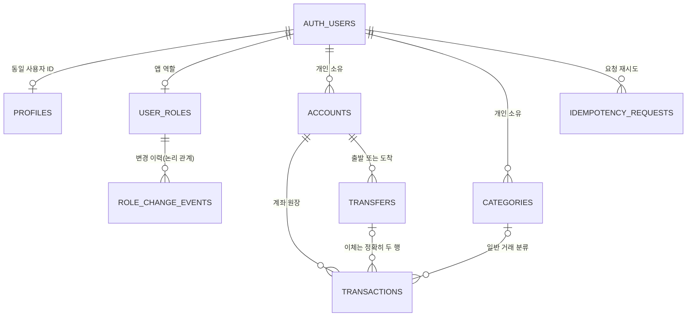

# 회원·금융 원장 전체 기본 스키마 설계

- 작성일: 2026-09-29
- 상태: 전체 기본 스키마 범위는 사용자 선택 완료. 아래 상세 설계는 검토용이며 SQL 구현·개발 DB 적용은 아직 하지 않았다.
- 기준: `feature/bank-state-transitions`, HEAD `f72f91f`. 인증 연결 작업의 미커밋 변경은 보존한다.
- 범위: 신규 8개 테이블. 기존 Supabase Auth, 앱 인증 7개, 은행 연결 3개 테이블의 책임을 유지한다.
- 선행 계약: [공용 원장 계약 설계](2026-08-26-ledger-public-contracts-design.md), [웹·모바일 공유 원장](2026-07-27-web-native-mobile-shared-ledger-design.md).

## 1. 목적과 완료 기준

같은 계정으로 PC 웹과 별도 모바일 앱에서 동일한 프로필·계좌·거래를 사용하는 가계부의 저장 기반을 만든다. 인증 계정은 Supabase가 관리하고, 앱 프로필·앱 권한·금융 기록은 우리 테이블이 관리한다. Table Editor에서도 스키마별로 이 구성을 확인할 수 있어야 한다.

사용자는 보안을 최우선으로 하고, 행동 원리·매개변수 설명과 한국어 문서, 기능별 Notion 기록을 요청했다. 이번 작업의 완료는 테이블·권한·제약조건·타입 선언·테스트·적용 기록까지다. 테이블 생성만으로 프로필 수정 화면, 장부 화면, 모바일 동기화 기능이 완성되었다고 표시하지 않는다.

이 문서는 아키텍처 변경에 해당한다. 상세 설계 검토 → 회원 기반 구현 계획 → 금융 원장 구현 계획 → 각 독립 검증 순으로 나눈다. 계정·금융정보를 지우는 reset이나 기존 migration 덮어쓰기는 하지 않는다.

## 2. 접근 방식 비교

| 방법 | 장점 | 단점 | 판단 |
| --- | --- | --- | --- |
| Auth metadata에 프로필·권한을 집중 | 초기 테이블 수가 적음 | 사용자 수정 가능 metadata를 권한 판단에 쓰면 위험. 금융 관계·제약·검색을 관리하기 어려움 | 채택하지 않음 |
| 인증·프로필·권한·금융을 역할별 테이블로 분리 | 기존 BFF/API 경계를 유지하고 SQL 제약·최소 권한 검증 가능 | migration과 권한 테스트가 필요 | 추천안 |
| 조직·공동장부·다중통화·복식부기까지 선제 구축 | 확장 모델을 처음부터 포함 | 현재 개인 원장 계약 변경과 새 권한 모델이 필요하고 검증 범위가 급증 | 별도 확장 단계 |

추천안의 한계도 명시한다. 이번 원장은 개인 소유(`user_id`)다. raon-app의 여러 사용자 공동 소유·위임 권한을 지금 지원하는 구조라고 표현하지 않는다. 향후 공동장부는 `ledgers`/`ledger_members`와 권한 이전 migration을 따로 설계한다. 현재 수입·지출·이체 공개 계약은 변경하지 않는다.

## 3. 저장 공간 지도

| 스키마 | 소유 기능 | 이번 처리 |
| --- | --- | --- |
| `auth` | Supabase 로그인 계정·인증 | 기존 사용자 보존. `auth.users.id`만 관계 키로 참조 |
| `app_private` | BFF 세션·OAuth·요청 제한·JWT replay | 이미 적용한 7개 테이블 유지 |
| `app_bank` | 은행 연결 신청·연결·암호화 자격정보 | 기존 SQL 3개 테이블 재사용. 이번에 동일 기능을 중복 생성하지 않음 |
| `app_identity` | 앱 프로필·역할·권한 변경 이력 | 신규 3개 |
| `app_ledger` | 개인 계좌·카테고리·거래·이체·멱등성 | 신규 5개 |

새 개발 Supabase에 실제 적용 확인된 앱 테이블은 현재 `app_private` 7개뿐이다. `app_bank`는 저장소에 migration이 있지만 이 개발 프로젝트에 적용 완료했다고 주장하지 않는다. 금융 원장 5개는 은행 연결 없이 수동 기록부터 사용할 수 있게 독립시킨다.

신규 스키마는 Supabase Data API의 Exposed schemas에 추가하지 않는다. 브라우저·모바일이 publishable key로 금융 테이블을 직접 조회하지 않는다. Table Editor는 관리자 도구이므로 비공개 스키마와 API 비노출은 별개다.

## 4. 관계도

관계도의 사용자 ID는 로그인 결과에서 서버가 확인한 UUID다. 클라이언트 요청의 `userId`, `ownerId`, `role`을 소유권 증명으로 받지 않는다. 외래 키는 관련 행의 존재를 보장하고, RLS는 누구의 행에 접근할 수 있는지 제한한다.

## 5. 회원 기반: 신규 3개

### 5.1 `app_identity.profiles`

| 열 | 형식 | 규칙·의미 |
| --- | --- | --- |
| `user_id` | UUID, PK/FK | `auth.users.id`와 1:1. 이메일을 관계 키로 쓰지 않음 |
| `nickname` | text, nullable | 미설정은 NULL. 설정 시 앞뒤 공백 제거 후 1~50자. 중복 닉네임 허용 |
| `avatar_object_key` | text, nullable | 이미지 자체나 외부 URL이 아니라 Storage 내부 경로. 최대 512자, 본인 UUID 디렉터리 아래 경로만 허용. `..`, 역슬래시, URL 금지 |
| `version` | bigint | 1부터 시작, 수정 때 증가. 최대 9,007,199,254,740,991 |
| `created_at`, `updated_at` | timestamptz | 서버 생성. 유한 시각, 수정 시각은 생성 시각 이상 |

프로필을 읽을 때마다 Auth metadata와 동기화하지 않는다. 이 테이블을 앱 프로필의 원본으로 삼는다. 이메일·비밀번호·토큰·관리자 역할은 이 테이블에 복제하지 않는다. Storage bucket·업로드 API·이미지 검사·파일 삭제 처리는 별도 구현이며, 경로 열이 있다는 것만으로 업로드 기능 완료가 아니다.

### 5.2 `app_identity.user_roles`

| 열 | 형식 | 규칙·의미 |
| --- | --- | --- |
| `user_id` | UUID, PK/FK | 사용자별 한 행 |
| `role` | text | `member` 또는 `admin`. 초기값은 항상 `member` |
| `created_at`, `updated_at` | timestamptz | 서버 생성·유한 시각 |

Supabase의 DB 역할 `authenticated`, `app_api`와 서비스 역할 `member`/`admin`은 다르다. 첫 가입자, 특정 이메일, user_metadata 값으로 자동 관리자 승격하지 않는다. 관리자 역할을 가진 사람에게 다른 회원의 금융정보 열람 권한을 자동 부여하지도 않는다.

구현 후 API 런타임에는 본인의 역할 조회만 허용하고 INSERT/UPDATE/DELETE는 금지한다. 관리자의 역할 부여·회수 UI/API는 이번 범위가 아니며, 향후 별도 제한된 관리자 경로와 재인증·감사 기록을 설계한다.

### 5.3 `app_identity.role_change_events`

| 열 | 형식 | 규칙·의미 |
| --- | --- | --- |
| `id` | UUID, PK | 서버 생성 |
| `target_user_id` | UUID | 역할 변경 대상 식별자. 계정 삭제와 함께 자동 소실되지 않도록 물리 FK 대신 감사용 식별자로 보관 |
| `previous_role`, `new_role` | text, nullable | `member`/`admin`. 신규 부여는 이전 값 NULL, 회수는 새 값 NULL. 둘 다 NULL 또는 동일한 변경은 기록하지 않음 |
| `db_actor` | text | 변경 시점의 `session_user`. 실제 사람의 신원을 증명하는 값이라고 설명하지 않음 |
| `reason` | text | 임의 메모 대신 `bootstrap`, `migration`, `role_change`, `role_revoke` 중 하나 |
| `created_at` | timestamptz | 서버 생성·유한 시각 |

역할 테이블 변경과 이벤트 기록은 같은 DB 트랜잭션에서 처리한다. 런타임은 감사 이력 읽기·쓰기·수정·삭제 권한을 갖지 않는다. 이메일·비밀번호·IP·토큰·금융 메모를 감사 이력에 저장하지 않는다. UUID도 사용자와 연결 가능한 정보이므로 익명 데이터라고 부르지 않는다. 감사 기록 보존·탈퇴 처리는 운영 공개 전 별도 검토 대상으로 남기며 무기한 보존 정책이 승인된 것으로 해석하지 않는다.

### 5.4 기존·신규 가입 계정 초기화

기존 회원은 `auth.users.id`만 읽어 누락된 프로필과 `member` 행을 채운다. 기존 프로필이나 이미 부여된 역할을 덮어쓰지 않는다. 계정 비밀번호·이메일·세션은 변경하지 않는다.

신규 회원은 `auth.users` INSERT 후 제한된 초기화 트리거로 프로필·일반 역할·bootstrap 이벤트를 같은 트랜잭션에서 만든다. 외부 HTTP/Storage 호출은 하지 않으며, metadata의 nickname·role·URL을 복사하지 않는다. 함수는 고정된 테이블만 사용하고 `search_path`를 비우며 PUBLIC·런타임의 직접 실행 권한을 철회한다.

**주요 위험:** 이 트리거가 실패하면 회원가입 자체가 실패할 수 있다. 실제 PostgreSQL에서 신규 가입·재실행·기존 회원 보존·악성 metadata를 시험한 뒤 적용한다. 오류를 무시해 프로필·역할이 절반만 생성되는 방식은 쓰지 않는다. 기존 인증 코드와 Supabase 관리 테이블의 열·인덱스를 임의 변경하지 않는다.

## 6. 금융 원장: 신규 5개

금융 행의 영구 ID는 서버/DB가 생성하는 UUID다. 모든 금액은 KRW 정수이며 소수·외화는 이번 범위가 아니다. `created_at`/`updated_at`은 timestamptz, 사용자가 선택한 거래일 `occurred_on`은 date다. 거래일은 시간대 변환으로 날짜가 바뀌지 않게 한다.

아래에서 nullable로 표시하지 않은 열은 NOT NULL이다. 모든 version은 기본값 1, 상한 9,007,199,254,740,991이며 profiles/accounts/categories/일반 transactions의 수정 시 DB 트리거가 이전 값에서 1을 증가시키고 updated_at을 설정한다. ID·user_id·created_at은 생성 후 바꾸지 못한다. API가 version 열을 직접 덮어쓰지는 못하지만 후속 repository에서 expectedVersion 조건은 반드시 별도로 검사해야 한다.

### 6.1 `app_ledger.accounts`

- `id UUID PK`, `user_id UUID NOT NULL FK auth.users.id`
- `kind`: `cash`/`bank`/`card`; 생성 후 불변
- `name`: trim된 1~80자
- `currency`: `KRW` 고정
- `version BIGINT`: 1부터 시작, 공개 계약의 안전 정수 상한 적용
- `archived_at nullable`, `created_at`, `updated_at`: 유한 시각
- `(id, user_id)` UNIQUE: 거래·이체에서 계좌와 소유자를 함께 참조하기 위한 키

여기서 bank는 가계부의 수동 은행 계좌 항목이며 은행 API 연결 완료를 뜻하지 않는다. 은행명·실계좌번호·잔액조회 토큰을 임의로 추가하지 않는다. 참조 기록을 보존하기 위해 일반 사용자는 hard delete하지 않고 archive한다.

잔액은 계좌의 활성 원장 행 합계에서 계산한다. 별도의 수정 가능한 잔액을 중복 저장하지 않는다. 은행에서 조회한 잔액 스냅샷은 추후 별도 모델로 추가하며 장부 잔액과 혼동하지 않는다.

### 6.2 `app_ledger.categories`

- `id UUID PK`, `user_id UUID NOT NULL FK auth.users.id`
- `kind`: `income`/`expense`; 생성 후 불변
- `name`: trim된 1~50자; 중복 이름은 허용하되 ID로 구분
- `sort_order integer`: 0~10,000
- `version`, `archived_at`, `created_at`, `updated_at`
- `(id, user_id, kind)` UNIQUE: 타인 카테고리 및 수입/지출 종류가 다른 카테고리 연결을 DB에서도 거부

archive된 카테고리로 신규 거래를 만들 수 없지만 과거 거래의 연결은 유지한다. 기본 카테고리는 이번 migration에서 임의로 전 사용자에게 대량 생성하지 않는다.

### 6.3 `app_ledger.transactions`

- `id UUID PK`, `user_id UUID NOT NULL`, `account_id UUID NOT NULL`
- `kind`: `income`, `expense`, `transfer_out`, `transfer_in`, `opening_balance`
- `amount_krw BIGINT`: 1~9,007,199,254,740,991
- `occurred_on DATE`: 실제 날짜, 0001-01-01~9999-12-31
- `memo TEXT NULL`: 설정 시 trim된 1~500자. 빈 메모는 NULL
- `category_id UUID NULL`, `transfer_id UUID NULL`, `opening_direction TEXT NULL`
- `version`, `deleted_at nullable`, `created_at`, `updated_at`
- `(id, user_id)` UNIQUE, `(account_id, user_id)` 복합 FK

행 종류별 필수 조건:

| kind | category_id | transfer_id | opening_direction |
| --- | --- | --- | --- |
| income / expense | 필수, `(category_id,user_id,kind)` 복합 FK | NULL | NULL |
| transfer_out / transfer_in | NULL | 필수, `(transfer_id,user_id)` 복합 FK | NULL |
| opening_balance | NULL | NULL | asset 또는 liability |

계좌별 삭제되지 않은 opening_balance는 최대 한 개다. 일반 수정 API가 이체나 시작 잔액 행을 일반 거래로 바꾸지 못하게 저장 계층에서도 종류 전환을 제한한다. income↔expense 변경만 카테고리 변경과 함께 허용한다. 일반 거래 삭제는 `deleted_at`과 증가한 version을 남기는 tombstone이며 금융 합계에서 제외한다.

동일 사용자의 유효한 계좌/카테고리만 새로 연결한다. archive 이후에도 기존 기록을 읽을 수 있다. 계좌·카테고리의 활성 여부 확인은 연결 대상 행 잠금과 함께 구현해야 archive와 신규 거래 생성의 경쟁을 막을 수 있다.

### 6.4 `app_ledger.transfers`

- `id UUID PK`, `user_id UUID NOT NULL`
- `from_account_id`, `to_account_id`: 같은 사용자의 서로 다른 계좌, 각각 복합 FK
- `amount_krw`, `occurred_on`, `memo`: 두 거래 행과 일치해야 하는 이체 공통 정보
- `created_at`: 서버 생성 유한 시각
- `(id,user_id)` UNIQUE

한 번의 이체는 header 1행과 출금·입금 transaction 2행을 같은 DB 트랜잭션으로 만든다. COMMIT 시점에 정확히 2행, 서로 다른 계좌, 정확한 방향, 동일 소유자·금액·날짜·메모를 검사하는 지연 제약 트리거를 둔다. 한쪽만 저장하거나 제3의 행을 추가할 수 없다. CHECK 한 개만으로 여러 행의 합치성을 보장했다고 주장하지 않는다.

이번 공개 계약에는 이체 수정·삭제가 없다. 런타임에 header 변경·삭제 및 연결된 transaction의 변경·삭제를 허용하지 않는다. 나중에 수정·취소 기능을 추가할 때 두 원장 행을 함께 처리하는 별도 명령을 만든다. 이체는 통장 간 이동 기록이며 실제 송금 기능이 아니다.

### 6.5 `app_ledger.idempotency_requests`

- 복합 PK: `(user_id, operation, idempotency_key)`
- `user_id UUID`: `auth.users.id`를 참조하며 소유자 삭제에는 RESTRICT 적용
- `idempotency_key UUID`: 클라이언트가 한 생성 시도마다 만든 UUID v4
- `operation`: `create_account`, `set_opening_balance`, `create_category`, `create_transaction`, `create_transfer`
- `request_fingerprint BYTEA`: 정규화한 요청 내용의 SHA-256, 정확히 32바이트
- `response_snapshot JSONB`: 해당 공개 응답 계약을 통과한 결과만 저장. JSON object, 최대 16 KiB
- `created_at TIMESTAMPTZ`: 서버 생성 유한 시각

금융 행과 성공 응답 snapshot은 반드시 같은 DB 트랜잭션에서 저장한다. 성공하지 않은 요청은 완료 기록을 남기지 않는다. 같은 사용자·작업·키·fingerprint는 최초 결과를 반환하고, 다른 fingerprint는 충돌이다. 다른 사용자가 같은 키를 써도 서로 간섭하지 않는다.

snapshot은 거래 후 수정된 현재 행과 최초 생성 응답을 구분하기 위한 것이다. 토큰·쿠키·비밀번호·내부 오류를 넣지 않으며 SQL object/크기 검사만으로 내용 검증이 끝났다고 주장하지 않는다. 공개 응답 스키마 검증은 후속 repository의 책임이다. v1에서는 시간만 지났다는 이유로 자동 만료하지 않아 늦은 재시도가 중복 거래로 바뀌지 않게 한다. 사용자 데이터 정리 시 함께 처리한다.

## 7. 권한·동시성·삭제 기준

| 주체 | 프로필 | 앱 역할/감사 | 금융 원장 |
| --- | --- | --- | --- |
| 브라우저 / anon / authenticated | DB 직접 접근 금지 | 금지 | 금지 |
| BFF `app_session_bff` | 금지, API 경유 | 금지 | 금지 |
| API `app_api` | 본인 조회, nickname/avatar 열만 수정 | 본인 역할 조회만, 감사 접근 금지 | 본인 조회·허용된 생성/수정. hard delete 금지 |
| migration/owner | 승인된 초기화·권한 변경 | 변경과 감사 기록 | migration·승인된 유지보수 |

새 스키마·테이블·함수의 PUBLIC 및 Supabase 공개 역할 권한은 명시적으로 철회한다. API는 테이블/schema owner나 SUPERUSER/BYPASSRLS/CREATEROLE이 아니어야 한다. RLS는 ENABLE과 FORCE를 함께 적용하고 `USING`과 `WITH CHECK`로 읽기·쓰기 소유권을 모두 검사한다.

기존 은행 저장소 패턴에 맞춰 검증된 API principal을 transaction-local `app.user_id`로 전달한다. 미설정은 접근 거부, 다른 사용자 행은 반환하지 않는다. pool에서 재사용한 연결에 이전 사용자 문맥이 남지 않음을 시험한다. 이 방식이 침해된 API의 임의 SQL/GUC 조작까지 막는다고 주장하지 않는다.

수정은 `(user_id,id,expectedVersion)` 조건을 하나의 원자적 UPDATE에 포함하고 version을 올린다. 계좌 관련 잠금은 UUID 오름차순으로 획득해 이체·동시 수정의 교착 가능성을 낮춘다. 스키마의 version 열만으로 낙관적 동시성 제어가 구현됐다고 표시하지 않는다.

개별 금액은 안전 정수 범위로 제한해도 합계는 범위를 넘을 수 있다. DB에서는 정확한 정수/수치 합산을 하고 후속 API는 범위를 검사한 뒤에만 JSON number로 변환한다. 범위 초과를 조용히 반올림하지 않는다. 이 검사·잔액 응답 경로는 repository/API 구현 시 별도 완료 기준이다.

프로필·현재 역할의 FK는 사용자 삭제에 CASCADE를 적용하고 금융 소유자 FK는 RESTRICT로 보호한다. 따라서 금융 데이터가 생긴 후 Auth Users에서 계정만 먼저 삭제하려 하면 전체 삭제가 거부되어 프로필·역할도 보존된다. 계정 탈퇴는 원장·멱등성·은행 연결·Storage·세션·감사 정책을 포함한 별도 정리 절차로 구현한다. 이 절차와 보존 고지가 없으면 실제 금융정보 베타를 열지 않는다.

## 8. 조회 인덱스와 초급 개발자용 예시

- 거래 기본 목록: `(user_id, occurred_on DESC, id DESC)` — 활성 행의 부분 인덱스
- 계좌/카테고리별 거래: 위 목록 키 앞에 해당 ID를 추가한 인덱스
- 계좌·카테고리 목록: user_id와 archived_at, 카테고리 정렬에는 sort_order
- 이체 조회: user_id·created_at·id와 transfer_id 결속 키
- 역할 이력: target_user_id·created_at, 보존 검토용 created_at
- 멱등성 조회: 복합 PK 사용

예를 들어 커피 4,500원 지출은 로그인 계정에 연결된 계좌와 지출 카테고리를 참조하는 거래 한 행이다. account_id만 맞고 user_id가 다른 조합은 복합 FK로 거부한다. 10,000원 통장 간 이동은 transfer header와 transfer_out/transfer_in 두 행이다. 두 행 모두 수입·지출 통계에서는 제외하지만 각 계좌 잔액에는 반영한다.

개인 거래 목록에 필요한 인덱스만 먼저 만들며 모든 열에 인덱스를 추가하지 않는다. 실제 EXPLAIN/조회 측정 전 응답 시간 향상이나 FCP 개선 수치를 약속하지 않는다.

## 9. 예상 변경 파일과 작업 순서

회원과 금융은 하나의 관계도를 공유하되 독립적으로 검증할 수 있는 구현 계획 두 개로 나눈다. 신규 SQL은 기존 2026-09-28 migration 다음 순서를 사용한다.

| 파일군 | 신규/수정 | 역할 |
| --- | --- | --- |
| `supabase/migrations/202609290001_identity_storage.sql` | 신규 | 회원 3개 테이블·기본 제약 |
| `supabase/migrations/202609290002_identity_access.sql` | 신규 | 최소 권한·RLS·감사·초기화·기존 계정 backfill |
| `supabase/migrations/202609290003_ledger_storage.sql` | 신규 | 금융 5개 테이블·복합 FK·인덱스 |
| `supabase/migrations/202609290004_ledger_integrity.sql` | 신규 | 이체 쌍·불변 필드·archive 연결 제약 |
| `supabase/migrations/202609290005_ledger_access.sql` | 신규 | 원장 RLS·최소 권한 |
| `packages/database/src/schema/identity-*.ts`, `ledger-*.ts` | 신규 | SQL과 대응하는 역할별 TypeScript 선언 |
| `packages/database/src/index.ts` | 수정 | 검증된 선언 export |
| `tests/database/support/core-*.ts` | 신규 | 폐기용 테스트 DB·합성 사용자·역할 fixture |
| `tests/database/identity-*.test.ts`, `ledger-*.test.ts` | 신규 | 실제 SQL 제약·권한·이체·동시성·타입 일치 검사 |
| `docs/database/core-schema.ko.md` | 신규 | 구현 후 실제 테이블·예제·Table Editor 안내 |
| `docs/database/README.md`, 진행 MD, Notion 02/12 | 수정 | 실제 완료/대기 구분 |

예상 전체 작업량은 20~30개 파일, 테스트·주석·문서를 포함해 약 1,500~2,500줄이다. 확정된 변경량이 아니라 계획 추정이다. 한 파일에 전체 금융 구조를 몰아넣지 않는다. 기존 공개 API 계약, 로그인 화면 CSS, 관리자 화면, 은행 API 공급자 설정은 수정 대상이 아니다.

## 10. 검증 및 적용 게이트

1. 실패 테스트를 먼저 작성하고 미구현 상태의 RED를 확인한다.
2. 회원 3개: 기존 회원 보존·신규 초기화·metadata 관리자 주입 무시·직접 역할 변경 거부·감사 원자성·본인/타인 프로필·허용 열만 수정.
3. 금융 5개: 금액·날짜·메모 경계, 타인 계좌/카테고리, 카테고리 종류, 시작 잔액 중복, archive 경쟁, 이체 1/3행 거부, 동일 계좌·상이한 금액·한쪽 수정 거부.
4. 멱등성: 사용자·작업별 키 격리, 재시도·충돌·동시 요청 처리. UNIQUE 검사 성공과 전체 repository 기능 완료는 구분한다.
5. RLS/GRANT: app_api·BFF·anon·authenticated·service_role, 미설정·변경된 사용자 문맥, pool 문맥 잔류, owner 전환 거부.
6. 실제 PostgreSQL과 TypeScript 선언의 열·제약·인덱스 일치, Supabase처럼 비슈퍼유저 migration 실행 점검.
7. 타입검사·린트·전체 기존 테스트·빌드·diff/비밀값 검사. SQL 정규식 테스트만으로 RLS 검증 완료라고 하지 않는다.
8. 검증된 SQL과 신규 계정 초기화 영향 검토 후에만 개발 Supabase 적용. 이미 있는 객체가 예상과 다르면 중단하며 `IF NOT EXISTS`로 충돌을 숨기지 않는다.
9. 적용 결과는 테이블 수·권한 메타데이터·기존 계정 보존 여부만 기록한다. 이메일·토큰·DB 비밀번호·실제 거래를 로그/Notion으로 복사하지 않는다.

현재 PC에서 `docker`, `psql`, `pg_ctl`, `initdb` 명령은 발견하지 못했다. 기존의 폐기용 PostgreSQL CI 검증 경로를 이용하거나 안전한 로컬 테스트 환경을 먼저 준비해야 한다. 이 제한을 이유로 hosted Supabase에 파괴적인 `pnpm test:db`를 실행하지 않는다. 실제 SQL 검증 전에는 개발 DB 적용 완료를 주장하지 않는다.

## 11. 후속 기능과 이번 작업의 경계

- 이번 포함: 8개 기본 테이블, DB 보안·정합성 규칙, 기존 회원 연결, TypeScript 선언·검증·문서.
- 다음 구현: repository, NestJS API, 프로필/장부 웹 화면, 로그인 후 `/app`, 웹·모바일 공통 데이터 경로.
- 별도 확장: 예산, 반복 거래, 영수증, 알림, 자동수집 원본/분류 대기함, 은행 잔액 스냅샷, raon-app 연결, 공동장부 권한, 관리자 UI, 다중통화.
- 아직 하지 않은 것: SQL 파일 생성·원격 DB 적용·사용자 역할 변경·프로필 backfill·새 계정 생성·전체 회귀 테스트.

## 12. 근거와 검토 기록

- [Supabase 사용자 데이터 관리](https://supabase.com/docs/guides/auth/managing-user-data): 앱 프로필은 별도 테이블로 연결 가능하며 가입 트리거 실패가 가입을 막을 수 있음.
- [PostgreSQL 17 제약조건](https://www.postgresql.org/docs/17/ddl-constraints.html): 복합 FK·고유 제약과 행 간 규칙 구분.
- [PostgreSQL 17 RLS](https://www.postgresql.org/docs/17/ddl-rowsecurity.html): 정책과 테이블 권한, owner/BYPASSRLS의 별도 신뢰 경계.
- 기존 계약 원문과 `packages/contracts/src/accounts.ts`, `categories.ts`, `transactions.ts`, `ledger-common.ts`를 대조했다.
- 자체 검토: 금액·날짜·이체·ID·멱등성·version 계약을 보존했다. 관리자 자동 부여, 공개 API 노출, 실제 송금, 공동장부 선구현을 제외했다. DB 구현과 API 기능 완료를 구분했다.
- 이번에는 설계 문서와 색인·Notion만 갱신한다. 기존 인증 연결 변경은 미커밋 상태로 보존하며 이 설계가 적용된 것으로 기록하지 않는다.

## English summary

Design proposal for eight new tables: profiles, application roles, role-change events, accounts, categories, transactions, transfers, and idempotency requests. Supabase Auth stays authoritative for login; identity and ledger data stay in API-only private schemas. Existing personal-owner contracts and integer KRW amounts are preserved. Shared ledgers, bank ingestion, UI and live migrations are not completed by this design. Review the signup bootstrap trigger and test real PostgreSQL constraints/RLS before applying it to the existing development project.
